This is the console output from running `make`:

```shell
$ make
Scanning dependencies of target 2D_feature_tracking
[ 25%] Building CXX object CMakeFiles/2D_feature_tracking.dir/src/matching2D_Student.cpp.o
[ 50%] Building CXX object CMakeFiles/2D_feature_tracking.dir/src/MidTermProject_Camera_Student.cpp.o
[ 75%] Building CXX object CMakeFiles/2D_feature_tracking.dir/src/reporting.cpp.o
[100%] Linking CXX executable 2D_feature_tracking
[100%] Built target 2D_feature_tracking
Kens-iMac-Pro:cmake-build-debug kenpower$ ./2D_feature_tracking
```

This is the console output from running the full set of detector-descriptor experiments:

```shell
*** RUNNING EXPERIMENT 0 WITH detector = Shi-Tomasi  and descriptor = BRISK ***
#1 : LOAD IMAGE INTO BUFFER done
Shi-Tomasi detection with n=1370 keypoints in 13.5739 ms
Focusing just on the preceding vehicle
Total Keypoints detected in the image = 1370
Keypoints detected on the preceding vehicle = 125; hence 90.8759% of keypoints removed
#2 : DETECT KEYPOINTS done
BRISK descriptor extraction in 2.08241 ms
#3 : EXTRACT DESCRIPTORS done
#1 : LOAD IMAGE INTO BUFFER done
Shi-Tomasi detection with n=1301 keypoints in 15.5179 ms
Focusing just on the preceding vehicle
Total Keypoints detected in the image = 1301
Keypoints detected on the preceding vehicle = 118; hence 90.9301% of keypoints removed
#2 : DETECT KEYPOINTS done
BRISK descriptor extraction in 2.08063 ms
#3 : EXTRACT DESCRIPTORS done
(KNN) with n=125 matches in 0.226316 ms; matches = 95, KNN matches = 125 => keypoints removed = 30 (24%)
#4 : MATCH KEYPOINT DESCRIPTORS done
#1 : LOAD IMAGE INTO BUFFER done
Shi-Tomasi detection with n=1361 keypoints in 13.0763 ms
Focusing just on the preceding vehicle
Total Keypoints detected in the image = 1361
Keypoints detected on the preceding vehicle = 123; hence 90.9625% of keypoints removed
#2 : DETECT KEYPOINTS done
BRISK descriptor extraction in 1.39067 ms
#3 : EXTRACT DESCRIPTORS done
(KNN) with n=118 matches in 0.124955 ms; matches = 88, KNN matches = 118 => keypoints removed = 30 (25.4237%)
#4 : MATCH KEYPOINT DESCRIPTORS done
#1 : LOAD IMAGE INTO BUFFER done
Shi-Tomasi detection with n=1358 keypoints in 10.5149 ms
Focusing just on the preceding vehicle
Total Keypoints detected in the image = 1358
Keypoints detected on the preceding vehicle = 120; hence 91.1635% of keypoints removed
#2 : DETECT KEYPOINTS done
BRISK descriptor extraction in 2.03677 ms
#3 : EXTRACT DESCRIPTORS done
(KNN) with n=123 matches in 0.186175 ms; matches = 80, KNN matches = 123 => keypoints removed = 43 (34.9594%)
#4 : MATCH KEYPOINT DESCRIPTORS done
#1 : LOAD IMAGE INTO BUFFER done
Shi-Tomasi detection with n=1333 keypoints in 12.8506 ms
Focusing just on the preceding vehicle
Total Keypoints detected in the image = 1333
Keypoints detected on the preceding vehicle = 120; hence 90.9977% of keypoints removed
#2 : DETECT KEYPOINTS done
BRISK descriptor extraction in 1.36994 ms
#3 : EXTRACT DESCRIPTORS done
(KNN) with n=120 matches in 0.161738 ms; matches = 90, KNN matches = 120 => keypoints removed = 30 (25%)
#4 : MATCH KEYPOINT DESCRIPTORS done
#1 : LOAD IMAGE INTO BUFFER done
Shi-Tomasi detection with n=1284 keypoints in 14.6374 ms
Focusing just on the preceding vehicle
Total Keypoints detected in the image = 1284
Keypoints detected on the preceding vehicle = 113; hence 91.1994% of keypoints removed
#2 : DETECT KEYPOINTS done
BRISK descriptor extraction in 1.2339 ms
#3 : EXTRACT DESCRIPTORS done
(KNN) with n=120 matches in 0.159948 ms; matches = 82, KNN matches = 120 => keypoints removed = 38 (31.6667%)
#4 : MATCH KEYPOINT DESCRIPTORS done
#1 : LOAD IMAGE INTO BUFFER done
Shi-Tomasi detection with n=1322 keypoints in 9.09259 ms
Focusing just on the preceding vehicle
Total Keypoints detected in the image = 1322
Keypoints detected on the preceding vehicle = 114; hence 91.3767% of keypoints removed
#2 : DETECT KEYPOINTS done
BRISK descriptor extraction in 1.34111 ms
#3 : EXTRACT DESCRIPTORS done
(KNN) with n=113 matches in 0.111706 ms; matches = 79, KNN matches = 113 => keypoints removed = 34 (30.0885%)
#4 : MATCH KEYPOINT DESCRIPTORS done
#1 : LOAD IMAGE INTO BUFFER done
Shi-Tomasi detection with n=1366 keypoints in 9.34116 ms
Focusing just on the preceding vehicle
Total Keypoints detected in the image = 1366
Keypoints detected on the preceding vehicle = 123; hence 90.9956% of keypoints removed
#2 : DETECT KEYPOINTS done
BRISK descriptor extraction in 1.55425 ms
#3 : EXTRACT DESCRIPTORS done
(KNN) with n=114 matches in 0.112905 ms; matches = 85, KNN matches = 114 => keypoints removed = 29 (25.4386%)
#4 : MATCH KEYPOINT DESCRIPTORS done
#1 : LOAD IMAGE INTO BUFFER done
Shi-Tomasi detection with n=1389 keypoints in 11.0237 ms
Focusing just on the preceding vehicle
Total Keypoints detected in the image = 1389
Keypoints detected on the preceding vehicle = 111; hence 92.0086% of keypoints removed
#2 : DETECT KEYPOINTS done
BRISK descriptor extraction in 1.50604 ms
#3 : EXTRACT DESCRIPTORS done
(KNN) with n=123 matches in 0.131337 ms; matches = 86, KNN matches = 123 => keypoints removed = 37 (30.0813%)
#4 : MATCH KEYPOINT DESCRIPTORS done
#1 : LOAD IMAGE INTO BUFFER done
Shi-Tomasi detection with n=1339 keypoints in 8.15735 ms
Focusing just on the preceding vehicle
Total Keypoints detected in the image = 1339
Keypoints detected on the preceding vehicle = 112; hence 91.6355% of keypoints removed
#2 : DETECT KEYPOINTS done
BRISK descriptor extraction in 1.31191 ms
#3 : EXTRACT DESCRIPTORS done
(KNN) with n=111 matches in 0.129217 ms; matches = 82, KNN matches = 111 => keypoints removed = 29 (26.1261%)
#4 : MATCH KEYPOINT DESCRIPTORS done
---- Processing Performance Evaluation 1: Keypoint count data (Shi-Tomasi + BRISK)
---- Processing Performance Evaluation 2: Keypoints matches data (Shi-Tomasi + BRISK)
---- Processing Performance Evaluation 3: processing times for descriptor matching and extraction (Shi-Tomasi + BRISK)

*** RUNNING EXPERIMENT 1 WITH detector = Shi-Tomasi  and descriptor = BRIEF ***
#1 : LOAD IMAGE INTO BUFFER done
Shi-Tomasi detection with n=1370 keypoints in 11.102 ms
Focusing just on the preceding vehicle
Total Keypoints detected in the image = 1370
Keypoints detected on the preceding vehicle = 125; hence 90.8759% of keypoints removed
#2 : DETECT KEYPOINTS done
BRIEF descriptor extraction in 0.88663 ms
#3 : EXTRACT DESCRIPTORS done
#1 : LOAD IMAGE INTO BUFFER done
Shi-Tomasi detection with n=1301 keypoints in 8.63151 ms
Focusing just on the preceding vehicle
Total Keypoints detected in the image = 1301
Keypoints detected on the preceding vehicle = 118; hence 90.9301% of keypoints removed
#2 : DETECT KEYPOINTS done
BRIEF descriptor extraction in 0.944061 ms
#3 : EXTRACT DESCRIPTORS done
(KNN) with n=125 matches in 0.123124 ms; matches = 115, KNN matches = 125 => keypoints removed = 10 (8%)
#4 : MATCH KEYPOINT DESCRIPTORS done
#1 : LOAD IMAGE INTO BUFFER done
Shi-Tomasi detection with n=1361 keypoints in 9.68376 ms
Focusing just on the preceding vehicle
Total Keypoints detected in the image = 1361
Keypoints detected on the preceding vehicle = 123; hence 90.9625% of keypoints removed
#2 : DETECT KEYPOINTS done
BRIEF descriptor extraction in 0.773312 ms
#3 : EXTRACT DESCRIPTORS done
(KNN) with n=118 matches in 0.125792 ms; matches = 111, KNN matches = 118 => keypoints removed = 7 (5.9322%)
#4 : MATCH KEYPOINT DESCRIPTORS done
#1 : LOAD IMAGE INTO BUFFER done
Shi-Tomasi detection with n=1358 keypoints in 9.52074 ms
Focusing just on the preceding vehicle
Total Keypoints detected in the image = 1358
Keypoints detected on the preceding vehicle = 120; hence 91.1635% of keypoints removed
#2 : DETECT KEYPOINTS done
BRIEF descriptor extraction in 0.611993 ms
#3 : EXTRACT DESCRIPTORS done
(KNN) with n=123 matches in 0.151802 ms; matches = 104, KNN matches = 123 => keypoints removed = 19 (15.4472%)
#4 : MATCH KEYPOINT DESCRIPTORS done
#1 : LOAD IMAGE INTO BUFFER done
Shi-Tomasi detection with n=1333 keypoints in 9.35577 ms
Focusing just on the preceding vehicle
Total Keypoints detected in the image = 1333
Keypoints detected on the preceding vehicle = 120; hence 90.9977% of keypoints removed
#2 : DETECT KEYPOINTS done
BRIEF descriptor extraction in 0.687227 ms
#3 : EXTRACT DESCRIPTORS done
(KNN) with n=120 matches in 0.143107 ms; matches = 101, KNN matches = 120 => keypoints removed = 19 (15.8333%)
#4 : MATCH KEYPOINT DESCRIPTORS done
#1 : LOAD IMAGE INTO BUFFER done
Shi-Tomasi detection with n=1284 keypoints in 12.8032 ms
Focusing just on the preceding vehicle
Total Keypoints detected in the image = 1284
Keypoints detected on the preceding vehicle = 113; hence 91.1994% of keypoints removed
#2 : DETECT KEYPOINTS done
BRIEF descriptor extraction in 1.7486 ms
#3 : EXTRACT DESCRIPTORS done
(KNN) with n=120 matches in 0.151634 ms; matches = 102, KNN matches = 120 => keypoints removed = 18 (15%)
#4 : MATCH KEYPOINT DESCRIPTORS done
#1 : LOAD IMAGE INTO BUFFER done
Shi-Tomasi detection with n=1322 keypoints in 9.11648 ms
Focusing just on the preceding vehicle
Total Keypoints detected in the image = 1322
Keypoints detected on the preceding vehicle = 114; hence 91.3767% of keypoints removed
#2 : DETECT KEYPOINTS done
BRIEF descriptor extraction in 0.734927 ms
#3 : EXTRACT DESCRIPTORS done
(KNN) with n=113 matches in 0.126928 ms; matches = 102, KNN matches = 113 => keypoints removed = 11 (9.73451%)
#4 : MATCH KEYPOINT DESCRIPTORS done
#1 : LOAD IMAGE INTO BUFFER done
Shi-Tomasi detection with n=1366 keypoints in 9.42314 ms
Focusing just on the preceding vehicle
Total Keypoints detected in the image = 1366
Keypoints detected on the preceding vehicle = 123; hence 90.9956% of keypoints removed
#2 : DETECT KEYPOINTS done
BRIEF descriptor extraction in 0.613998 ms
#3 : EXTRACT DESCRIPTORS done
(KNN) with n=114 matches in 0.122254 ms; matches = 100, KNN matches = 114 => keypoints removed = 14 (12.2807%)
#4 : MATCH KEYPOINT DESCRIPTORS done
#1 : LOAD IMAGE INTO BUFFER done
Shi-Tomasi detection with n=1389 keypoints in 11.7306 ms
Focusing just on the preceding vehicle
Total Keypoints detected in the image = 1389
Keypoints detected on the preceding vehicle = 111; hence 92.0086% of keypoints removed
#2 : DETECT KEYPOINTS done
BRIEF descriptor extraction in 0.574829 ms
#3 : EXTRACT DESCRIPTORS done
(KNN) with n=123 matches in 0.151936 ms; matches = 109, KNN matches = 123 => keypoints removed = 14 (11.3821%)
#4 : MATCH KEYPOINT DESCRIPTORS done
#1 : LOAD IMAGE INTO BUFFER done
Shi-Tomasi detection with n=1339 keypoints in 9.19668 ms
Focusing just on the preceding vehicle
Total Keypoints detected in the image = 1339
Keypoints detected on the preceding vehicle = 112; hence 91.6355% of keypoints removed
#2 : DETECT KEYPOINTS done
BRIEF descriptor extraction in 0.661458 ms
#3 : EXTRACT DESCRIPTORS done
(KNN) with n=111 matches in 0.154179 ms; matches = 100, KNN matches = 111 => keypoints removed = 11 (9.90991%)
#4 : MATCH KEYPOINT DESCRIPTORS done
---- Processing Performance Evaluation 1: Keypoint count data (Shi-Tomasi + BRIEF)
---- Processing Performance Evaluation 2: Keypoints matches data (Shi-Tomasi + BRIEF)
---- Processing Performance Evaluation 3: processing times for descriptor matching and extraction (Shi-Tomasi + BRIEF)

*** RUNNING EXPERIMENT 2 WITH detector = Shi-Tomasi  and descriptor = ORB ***
#1 : LOAD IMAGE INTO BUFFER done
Shi-Tomasi detection with n=1370 keypoints in 11.0495 ms
Focusing just on the preceding vehicle
Total Keypoints detected in the image = 1370
Keypoints detected on the preceding vehicle = 125; hence 90.8759% of keypoints removed
#2 : DETECT KEYPOINTS done
ORB descriptor extraction in 2.01157 ms
#3 : EXTRACT DESCRIPTORS done
#1 : LOAD IMAGE INTO BUFFER done
Shi-Tomasi detection with n=1301 keypoints in 8.44382 ms
Focusing just on the preceding vehicle
Total Keypoints detected in the image = 1301
Keypoints detected on the preceding vehicle = 118; hence 90.9301% of keypoints removed
#2 : DETECT KEYPOINTS done
ORB descriptor extraction in 1.71454 ms
#3 : EXTRACT DESCRIPTORS done
(KNN) with n=125 matches in 0.185633 ms; matches = 104, KNN matches = 125 => keypoints removed = 21 (16.8%)
#4 : MATCH KEYPOINT DESCRIPTORS done
#1 : LOAD IMAGE INTO BUFFER done
Shi-Tomasi detection with n=1361 keypoints in 10.6868 ms
Focusing just on the preceding vehicle
Total Keypoints detected in the image = 1361
Keypoints detected on the preceding vehicle = 123; hence 90.9625% of keypoints removed
#2 : DETECT KEYPOINTS done
ORB descriptor extraction in 1.69948 ms
#3 : EXTRACT DESCRIPTORS done
(KNN) with n=118 matches in 0.140899 ms; matches = 103, KNN matches = 118 => keypoints removed = 15 (12.7119%)
#4 : MATCH KEYPOINT DESCRIPTORS done
#1 : LOAD IMAGE INTO BUFFER done
Shi-Tomasi detection with n=1358 keypoints in 12.6003 ms
Focusing just on the preceding vehicle
Total Keypoints detected in the image = 1358
Keypoints detected on the preceding vehicle = 120; hence 91.1635% of keypoints removed
#2 : DETECT KEYPOINTS done
ORB descriptor extraction in 1.6754 ms
#3 : EXTRACT DESCRIPTORS done
(KNN) with n=123 matches in 0.148198 ms; matches = 100, KNN matches = 123 => keypoints removed = 23 (18.6992%)
#4 : MATCH KEYPOINT DESCRIPTORS done
#1 : LOAD IMAGE INTO BUFFER done
Shi-Tomasi detection with n=1333 keypoints in 9.16059 ms
Focusing just on the preceding vehicle
Total Keypoints detected in the image = 1333
Keypoints detected on the preceding vehicle = 120; hence 90.9977% of keypoints removed
#2 : DETECT KEYPOINTS done
ORB descriptor extraction in 1.85535 ms
#3 : EXTRACT DESCRIPTORS done
(KNN) with n=120 matches in 0.12976 ms; matches = 102, KNN matches = 120 => keypoints removed = 18 (15%)
#4 : MATCH KEYPOINT DESCRIPTORS done
#1 : LOAD IMAGE INTO BUFFER done
Shi-Tomasi detection with n=1284 keypoints in 12.1452 ms
Focusing just on the preceding vehicle
Total Keypoints detected in the image = 1284
Keypoints detected on the preceding vehicle = 113; hence 91.1994% of keypoints removed
#2 : DETECT KEYPOINTS done
ORB descriptor extraction in 1.68172 ms
#3 : EXTRACT DESCRIPTORS done
(KNN) with n=120 matches in 0.120689 ms; matches = 103, KNN matches = 120 => keypoints removed = 17 (14.1667%)
#4 : MATCH KEYPOINT DESCRIPTORS done
#1 : LOAD IMAGE INTO BUFFER done
Shi-Tomasi detection with n=1322 keypoints in 7.94213 ms
Focusing just on the preceding vehicle
Total Keypoints detected in the image = 1322
Keypoints detected on the preceding vehicle = 114; hence 91.3767% of keypoints removed
#2 : DETECT KEYPOINTS done
ORB descriptor extraction in 1.76198 ms
#3 : EXTRACT DESCRIPTORS done
(KNN) with n=113 matches in 0.114907 ms; matches = 98, KNN matches = 113 => keypoints removed = 15 (13.2743%)
#4 : MATCH KEYPOINT DESCRIPTORS done
#1 : LOAD IMAGE INTO BUFFER done
Shi-Tomasi detection with n=1366 keypoints in 10.0509 ms
Focusing just on the preceding vehicle
Total Keypoints detected in the image = 1366
Keypoints detected on the preceding vehicle = 123; hence 90.9956% of keypoints removed
#2 : DETECT KEYPOINTS done
ORB descriptor extraction in 1.7842 ms
#3 : EXTRACT DESCRIPTORS done
(KNN) with n=114 matches in 0.133819 ms; matches = 98, KNN matches = 114 => keypoints removed = 16 (14.0351%)
#4 : MATCH KEYPOINT DESCRIPTORS done
#1 : LOAD IMAGE INTO BUFFER done
Shi-Tomasi detection with n=1389 keypoints in 9.57662 ms
Focusing just on the preceding vehicle
Total Keypoints detected in the image = 1389
Keypoints detected on the preceding vehicle = 111; hence 92.0086% of keypoints removed
#2 : DETECT KEYPOINTS done
ORB descriptor extraction in 1.71587 ms
#3 : EXTRACT DESCRIPTORS done
(KNN) with n=123 matches in 0.153164 ms; matches = 102, KNN matches = 123 => keypoints removed = 21 (17.0732%)
#4 : MATCH KEYPOINT DESCRIPTORS done
#1 : LOAD IMAGE INTO BUFFER done
Shi-Tomasi detection with n=1339 keypoints in 9.35643 ms
Focusing just on the preceding vehicle
Total Keypoints detected in the image = 1339
Keypoints detected on the preceding vehicle = 112; hence 91.6355% of keypoints removed
#2 : DETECT KEYPOINTS done
ORB descriptor extraction in 2.9614 ms
#3 : EXTRACT DESCRIPTORS done
(KNN) with n=111 matches in 0.137788 ms; matches = 97, KNN matches = 111 => keypoints removed = 14 (12.6126%)
#4 : MATCH KEYPOINT DESCRIPTORS done
#1 : LOAD IMAGE INTO BUFFER done
Shi-Tomasi detection with n=1370 keypoints in 9.912 ms
Focusing just on the preceding vehicle
Total Keypoints detected in the image = 1370
Keypoints detected on the preceding vehicle = 125; hence 90.8759% of keypoints removed
#2 : DETECT KEYPOINTS done
ORB descriptor extraction in 1.69126 ms
#3 : EXTRACT DESCRIPTORS done
#1 : LOAD IMAGE INTO BUFFER done
Shi-Tomasi detection with n=1301 keypoints in 8.93624 ms
Focusing just on the preceding vehicle
Total Keypoints detected in the image = 1301
Keypoints detected on the preceding vehicle = 118; hence 90.9301% of keypoints removed
#2 : DETECT KEYPOINTS done
ORB descriptor extraction in 1.67271 ms
#3 : EXTRACT DESCRIPTORS done
(KNN) with n=125 matches in 0.181172 ms; matches = 104, KNN matches = 125 => keypoints removed = 21 (16.8%)
#4 : MATCH KEYPOINT DESCRIPTORS done
#1 : LOAD IMAGE INTO BUFFER done
Shi-Tomasi detection with n=1361 keypoints in 8.71774 ms
Focusing just on the preceding vehicle
Total Keypoints detected in the image = 1361
Keypoints detected on the preceding vehicle = 123; hence 90.9625% of keypoints removed
#2 : DETECT KEYPOINTS done
ORB descriptor extraction in 1.71448 ms
#3 : EXTRACT DESCRIPTORS done
(KNN) with n=118 matches in 0.136648 ms; matches = 103, KNN matches = 118 => keypoints removed = 15 (12.7119%)
#4 : MATCH KEYPOINT DESCRIPTORS done
#1 : LOAD IMAGE INTO BUFFER done
Shi-Tomasi detection with n=1358 keypoints in 8.53033 ms
Focusing just on the preceding vehicle
Total Keypoints detected in the image = 1358
Keypoints detected on the preceding vehicle = 120; hence 91.1635% of keypoints removed
#2 : DETECT KEYPOINTS done
ORB descriptor extraction in 1.72088 ms
#3 : EXTRACT DESCRIPTORS done
(KNN) with n=123 matches in 0.117373 ms; matches = 100, KNN matches = 123 => keypoints removed = 23 (18.6992%)
#4 : MATCH KEYPOINT DESCRIPTORS done
#1 : LOAD IMAGE INTO BUFFER done
Shi-Tomasi detection with n=1333 keypoints in 9.2877 ms
Focusing just on the preceding vehicle
Total Keypoints detected in the image = 1333
Keypoints detected on the preceding vehicle = 120; hence 90.9977% of keypoints removed
#2 : DETECT KEYPOINTS done
ORB descriptor extraction in 1.72197 ms
#3 : EXTRACT DESCRIPTORS done
(KNN) with n=120 matches in 0.202485 ms; matches = 102, KNN matches = 120 => keypoints removed = 18 (15%)
#4 : MATCH KEYPOINT DESCRIPTORS done
#1 : LOAD IMAGE INTO BUFFER done
Shi-Tomasi detection with n=1284 keypoints in 9.12256 ms
Focusing just on the preceding vehicle
Total Keypoints detected in the image = 1284
Keypoints detected on the preceding vehicle = 113; hence 91.1994% of keypoints removed
#2 : DETECT KEYPOINTS done
ORB descriptor extraction in 1.72692 ms
#3 : EXTRACT DESCRIPTORS done
(KNN) with n=120 matches in 0.107941 ms; matches = 103, KNN matches = 120 => keypoints removed = 17 (14.1667%)
#4 : MATCH KEYPOINT DESCRIPTORS done
#1 : LOAD IMAGE INTO BUFFER done
Shi-Tomasi detection with n=1322 keypoints in 9.14835 ms
Focusing just on the preceding vehicle
Total Keypoints detected in the image = 1322
Keypoints detected on the preceding vehicle = 114; hence 91.3767% of keypoints removed
#2 : DETECT KEYPOINTS done
ORB descriptor extraction in 1.7062 ms
#3 : EXTRACT DESCRIPTORS done
(KNN) with n=113 matches in 0.127102 ms; matches = 98, KNN matches = 113 => keypoints removed = 15 (13.2743%)
#4 : MATCH KEYPOINT DESCRIPTORS done
#1 : LOAD IMAGE INTO BUFFER done
Shi-Tomasi detection with n=1366 keypoints in 8.83163 ms
Focusing just on the preceding vehicle
Total Keypoints detected in the image = 1366
Keypoints detected on the preceding vehicle = 123; hence 90.9956% of keypoints removed
#2 : DETECT KEYPOINTS done
ORB descriptor extraction in 1.70613 ms
#3 : EXTRACT DESCRIPTORS done
(KNN) with n=114 matches in 0.151394 ms; matches = 98, KNN matches = 114 => keypoints removed = 16 (14.0351%)
#4 : MATCH KEYPOINT DESCRIPTORS done
#1 : LOAD IMAGE INTO BUFFER done
Shi-Tomasi detection with n=1389 keypoints in 8.76666 ms
Focusing just on the preceding vehicle
Total Keypoints detected in the image = 1389
Keypoints detected on the preceding vehicle = 111; hence 92.0086% of keypoints removed
#2 : DETECT KEYPOINTS done
ORB descriptor extraction in 1.69465 ms
#3 : EXTRACT DESCRIPTORS done
(KNN) with n=123 matches in 0.117119 ms; matches = 102, KNN matches = 123 => keypoints removed = 21 (17.0732%)
#4 : MATCH KEYPOINT DESCRIPTORS done
#1 : LOAD IMAGE INTO BUFFER done
Shi-Tomasi detection with n=1339 keypoints in 9.00835 ms
Focusing just on the preceding vehicle
Total Keypoints detected in the image = 1339
Keypoints detected on the preceding vehicle = 112; hence 91.6355% of keypoints removed
#2 : DETECT KEYPOINTS done
ORB descriptor extraction in 1.69107 ms
#3 : EXTRACT DESCRIPTORS done
(KNN) with n=111 matches in 0.132256 ms; matches = 97, KNN matches = 111 => keypoints removed = 14 (12.6126%)
#4 : MATCH KEYPOINT DESCRIPTORS done
---- Processing Performance Evaluation 1: Keypoint count data (Shi-Tomasi + ORB)
---- Processing Performance Evaluation 2: Keypoints matches data (Shi-Tomasi + ORB)
---- Processing Performance Evaluation 3: processing times for descriptor matching and extraction (Shi-Tomasi + ORB)

*** RUNNING EXPERIMENT 3 WITH detector = Shi-Tomasi  and descriptor = FREAK ***
#1 : LOAD IMAGE INTO BUFFER done
Shi-Tomasi detection with n=1370 keypoints in 9.10787 ms
Focusing just on the preceding vehicle
Total Keypoints detected in the image = 1370
Keypoints detected on the preceding vehicle = 125; hence 90.8759% of keypoints removed
#2 : DETECT KEYPOINTS done
FREAK descriptor extraction in 19.6769 ms
#3 : EXTRACT DESCRIPTORS done
#1 : LOAD IMAGE INTO BUFFER done
Shi-Tomasi detection with n=1301 keypoints in 9.13362 ms
Focusing just on the preceding vehicle
Total Keypoints detected in the image = 1301
Keypoints detected on the preceding vehicle = 118; hence 90.9301% of keypoints removed
#2 : DETECT KEYPOINTS done
FREAK descriptor extraction in 15.9828 ms
#3 : EXTRACT DESCRIPTORS done
(KNN) with n=125 matches in 0.138171 ms; matches = 90, KNN matches = 125 => keypoints removed = 35 (28%)
#4 : MATCH KEYPOINT DESCRIPTORS done
#1 : LOAD IMAGE INTO BUFFER done
Shi-Tomasi detection with n=1361 keypoints in 9.04643 ms
Focusing just on the preceding vehicle
Total Keypoints detected in the image = 1361
Keypoints detected on the preceding vehicle = 123; hence 90.9625% of keypoints removed
#2 : DETECT KEYPOINTS done
FREAK descriptor extraction in 16.0573 ms
#3 : EXTRACT DESCRIPTORS done
(KNN) with n=118 matches in 0.128609 ms; matches = 88, KNN matches = 118 => keypoints removed = 30 (25.4237%)
#4 : MATCH KEYPOINT DESCRIPTORS done
#1 : LOAD IMAGE INTO BUFFER done
Shi-Tomasi detection with n=1358 keypoints in 8.78664 ms
Focusing just on the preceding vehicle
Total Keypoints detected in the image = 1358
Keypoints detected on the preceding vehicle = 120; hence 91.1635% of keypoints removed
#2 : DETECT KEYPOINTS done
FREAK descriptor extraction in 15.8901 ms
#3 : EXTRACT DESCRIPTORS done
(KNN) with n=123 matches in 0.18408 ms; matches = 87, KNN matches = 123 => keypoints removed = 36 (29.2683%)
#4 : MATCH KEYPOINT DESCRIPTORS done
#1 : LOAD IMAGE INTO BUFFER done
Shi-Tomasi detection with n=1333 keypoints in 10.1912 ms
Focusing just on the preceding vehicle
Total Keypoints detected in the image = 1333
Keypoints detected on the preceding vehicle = 120; hence 90.9977% of keypoints removed
#2 : DETECT KEYPOINTS done
FREAK descriptor extraction in 15.9946 ms
#3 : EXTRACT DESCRIPTORS done
(KNN) with n=120 matches in 0.157215 ms; matches = 89, KNN matches = 120 => keypoints removed = 31 (25.8333%)
#4 : MATCH KEYPOINT DESCRIPTORS done
#1 : LOAD IMAGE INTO BUFFER done
Shi-Tomasi detection with n=1284 keypoints in 9.02945 ms
Focusing just on the preceding vehicle
Total Keypoints detected in the image = 1284
Keypoints detected on the preceding vehicle = 113; hence 91.1994% of keypoints removed
#2 : DETECT KEYPOINTS done
FREAK descriptor extraction in 15.8462 ms
#3 : EXTRACT DESCRIPTORS done
(KNN) with n=120 matches in 0.136222 ms; matches = 83, KNN matches = 120 => keypoints removed = 37 (30.8333%)
#4 : MATCH KEYPOINT DESCRIPTORS done
#1 : LOAD IMAGE INTO BUFFER done
Shi-Tomasi detection with n=1322 keypoints in 11.6898 ms
Focusing just on the preceding vehicle
Total Keypoints detected in the image = 1322
Keypoints detected on the preceding vehicle = 114; hence 91.3767% of keypoints removed
#2 : DETECT KEYPOINTS done
FREAK descriptor extraction in 16.1135 ms
#3 : EXTRACT DESCRIPTORS done
(KNN) with n=113 matches in 0.153892 ms; matches = 78, KNN matches = 113 => keypoints removed = 35 (30.9735%)
#4 : MATCH KEYPOINT DESCRIPTORS done
#1 : LOAD IMAGE INTO BUFFER done
Shi-Tomasi detection with n=1366 keypoints in 8.46709 ms
Focusing just on the preceding vehicle
Total Keypoints detected in the image = 1366
Keypoints detected on the preceding vehicle = 123; hence 90.9956% of keypoints removed
#2 : DETECT KEYPOINTS done
FREAK descriptor extraction in 16.1261 ms
#3 : EXTRACT DESCRIPTORS done
(KNN) with n=114 matches in 0.150792 ms; matches = 81, KNN matches = 114 => keypoints removed = 33 (28.9474%)
#4 : MATCH KEYPOINT DESCRIPTORS done
#1 : LOAD IMAGE INTO BUFFER done
Shi-Tomasi detection with n=1389 keypoints in 8.45531 ms
Focusing just on the preceding vehicle
Total Keypoints detected in the image = 1389
Keypoints detected on the preceding vehicle = 111; hence 92.0086% of keypoints removed
#2 : DETECT KEYPOINTS done
FREAK descriptor extraction in 15.777 ms
#3 : EXTRACT DESCRIPTORS done
(KNN) with n=123 matches in 0.109513 ms; matches = 86, KNN matches = 123 => keypoints removed = 37 (30.0813%)
#4 : MATCH KEYPOINT DESCRIPTORS done
#1 : LOAD IMAGE INTO BUFFER done
Shi-Tomasi detection with n=1339 keypoints in 8.67378 ms
Focusing just on the preceding vehicle
Total Keypoints detected in the image = 1339
Keypoints detected on the preceding vehicle = 112; hence 91.6355% of keypoints removed
#2 : DETECT KEYPOINTS done
FREAK descriptor extraction in 15.5666 ms
#3 : EXTRACT DESCRIPTORS done
(KNN) with n=111 matches in 0.138569 ms; matches = 84, KNN matches = 111 => keypoints removed = 27 (24.3243%)
#4 : MATCH KEYPOINT DESCRIPTORS done
---- Processing Performance Evaluation 1: Keypoint count data (Shi-Tomasi + FREAK)
---- Processing Performance Evaluation 2: Keypoints matches data (Shi-Tomasi + FREAK)
---- Processing Performance Evaluation 3: processing times for descriptor matching and extraction (Shi-Tomasi + FREAK)

*** RUNNING EXPERIMENT 4 WITH detector = Shi-Tomasi  and descriptor = AKAZE ***
Can't use AKAZE descriptor with non-AKAZE detector.

*** RUNNING EXPERIMENT 4 WITH detector = Shi-Tomasi  and descriptor = SIFT ***
#1 : LOAD IMAGE INTO BUFFER done
Shi-Tomasi detection with n=1370 keypoints in 9.27839 ms
Focusing just on the preceding vehicle
Total Keypoints detected in the image = 1370
Keypoints detected on the preceding vehicle = 125; hence 90.8759% of keypoints removed
#2 : DETECT KEYPOINTS done
SIFT descriptor extraction in 12.5804 ms
#3 : EXTRACT DESCRIPTORS done
#1 : LOAD IMAGE INTO BUFFER done
Shi-Tomasi detection with n=1301 keypoints in 8.70049 ms
Focusing just on the preceding vehicle
Total Keypoints detected in the image = 1301
Keypoints detected on the preceding vehicle = 118; hence 90.9301% of keypoints removed
#2 : DETECT KEYPOINTS done
SIFT descriptor extraction in 9.60147 ms
#3 : EXTRACT DESCRIPTORS done
(KNN) with n=125 matches in 1.48831 ms; matches = 111, KNN matches = 125 => keypoints removed = 14 (11.2%)
#4 : MATCH KEYPOINT DESCRIPTORS done
#1 : LOAD IMAGE INTO BUFFER done
Shi-Tomasi detection with n=1361 keypoints in 9.2496 ms
Focusing just on the preceding vehicle
Total Keypoints detected in the image = 1361
Keypoints detected on the preceding vehicle = 123; hence 90.9625% of keypoints removed
#2 : DETECT KEYPOINTS done
SIFT descriptor extraction in 10.7367 ms
#3 : EXTRACT DESCRIPTORS done
(KNN) with n=118 matches in 1.73371 ms; matches = 109, KNN matches = 118 => keypoints removed = 9 (7.62712%)
#4 : MATCH KEYPOINT DESCRIPTORS done
#1 : LOAD IMAGE INTO BUFFER done
Shi-Tomasi detection with n=1358 keypoints in 10.487 ms
Focusing just on the preceding vehicle
Total Keypoints detected in the image = 1358
Keypoints detected on the preceding vehicle = 120; hence 91.1635% of keypoints removed
#2 : DETECT KEYPOINTS done
SIFT descriptor extraction in 10.2321 ms
#3 : EXTRACT DESCRIPTORS done
(KNN) with n=123 matches in 2.28719 ms; matches = 104, KNN matches = 123 => keypoints removed = 19 (15.4472%)
#4 : MATCH KEYPOINT DESCRIPTORS done
#1 : LOAD IMAGE INTO BUFFER done
Shi-Tomasi detection with n=1333 keypoints in 8.3373 ms
Focusing just on the preceding vehicle
Total Keypoints detected in the image = 1333
Keypoints detected on the preceding vehicle = 120; hence 90.9977% of keypoints removed
#2 : DETECT KEYPOINTS done
SIFT descriptor extraction in 12.4777 ms
#3 : EXTRACT DESCRIPTORS done
(KNN) with n=120 matches in 1.88761 ms; matches = 103, KNN matches = 120 => keypoints removed = 17 (14.1667%)
#4 : MATCH KEYPOINT DESCRIPTORS done
#1 : LOAD IMAGE INTO BUFFER done
Shi-Tomasi detection with n=1284 keypoints in 9.22471 ms
Focusing just on the preceding vehicle
Total Keypoints detected in the image = 1284
Keypoints detected on the preceding vehicle = 113; hence 91.1994% of keypoints removed
#2 : DETECT KEYPOINTS done
SIFT descriptor extraction in 10.7968 ms
#3 : EXTRACT DESCRIPTORS done
(KNN) with n=120 matches in 1.91343 ms; matches = 101, KNN matches = 120 => keypoints removed = 19 (15.8333%)
#4 : MATCH KEYPOINT DESCRIPTORS done
#1 : LOAD IMAGE INTO BUFFER done
Shi-Tomasi detection with n=1322 keypoints in 8.44617 ms
Focusing just on the preceding vehicle
Total Keypoints detected in the image = 1322
Keypoints detected on the preceding vehicle = 114; hence 91.3767% of keypoints removed
#2 : DETECT KEYPOINTS done
SIFT descriptor extraction in 10.5544 ms
#3 : EXTRACT DESCRIPTORS done
(KNN) with n=113 matches in 1.82591 ms; matches = 101, KNN matches = 113 => keypoints removed = 12 (10.6195%)
#4 : MATCH KEYPOINT DESCRIPTORS done
#1 : LOAD IMAGE INTO BUFFER done
Shi-Tomasi detection with n=1366 keypoints in 8.85593 ms
Focusing just on the preceding vehicle
Total Keypoints detected in the image = 1366
Keypoints detected on the preceding vehicle = 123; hence 90.9956% of keypoints removed
#2 : DETECT KEYPOINTS done
SIFT descriptor extraction in 10.4228 ms
#3 : EXTRACT DESCRIPTORS done
(KNN) with n=114 matches in 1.7377 ms; matches = 96, KNN matches = 114 => keypoints removed = 18 (15.7895%)
#4 : MATCH KEYPOINT DESCRIPTORS done
#1 : LOAD IMAGE INTO BUFFER done
Shi-Tomasi detection with n=1389 keypoints in 9.7836 ms
Focusing just on the preceding vehicle
Total Keypoints detected in the image = 1389
Keypoints detected on the preceding vehicle = 111; hence 92.0086% of keypoints removed
#2 : DETECT KEYPOINTS done
SIFT descriptor extraction in 10.8198 ms
#3 : EXTRACT DESCRIPTORS done
(KNN) with n=123 matches in 1.34332 ms; matches = 107, KNN matches = 123 => keypoints removed = 16 (13.0081%)
#4 : MATCH KEYPOINT DESCRIPTORS done
#1 : LOAD IMAGE INTO BUFFER done
Shi-Tomasi detection with n=1339 keypoints in 10.7983 ms
Focusing just on the preceding vehicle
Total Keypoints detected in the image = 1339
Keypoints detected on the preceding vehicle = 112; hence 91.6355% of keypoints removed
#2 : DETECT KEYPOINTS done
SIFT descriptor extraction in 11.7142 ms
#3 : EXTRACT DESCRIPTORS done
(KNN) with n=111 matches in 1.87597 ms; matches = 97, KNN matches = 111 => keypoints removed = 14 (12.6126%)
#4 : MATCH KEYPOINT DESCRIPTORS done
---- Processing Performance Evaluation 1: Keypoint count data (Shi-Tomasi + SIFT)
---- Processing Performance Evaluation 2: Keypoints matches data (Shi-Tomasi + SIFT)
---- Processing Performance Evaluation 3: processing times for descriptor matching and extraction (Shi-Tomasi + SIFT)

*** RUNNING EXPERIMENT 5 WITH detector = HARRIS  and descriptor = BRISK ***
#1 : LOAD IMAGE INTO BUFFER done
Harris detection with n=115 keypoints in 10.2954 ms
Focusing just on the preceding vehicle
Total Keypoints detected in the image = 115
Keypoints detected on the preceding vehicle = 17; hence 85.2174% of keypoints removed
#2 : DETECT KEYPOINTS done
BRISK descriptor extraction in 0.712022 ms
#3 : EXTRACT DESCRIPTORS done
#1 : LOAD IMAGE INTO BUFFER done
Harris detection with n=98 keypoints in 10.1861 ms
Focusing just on the preceding vehicle
Total Keypoints detected in the image = 98
Keypoints detected on the preceding vehicle = 14; hence 85.7143% of keypoints removed
#2 : DETECT KEYPOINTS done
BRISK descriptor extraction in 0.74807 ms
#3 : EXTRACT DESCRIPTORS done
(KNN) with n=17 matches in 0.070766 ms; matches = 12, KNN matches = 17 => keypoints removed = 5 (29.4118%)
#4 : MATCH KEYPOINT DESCRIPTORS done
#1 : LOAD IMAGE INTO BUFFER done
Harris detection with n=113 keypoints in 9.58079 ms
Focusing just on the preceding vehicle
Total Keypoints detected in the image = 113
Keypoints detected on the preceding vehicle = 18; hence 84.0708% of keypoints removed
#2 : DETECT KEYPOINTS done
BRISK descriptor extraction in 1.55566 ms
#3 : EXTRACT DESCRIPTORS done
(KNN) with n=14 matches in 0.081259 ms; matches = 10, KNN matches = 14 => keypoints removed = 4 (28.5714%)
#4 : MATCH KEYPOINT DESCRIPTORS done
#1 : LOAD IMAGE INTO BUFFER done
Harris detection with n=121 keypoints in 9.56017 ms
Focusing just on the preceding vehicle
Total Keypoints detected in the image = 121
Keypoints detected on the preceding vehicle = 21; hence 82.6446% of keypoints removed
#2 : DETECT KEYPOINTS done
BRISK descriptor extraction in 0.87294 ms
#3 : EXTRACT DESCRIPTORS done
(KNN) with n=18 matches in 0.084283 ms; matches = 14, KNN matches = 18 => keypoints removed = 4 (22.2222%)
#4 : MATCH KEYPOINT DESCRIPTORS done
#1 : LOAD IMAGE INTO BUFFER done
Harris detection with n=160 keypoints in 9.28562 ms
Focusing just on the preceding vehicle
Total Keypoints detected in the image = 160
Keypoints detected on the preceding vehicle = 26; hence 83.75% of keypoints removed
#2 : DETECT KEYPOINTS done
BRISK descriptor extraction in 1.42402 ms
#3 : EXTRACT DESCRIPTORS done
(KNN) with n=21 matches in 0.088842 ms; matches = 15, KNN matches = 21 => keypoints removed = 6 (28.5714%)
#4 : MATCH KEYPOINT DESCRIPTORS done
#1 : LOAD IMAGE INTO BUFFER done
Harris detection with n=383 keypoints in 18.6553 ms
Focusing just on the preceding vehicle
Total Keypoints detected in the image = 383
Keypoints detected on the preceding vehicle = 43; hence 88.7728% of keypoints removed
#2 : DETECT KEYPOINTS done
BRISK descriptor extraction in 1.58556 ms
#3 : EXTRACT DESCRIPTORS done
(KNN) with n=26 matches in 0.095956 ms; matches = 16, KNN matches = 26 => keypoints removed = 10 (38.4615%)
#4 : MATCH KEYPOINT DESCRIPTORS done
#1 : LOAD IMAGE INTO BUFFER done
Harris detection with n=85 keypoints in 9.82814 ms
Focusing just on the preceding vehicle
Total Keypoints detected in the image = 85
Keypoints detected on the preceding vehicle = 18; hence 78.8235% of keypoints removed
#2 : DETECT KEYPOINTS done
BRISK descriptor extraction in 0.61346 ms
#3 : EXTRACT DESCRIPTORS done
(KNN) with n=43 matches in 0.073802 ms; matches = 16, KNN matches = 43 => keypoints removed = 27 (62.7907%)
#4 : MATCH KEYPOINT DESCRIPTORS done
#1 : LOAD IMAGE INTO BUFFER done
Harris detection with n=210 keypoints in 11.875 ms
Focusing just on the preceding vehicle
Total Keypoints detected in the image = 210
Keypoints detected on the preceding vehicle = 31; hence 85.2381% of keypoints removed
#2 : DETECT KEYPOINTS done
BRISK descriptor extraction in 1.55176 ms
#3 : EXTRACT DESCRIPTORS done
(KNN) with n=18 matches in 0.092704 ms; matches = 15, KNN matches = 18 => keypoints removed = 3 (16.6667%)
#4 : MATCH KEYPOINT DESCRIPTORS done
#1 : LOAD IMAGE INTO BUFFER done
Harris detection with n=171 keypoints in 9.4229 ms
Focusing just on the preceding vehicle
Total Keypoints detected in the image = 171
Keypoints detected on the preceding vehicle = 26; hence 84.7953% of keypoints removed
#2 : DETECT KEYPOINTS done
BRISK descriptor extraction in 0.800098 ms
#3 : EXTRACT DESCRIPTORS done
(KNN) with n=31 matches in 0.076965 ms; matches = 23, KNN matches = 31 => keypoints removed = 8 (25.8064%)
#4 : MATCH KEYPOINT DESCRIPTORS done
#1 : LOAD IMAGE INTO BUFFER done
Harris detection with n=281 keypoints in 17.4895 ms
Focusing just on the preceding vehicle
Total Keypoints detected in the image = 281
Keypoints detected on the preceding vehicle = 34; hence 87.9004% of keypoints removed
#2 : DETECT KEYPOINTS done
BRISK descriptor extraction in 0.743616 ms
#3 : EXTRACT DESCRIPTORS done
(KNN) with n=26 matches in 0.063784 ms; matches = 21, KNN matches = 26 => keypoints removed = 5 (19.2308%)
#4 : MATCH KEYPOINT DESCRIPTORS done
---- Processing Performance Evaluation 1: Keypoint count data (HARRIS + BRISK)
---- Processing Performance Evaluation 2: Keypoints matches data (HARRIS + BRISK)
---- Processing Performance Evaluation 3: processing times for descriptor matching and extraction (HARRIS + BRISK)

*** RUNNING EXPERIMENT 6 WITH detector = HARRIS  and descriptor = BRIEF ***
#1 : LOAD IMAGE INTO BUFFER done
Harris detection with n=115 keypoints in 9.03924 ms
Focusing just on the preceding vehicle
Total Keypoints detected in the image = 115
Keypoints detected on the preceding vehicle = 17; hence 85.2174% of keypoints removed
#2 : DETECT KEYPOINTS done
BRIEF descriptor extraction in 1.01691 ms
#3 : EXTRACT DESCRIPTORS done
#1 : LOAD IMAGE INTO BUFFER done
Harris detection with n=98 keypoints in 9.15665 ms
Focusing just on the preceding vehicle
Total Keypoints detected in the image = 98
Keypoints detected on the preceding vehicle = 14; hence 85.7143% of keypoints removed
#2 : DETECT KEYPOINTS done
BRIEF descriptor extraction in 1.09092 ms
#3 : EXTRACT DESCRIPTORS done
(KNN) with n=17 matches in 0.069276 ms; matches = 14, KNN matches = 17 => keypoints removed = 3 (17.6471%)
#4 : MATCH KEYPOINT DESCRIPTORS done
#1 : LOAD IMAGE INTO BUFFER done
Harris detection with n=113 keypoints in 8.73964 ms
Focusing just on the preceding vehicle
Total Keypoints detected in the image = 113
Keypoints detected on the preceding vehicle = 18; hence 84.0708% of keypoints removed
#2 : DETECT KEYPOINTS done
BRIEF descriptor extraction in 0.440695 ms
#3 : EXTRACT DESCRIPTORS done
(KNN) with n=14 matches in 0.053817 ms; matches = 11, KNN matches = 14 => keypoints removed = 3 (21.4286%)
#4 : MATCH KEYPOINT DESCRIPTORS done
#1 : LOAD IMAGE INTO BUFFER done
Harris detection with n=121 keypoints in 9.16626 ms
Focusing just on the preceding vehicle
Total Keypoints detected in the image = 121
Keypoints detected on the preceding vehicle = 21; hence 82.6446% of keypoints removed
#2 : DETECT KEYPOINTS done
BRIEF descriptor extraction in 0.679813 ms
#3 : EXTRACT DESCRIPTORS done
(KNN) with n=18 matches in 0.068964 ms; matches = 15, KNN matches = 18 => keypoints removed = 3 (16.6667%)
#4 : MATCH KEYPOINT DESCRIPTORS done
#1 : LOAD IMAGE INTO BUFFER done
Harris detection with n=160 keypoints in 8.99459 ms
Focusing just on the preceding vehicle
Total Keypoints detected in the image = 160
Keypoints detected on the preceding vehicle = 26; hence 83.75% of keypoints removed
#2 : DETECT KEYPOINTS done
BRIEF descriptor extraction in 0.421397 ms
#3 : EXTRACT DESCRIPTORS done
(KNN) with n=21 matches in 0.081623 ms; matches = 20, KNN matches = 21 => keypoints removed = 1 (4.7619%)
#4 : MATCH KEYPOINT DESCRIPTORS done
#1 : LOAD IMAGE INTO BUFFER done
Harris detection with n=383 keypoints in 17.5848 ms
Focusing just on the preceding vehicle
Total Keypoints detected in the image = 383
Keypoints detected on the preceding vehicle = 43; hence 88.7728% of keypoints removed
#2 : DETECT KEYPOINTS done
BRIEF descriptor extraction in 0.472705 ms
#3 : EXTRACT DESCRIPTORS done
(KNN) with n=26 matches in 0.083866 ms; matches = 24, KNN matches = 26 => keypoints removed = 2 (7.69231%)
#4 : MATCH KEYPOINT DESCRIPTORS done
#1 : LOAD IMAGE INTO BUFFER done
Harris detection with n=85 keypoints in 8.91722 ms
Focusing just on the preceding vehicle
Total Keypoints detected in the image = 85
Keypoints detected on the preceding vehicle = 18; hence 78.8235% of keypoints removed
#2 : DETECT KEYPOINTS done
BRIEF descriptor extraction in 0.553908 ms
#3 : EXTRACT DESCRIPTORS done
(KNN) with n=43 matches in 0.063319 ms; matches = 26, KNN matches = 43 => keypoints removed = 17 (39.5349%)
#4 : MATCH KEYPOINT DESCRIPTORS done
#1 : LOAD IMAGE INTO BUFFER done
Harris detection with n=210 keypoints in 9.83726 ms
Focusing just on the preceding vehicle
Total Keypoints detected in the image = 210
Keypoints detected on the preceding vehicle = 31; hence 85.2381% of keypoints removed
#2 : DETECT KEYPOINTS done
BRIEF descriptor extraction in 0.680758 ms
#3 : EXTRACT DESCRIPTORS done
(KNN) with n=18 matches in 0.074646 ms; matches = 16, KNN matches = 18 => keypoints removed = 2 (11.1111%)
#4 : MATCH KEYPOINT DESCRIPTORS done
#1 : LOAD IMAGE INTO BUFFER done
Harris detection with n=171 keypoints in 9.34214 ms
Focusing just on the preceding vehicle
Total Keypoints detected in the image = 171
Keypoints detected on the preceding vehicle = 26; hence 84.7953% of keypoints removed
#2 : DETECT KEYPOINTS done
BRIEF descriptor extraction in 0.73491 ms
#3 : EXTRACT DESCRIPTORS done
(KNN) with n=31 matches in 0.069078 ms; matches = 24, KNN matches = 31 => keypoints removed = 7 (22.5806%)
#4 : MATCH KEYPOINT DESCRIPTORS done
#1 : LOAD IMAGE INTO BUFFER done
Harris detection with n=281 keypoints in 13.5787 ms
Focusing just on the preceding vehicle
Total Keypoints detected in the image = 281
Keypoints detected on the preceding vehicle = 34; hence 87.9004% of keypoints removed
#2 : DETECT KEYPOINTS done
BRIEF descriptor extraction in 1.12239 ms
#3 : EXTRACT DESCRIPTORS done
(KNN) with n=26 matches in 0.077992 ms; matches = 23, KNN matches = 26 => keypoints removed = 3 (11.5385%)
#4 : MATCH KEYPOINT DESCRIPTORS done
---- Processing Performance Evaluation 1: Keypoint count data (HARRIS + BRIEF)
---- Processing Performance Evaluation 2: Keypoints matches data (HARRIS + BRIEF)
---- Processing Performance Evaluation 3: processing times for descriptor matching and extraction (HARRIS + BRIEF)

*** RUNNING EXPERIMENT 7 WITH detector = HARRIS  and descriptor = ORB ***
#1 : LOAD IMAGE INTO BUFFER done
Harris detection with n=115 keypoints in 9.04265 ms
Focusing just on the preceding vehicle
Total Keypoints detected in the image = 115
Keypoints detected on the preceding vehicle = 17; hence 85.2174% of keypoints removed
#2 : DETECT KEYPOINTS done
ORB descriptor extraction in 1.68086 ms
#3 : EXTRACT DESCRIPTORS done
#1 : LOAD IMAGE INTO BUFFER done
Harris detection with n=98 keypoints in 8.51957 ms
Focusing just on the preceding vehicle
Total Keypoints detected in the image = 98
Keypoints detected on the preceding vehicle = 14; hence 85.7143% of keypoints removed
#2 : DETECT KEYPOINTS done
ORB descriptor extraction in 2.82092 ms
#3 : EXTRACT DESCRIPTORS done
(KNN) with n=17 matches in 0.053284 ms; matches = 12, KNN matches = 17 => keypoints removed = 5 (29.4118%)
#4 : MATCH KEYPOINT DESCRIPTORS done
#1 : LOAD IMAGE INTO BUFFER done
Harris detection with n=113 keypoints in 9.55198 ms
Focusing just on the preceding vehicle
Total Keypoints detected in the image = 113
Keypoints detected on the preceding vehicle = 18; hence 84.0708% of keypoints removed
#2 : DETECT KEYPOINTS done
ORB descriptor extraction in 1.67057 ms
#3 : EXTRACT DESCRIPTORS done
(KNN) with n=14 matches in 0.053145 ms; matches = 13, KNN matches = 14 => keypoints removed = 1 (7.14286%)
#4 : MATCH KEYPOINT DESCRIPTORS done
#1 : LOAD IMAGE INTO BUFFER done
Harris detection with n=121 keypoints in 9.10444 ms
Focusing just on the preceding vehicle
Total Keypoints detected in the image = 121
Keypoints detected on the preceding vehicle = 21; hence 82.6446% of keypoints removed
#2 : DETECT KEYPOINTS done
ORB descriptor extraction in 1.82019 ms
#3 : EXTRACT DESCRIPTORS done
(KNN) with n=18 matches in 0.073011 ms; matches = 16, KNN matches = 18 => keypoints removed = 2 (11.1111%)
#4 : MATCH KEYPOINT DESCRIPTORS done
#1 : LOAD IMAGE INTO BUFFER done
Harris detection with n=160 keypoints in 9.76918 ms
Focusing just on the preceding vehicle
Total Keypoints detected in the image = 160
Keypoints detected on the preceding vehicle = 26; hence 83.75% of keypoints removed
#2 : DETECT KEYPOINTS done
ORB descriptor extraction in 2.69768 ms
#3 : EXTRACT DESCRIPTORS done
(KNN) with n=21 matches in 0.099903 ms; matches = 18, KNN matches = 21 => keypoints removed = 3 (14.2857%)
#4 : MATCH KEYPOINT DESCRIPTORS done
#1 : LOAD IMAGE INTO BUFFER done
Harris detection with n=383 keypoints in 17.4163 ms
Focusing just on the preceding vehicle
Total Keypoints detected in the image = 383
Keypoints detected on the preceding vehicle = 43; hence 88.7728% of keypoints removed
#2 : DETECT KEYPOINTS done
ORB descriptor extraction in 1.80755 ms
#3 : EXTRACT DESCRIPTORS done
(KNN) with n=26 matches in 0.102324 ms; matches = 24, KNN matches = 26 => keypoints removed = 2 (7.69231%)
#4 : MATCH KEYPOINT DESCRIPTORS done
#1 : LOAD IMAGE INTO BUFFER done
Harris detection with n=85 keypoints in 9.6803 ms
Focusing just on the preceding vehicle
Total Keypoints detected in the image = 85
Keypoints detected on the preceding vehicle = 18; hence 78.8235% of keypoints removed
#2 : DETECT KEYPOINTS done
ORB descriptor extraction in 1.70169 ms
#3 : EXTRACT DESCRIPTORS done
(KNN) with n=43 matches in 0.077946 ms; matches = 18, KNN matches = 43 => keypoints removed = 25 (58.1395%)
#4 : MATCH KEYPOINT DESCRIPTORS done
#1 : LOAD IMAGE INTO BUFFER done
Harris detection with n=210 keypoints in 10.6036 ms
Focusing just on the preceding vehicle
Total Keypoints detected in the image = 210
Keypoints detected on the preceding vehicle = 31; hence 85.2381% of keypoints removed
#2 : DETECT KEYPOINTS done
ORB descriptor extraction in 2.68746 ms
#3 : EXTRACT DESCRIPTORS done
(KNN) with n=18 matches in 0.098447 ms; matches = 15, KNN matches = 18 => keypoints removed = 3 (16.6667%)
#4 : MATCH KEYPOINT DESCRIPTORS done
#1 : LOAD IMAGE INTO BUFFER done
Harris detection with n=171 keypoints in 10.4788 ms
Focusing just on the preceding vehicle
Total Keypoints detected in the image = 171
Keypoints detected on the preceding vehicle = 26; hence 84.7953% of keypoints removed
#2 : DETECT KEYPOINTS done
ORB descriptor extraction in 1.58987 ms
#3 : EXTRACT DESCRIPTORS done
(KNN) with n=31 matches in 0.060726 ms; matches = 24, KNN matches = 31 => keypoints removed = 7 (22.5806%)
#4 : MATCH KEYPOINT DESCRIPTORS done
#1 : LOAD IMAGE INTO BUFFER done
Harris detection with n=281 keypoints in 12.6661 ms
Focusing just on the preceding vehicle
Total Keypoints detected in the image = 281
Keypoints detected on the preceding vehicle = 34; hence 87.9004% of keypoints removed
#2 : DETECT KEYPOINTS done
ORB descriptor extraction in 1.62206 ms
#3 : EXTRACT DESCRIPTORS done
(KNN) with n=26 matches in 0.064796 ms; matches = 20, KNN matches = 26 => keypoints removed = 6 (23.0769%)
#4 : MATCH KEYPOINT DESCRIPTORS done
#1 : LOAD IMAGE INTO BUFFER done
Harris detection with n=115 keypoints in 9.54179 ms
Focusing just on the preceding vehicle
Total Keypoints detected in the image = 115
Keypoints detected on the preceding vehicle = 17; hence 85.2174% of keypoints removed
#2 : DETECT KEYPOINTS done
ORB descriptor extraction in 1.72114 ms
#3 : EXTRACT DESCRIPTORS done
#1 : LOAD IMAGE INTO BUFFER done
Harris detection with n=98 keypoints in 8.69272 ms
Focusing just on the preceding vehicle
Total Keypoints detected in the image = 98
Keypoints detected on the preceding vehicle = 14; hence 85.7143% of keypoints removed
#2 : DETECT KEYPOINTS done
ORB descriptor extraction in 2.29573 ms
#3 : EXTRACT DESCRIPTORS done
(KNN) with n=17 matches in 0.095754 ms; matches = 12, KNN matches = 17 => keypoints removed = 5 (29.4118%)
#4 : MATCH KEYPOINT DESCRIPTORS done
#1 : LOAD IMAGE INTO BUFFER done
Harris detection with n=113 keypoints in 9.72625 ms
Focusing just on the preceding vehicle
Total Keypoints detected in the image = 113
Keypoints detected on the preceding vehicle = 18; hence 84.0708% of keypoints removed
#2 : DETECT KEYPOINTS done
ORB descriptor extraction in 1.74171 ms
#3 : EXTRACT DESCRIPTORS done
(KNN) with n=14 matches in 0.125886 ms; matches = 13, KNN matches = 14 => keypoints removed = 1 (7.14286%)
#4 : MATCH KEYPOINT DESCRIPTORS done
#1 : LOAD IMAGE INTO BUFFER done
Harris detection with n=121 keypoints in 9.50493 ms
Focusing just on the preceding vehicle
Total Keypoints detected in the image = 121
Keypoints detected on the preceding vehicle = 21; hence 82.6446% of keypoints removed
#2 : DETECT KEYPOINTS done
ORB descriptor extraction in 3.05256 ms
#3 : EXTRACT DESCRIPTORS done
(KNN) with n=18 matches in 0.07539 ms; matches = 16, KNN matches = 18 => keypoints removed = 2 (11.1111%)
#4 : MATCH KEYPOINT DESCRIPTORS done
#1 : LOAD IMAGE INTO BUFFER done
Harris detection with n=160 keypoints in 9.51955 ms
Focusing just on the preceding vehicle
Total Keypoints detected in the image = 160
Keypoints detected on the preceding vehicle = 26; hence 83.75% of keypoints removed
#2 : DETECT KEYPOINTS done
ORB descriptor extraction in 1.60255 ms
#3 : EXTRACT DESCRIPTORS done
(KNN) with n=21 matches in 0.065178 ms; matches = 18, KNN matches = 21 => keypoints removed = 3 (14.2857%)
#4 : MATCH KEYPOINT DESCRIPTORS done
#1 : LOAD IMAGE INTO BUFFER done
Harris detection with n=383 keypoints in 17.3373 ms
Focusing just on the preceding vehicle
Total Keypoints detected in the image = 383
Keypoints detected on the preceding vehicle = 43; hence 88.7728% of keypoints removed
#2 : DETECT KEYPOINTS done
ORB descriptor extraction in 2.50378 ms
#3 : EXTRACT DESCRIPTORS done
(KNN) with n=26 matches in 0.131862 ms; matches = 24, KNN matches = 26 => keypoints removed = 2 (7.69231%)
#4 : MATCH KEYPOINT DESCRIPTORS done
#1 : LOAD IMAGE INTO BUFFER done
Harris detection with n=85 keypoints in 9.01811 ms
Focusing just on the preceding vehicle
Total Keypoints detected in the image = 85
Keypoints detected on the preceding vehicle = 18; hence 78.8235% of keypoints removed
#2 : DETECT KEYPOINTS done
ORB descriptor extraction in 2.79139 ms
#3 : EXTRACT DESCRIPTORS done
(KNN) with n=43 matches in 0.102911 ms; matches = 18, KNN matches = 43 => keypoints removed = 25 (58.1395%)
#4 : MATCH KEYPOINT DESCRIPTORS done
#1 : LOAD IMAGE INTO BUFFER done
Harris detection with n=210 keypoints in 11.0318 ms
Focusing just on the preceding vehicle
Total Keypoints detected in the image = 210
Keypoints detected on the preceding vehicle = 31; hence 85.2381% of keypoints removed
#2 : DETECT KEYPOINTS done
ORB descriptor extraction in 1.60908 ms
#3 : EXTRACT DESCRIPTORS done
(KNN) with n=18 matches in 0.110649 ms; matches = 15, KNN matches = 18 => keypoints removed = 3 (16.6667%)
#4 : MATCH KEYPOINT DESCRIPTORS done
#1 : LOAD IMAGE INTO BUFFER done
Harris detection with n=171 keypoints in 9.74792 ms
Focusing just on the preceding vehicle
Total Keypoints detected in the image = 171
Keypoints detected on the preceding vehicle = 26; hence 84.7953% of keypoints removed
#2 : DETECT KEYPOINTS done
ORB descriptor extraction in 1.60109 ms
#3 : EXTRACT DESCRIPTORS done
(KNN) with n=31 matches in 0.063545 ms; matches = 24, KNN matches = 31 => keypoints removed = 7 (22.5806%)
#4 : MATCH KEYPOINT DESCRIPTORS done
#1 : LOAD IMAGE INTO BUFFER done
Harris detection with n=281 keypoints in 12.25 ms
Focusing just on the preceding vehicle
Total Keypoints detected in the image = 281
Keypoints detected on the preceding vehicle = 34; hence 87.9004% of keypoints removed
#2 : DETECT KEYPOINTS done
ORB descriptor extraction in 1.62365 ms
#3 : EXTRACT DESCRIPTORS done
(KNN) with n=26 matches in 0.111245 ms; matches = 20, KNN matches = 26 => keypoints removed = 6 (23.0769%)
#4 : MATCH KEYPOINT DESCRIPTORS done
---- Processing Performance Evaluation 1: Keypoint count data (HARRIS + ORB)
---- Processing Performance Evaluation 2: Keypoints matches data (HARRIS + ORB)
---- Processing Performance Evaluation 3: processing times for descriptor matching and extraction (HARRIS + ORB)

*** RUNNING EXPERIMENT 8 WITH detector = HARRIS  and descriptor = FREAK ***
#1 : LOAD IMAGE INTO BUFFER done
Harris detection with n=115 keypoints in 9.35288 ms
Focusing just on the preceding vehicle
Total Keypoints detected in the image = 115
Keypoints detected on the preceding vehicle = 17; hence 85.2174% of keypoints removed
#2 : DETECT KEYPOINTS done
FREAK descriptor extraction in 15.6208 ms
#3 : EXTRACT DESCRIPTORS done
#1 : LOAD IMAGE INTO BUFFER done
Harris detection with n=98 keypoints in 9.48816 ms
Focusing just on the preceding vehicle
Total Keypoints detected in the image = 98
Keypoints detected on the preceding vehicle = 14; hence 85.7143% of keypoints removed
#2 : DETECT KEYPOINTS done
FREAK descriptor extraction in 15.3104 ms
#3 : EXTRACT DESCRIPTORS done
(KNN) with n=17 matches in 0.072743 ms; matches = 13, KNN matches = 17 => keypoints removed = 4 (23.5294%)
#4 : MATCH KEYPOINT DESCRIPTORS done
#1 : LOAD IMAGE INTO BUFFER done
Harris detection with n=113 keypoints in 9.35907 ms
Focusing just on the preceding vehicle
Total Keypoints detected in the image = 113
Keypoints detected on the preceding vehicle = 18; hence 84.0708% of keypoints removed
#2 : DETECT KEYPOINTS done
FREAK descriptor extraction in 16.1095 ms
#3 : EXTRACT DESCRIPTORS done
(KNN) with n=14 matches in 0.081107 ms; matches = 13, KNN matches = 14 => keypoints removed = 1 (7.14286%)
#4 : MATCH KEYPOINT DESCRIPTORS done
#1 : LOAD IMAGE INTO BUFFER done
Harris detection with n=121 keypoints in 9.48591 ms
Focusing just on the preceding vehicle
Total Keypoints detected in the image = 121
Keypoints detected on the preceding vehicle = 21; hence 82.6446% of keypoints removed
#2 : DETECT KEYPOINTS done
FREAK descriptor extraction in 15.6367 ms
#3 : EXTRACT DESCRIPTORS done
(KNN) with n=18 matches in 0.06549 ms; matches = 15, KNN matches = 18 => keypoints removed = 3 (16.6667%)
#4 : MATCH KEYPOINT DESCRIPTORS done
#1 : LOAD IMAGE INTO BUFFER done
Harris detection with n=160 keypoints in 10.3322 ms
Focusing just on the preceding vehicle
Total Keypoints detected in the image = 160
Keypoints detected on the preceding vehicle = 26; hence 83.75% of keypoints removed
#2 : DETECT KEYPOINTS done
FREAK descriptor extraction in 15.5939 ms
#3 : EXTRACT DESCRIPTORS done
(KNN) with n=21 matches in 0.07633 ms; matches = 15, KNN matches = 21 => keypoints removed = 6 (28.5714%)
#4 : MATCH KEYPOINT DESCRIPTORS done
#1 : LOAD IMAGE INTO BUFFER done
Harris detection with n=383 keypoints in 18.1596 ms
Focusing just on the preceding vehicle
Total Keypoints detected in the image = 383
Keypoints detected on the preceding vehicle = 43; hence 88.7728% of keypoints removed
#2 : DETECT KEYPOINTS done
FREAK descriptor extraction in 15.761 ms
#3 : EXTRACT DESCRIPTORS done
(KNN) with n=26 matches in 0.133445 ms; matches = 17, KNN matches = 26 => keypoints removed = 9 (34.6154%)
#4 : MATCH KEYPOINT DESCRIPTORS done
#1 : LOAD IMAGE INTO BUFFER done
Harris detection with n=85 keypoints in 8.64083 ms
Focusing just on the preceding vehicle
Total Keypoints detected in the image = 85
Keypoints detected on the preceding vehicle = 18; hence 78.8235% of keypoints removed
#2 : DETECT KEYPOINTS done
FREAK descriptor extraction in 15.2431 ms
#3 : EXTRACT DESCRIPTORS done
(KNN) with n=43 matches in 0.085153 ms; matches = 20, KNN matches = 43 => keypoints removed = 23 (53.4884%)
#4 : MATCH KEYPOINT DESCRIPTORS done
#1 : LOAD IMAGE INTO BUFFER done
Harris detection with n=210 keypoints in 11.5258 ms
Focusing just on the preceding vehicle
Total Keypoints detected in the image = 210
Keypoints detected on the preceding vehicle = 31; hence 85.2381% of keypoints removed
#2 : DETECT KEYPOINTS done
FREAK descriptor extraction in 15.4043 ms
#3 : EXTRACT DESCRIPTORS done
(KNN) with n=18 matches in 0.064708 ms; matches = 14, KNN matches = 18 => keypoints removed = 4 (22.2222%)
#4 : MATCH KEYPOINT DESCRIPTORS done
#1 : LOAD IMAGE INTO BUFFER done
Harris detection with n=171 keypoints in 11.459 ms
Focusing just on the preceding vehicle
Total Keypoints detected in the image = 171
Keypoints detected on the preceding vehicle = 26; hence 84.7953% of keypoints removed
#2 : DETECT KEYPOINTS done
FREAK descriptor extraction in 15.6961 ms
#3 : EXTRACT DESCRIPTORS done
(KNN) with n=31 matches in 0.087869 ms; matches = 21, KNN matches = 31 => keypoints removed = 10 (32.2581%)
#4 : MATCH KEYPOINT DESCRIPTORS done
#1 : LOAD IMAGE INTO BUFFER done
Harris detection with n=281 keypoints in 12.767 ms
Focusing just on the preceding vehicle
Total Keypoints detected in the image = 281
Keypoints detected on the preceding vehicle = 34; hence 87.9004% of keypoints removed
#2 : DETECT KEYPOINTS done
FREAK descriptor extraction in 15.7861 ms
#3 : EXTRACT DESCRIPTORS done
(KNN) with n=26 matches in 0.069812 ms; matches = 18, KNN matches = 26 => keypoints removed = 8 (30.7692%)
#4 : MATCH KEYPOINT DESCRIPTORS done
---- Processing Performance Evaluation 1: Keypoint count data (HARRIS + FREAK)
---- Processing Performance Evaluation 2: Keypoints matches data (HARRIS + FREAK)
---- Processing Performance Evaluation 3: processing times for descriptor matching and extraction (HARRIS + FREAK)

*** RUNNING EXPERIMENT 9 WITH detector = HARRIS  and descriptor = AKAZE ***
Can't use AKAZE descriptor with non-AKAZE detector.

*** RUNNING EXPERIMENT 9 WITH detector = HARRIS  and descriptor = SIFT ***
#1 : LOAD IMAGE INTO BUFFER done
Harris detection with n=115 keypoints in 9.31687 ms
Focusing just on the preceding vehicle
Total Keypoints detected in the image = 115
Keypoints detected on the preceding vehicle = 17; hence 85.2174% of keypoints removed
#2 : DETECT KEYPOINTS done
SIFT descriptor extraction in 12.9832 ms
#3 : EXTRACT DESCRIPTORS done
#1 : LOAD IMAGE INTO BUFFER done
Harris detection with n=98 keypoints in 9.48301 ms
Focusing just on the preceding vehicle
Total Keypoints detected in the image = 98
Keypoints detected on the preceding vehicle = 14; hence 85.7143% of keypoints removed
#2 : DETECT KEYPOINTS done
SIFT descriptor extraction in 10.8524 ms
#3 : EXTRACT DESCRIPTORS done
(KNN) with n=17 matches in 0.133674 ms; matches = 14, KNN matches = 17 => keypoints removed = 3 (17.6471%)
#4 : MATCH KEYPOINT DESCRIPTORS done
#1 : LOAD IMAGE INTO BUFFER done
Harris detection with n=113 keypoints in 9.21248 ms
Focusing just on the preceding vehicle
Total Keypoints detected in the image = 113
Keypoints detected on the preceding vehicle = 18; hence 84.0708% of keypoints removed
#2 : DETECT KEYPOINTS done
SIFT descriptor extraction in 11.2747 ms
#3 : EXTRACT DESCRIPTORS done
(KNN) with n=14 matches in 0.167416 ms; matches = 11, KNN matches = 14 => keypoints removed = 3 (21.4286%)
#4 : MATCH KEYPOINT DESCRIPTORS done
#1 : LOAD IMAGE INTO BUFFER done
Harris detection with n=121 keypoints in 9.6383 ms
Focusing just on the preceding vehicle
Total Keypoints detected in the image = 121
Keypoints detected on the preceding vehicle = 21; hence 82.6446% of keypoints removed
#2 : DETECT KEYPOINTS done
SIFT descriptor extraction in 11.3298 ms
#3 : EXTRACT DESCRIPTORS done
(KNN) with n=18 matches in 0.194519 ms; matches = 16, KNN matches = 18 => keypoints removed = 2 (11.1111%)
#4 : MATCH KEYPOINT DESCRIPTORS done
#1 : LOAD IMAGE INTO BUFFER done
Harris detection with n=160 keypoints in 9.67361 ms
Focusing just on the preceding vehicle
Total Keypoints detected in the image = 160
Keypoints detected on the preceding vehicle = 26; hence 83.75% of keypoints removed
#2 : DETECT KEYPOINTS done
SIFT descriptor extraction in 11.3693 ms
#3 : EXTRACT DESCRIPTORS done
(KNN) with n=21 matches in 0.277545 ms; matches = 19, KNN matches = 21 => keypoints removed = 2 (9.52381%)
#4 : MATCH KEYPOINT DESCRIPTORS done
#1 : LOAD IMAGE INTO BUFFER done
Harris detection with n=383 keypoints in 17.0446 ms
Focusing just on the preceding vehicle
Total Keypoints detected in the image = 383
Keypoints detected on the preceding vehicle = 43; hence 88.7728% of keypoints removed
#2 : DETECT KEYPOINTS done
SIFT descriptor extraction in 13.0588 ms
#3 : EXTRACT DESCRIPTORS done
(KNN) with n=26 matches in 0.380475 ms; matches = 22, KNN matches = 26 => keypoints removed = 4 (15.3846%)
#4 : MATCH KEYPOINT DESCRIPTORS done
#1 : LOAD IMAGE INTO BUFFER done
Harris detection with n=85 keypoints in 9.16136 ms
Focusing just on the preceding vehicle
Total Keypoints detected in the image = 85
Keypoints detected on the preceding vehicle = 18; hence 78.8235% of keypoints removed
#2 : DETECT KEYPOINTS done
SIFT descriptor extraction in 11.8592 ms
#3 : EXTRACT DESCRIPTORS done
(KNN) with n=43 matches in 0.317197 ms; matches = 22, KNN matches = 43 => keypoints removed = 21 (48.8372%)
#4 : MATCH KEYPOINT DESCRIPTORS done
#1 : LOAD IMAGE INTO BUFFER done
Harris detection with n=210 keypoints in 10.2587 ms
Focusing just on the preceding vehicle
Total Keypoints detected in the image = 210
Keypoints detected on the preceding vehicle = 31; hence 85.2381% of keypoints removed
#2 : DETECT KEYPOINTS done
SIFT descriptor extraction in 11.9108 ms
#3 : EXTRACT DESCRIPTORS done
(KNN) with n=18 matches in 0.294094 ms; matches = 13, KNN matches = 18 => keypoints removed = 5 (27.7778%)
#4 : MATCH KEYPOINT DESCRIPTORS done
#1 : LOAD IMAGE INTO BUFFER done
Harris detection with n=171 keypoints in 10.1843 ms
Focusing just on the preceding vehicle
Total Keypoints detected in the image = 171
Keypoints detected on the preceding vehicle = 26; hence 84.7953% of keypoints removed
#2 : DETECT KEYPOINTS done
SIFT descriptor extraction in 11.9227 ms
#3 : EXTRACT DESCRIPTORS done
(KNN) with n=31 matches in 0.359723 ms; matches = 24, KNN matches = 31 => keypoints removed = 7 (22.5806%)
#4 : MATCH KEYPOINT DESCRIPTORS done
#1 : LOAD IMAGE INTO BUFFER done
Harris detection with n=281 keypoints in 12.4255 ms
Focusing just on the preceding vehicle
Total Keypoints detected in the image = 281
Keypoints detected on the preceding vehicle = 34; hence 87.9004% of keypoints removed
#2 : DETECT KEYPOINTS done
SIFT descriptor extraction in 12.3404 ms
#3 : EXTRACT DESCRIPTORS done
(KNN) with n=26 matches in 0.359911 ms; matches = 22, KNN matches = 26 => keypoints removed = 4 (15.3846%)
#4 : MATCH KEYPOINT DESCRIPTORS done
---- Processing Performance Evaluation 1: Keypoint count data (HARRIS + SIFT)
---- Processing Performance Evaluation 2: Keypoints matches data (HARRIS + SIFT)
---- Processing Performance Evaluation 3: processing times for descriptor matching and extraction (HARRIS + SIFT)

*** RUNNING EXPERIMENT 10 WITH detector = FAST  and descriptor = BRISK ***
#1 : LOAD IMAGE INTO BUFFER done
FAST with n= 1824 keypoints in 0.568511 ms
Focusing just on the preceding vehicle
Total Keypoints detected in the image = 1824
Keypoints detected on the preceding vehicle = 149; hence 91.8311% of keypoints removed
#2 : DETECT KEYPOINTS done
BRISK descriptor extraction in 1.69378 ms
#3 : EXTRACT DESCRIPTORS done
#1 : LOAD IMAGE INTO BUFFER done
FAST with n= 1832 keypoints in 0.568206 ms
Focusing just on the preceding vehicle
Total Keypoints detected in the image = 1832
Keypoints detected on the preceding vehicle = 152; hence 91.7031% of keypoints removed
#2 : DETECT KEYPOINTS done
BRISK descriptor extraction in 1.57503 ms
#3 : EXTRACT DESCRIPTORS done
(KNN) with n=149 matches in 0.138364 ms; matches = 97, KNN matches = 149 => keypoints removed = 52 (34.8993%)
#4 : MATCH KEYPOINT DESCRIPTORS done
#1 : LOAD IMAGE INTO BUFFER done
FAST with n= 1810 keypoints in 0.550037 ms
Focusing just on the preceding vehicle
Total Keypoints detected in the image = 1810
Keypoints detected on the preceding vehicle = 150; hence 91.7127% of keypoints removed
#2 : DETECT KEYPOINTS done
BRISK descriptor extraction in 1.74457 ms
#3 : EXTRACT DESCRIPTORS done
(KNN) with n=152 matches in 0.148064 ms; matches = 104, KNN matches = 152 => keypoints removed = 48 (31.5789%)
#4 : MATCH KEYPOINT DESCRIPTORS done
#1 : LOAD IMAGE INTO BUFFER done
FAST with n= 1817 keypoints in 0.536945 ms
Focusing just on the preceding vehicle
Total Keypoints detected in the image = 1817
Keypoints detected on the preceding vehicle = 155; hence 91.4695% of keypoints removed
#2 : DETECT KEYPOINTS done
BRISK descriptor extraction in 1.64763 ms
#3 : EXTRACT DESCRIPTORS done
(KNN) with n=150 matches in 0.231825 ms; matches = 101, KNN matches = 150 => keypoints removed = 49 (32.6667%)
#4 : MATCH KEYPOINT DESCRIPTORS done
#1 : LOAD IMAGE INTO BUFFER done
FAST with n= 1793 keypoints in 0.53582 ms
Focusing just on the preceding vehicle
Total Keypoints detected in the image = 1793
Keypoints detected on the preceding vehicle = 149; hence 91.6899% of keypoints removed
#2 : DETECT KEYPOINTS done
BRISK descriptor extraction in 1.70008 ms
#3 : EXTRACT DESCRIPTORS done
(KNN) with n=155 matches in 0.151791 ms; matches = 98, KNN matches = 155 => keypoints removed = 57 (36.7742%)
#4 : MATCH KEYPOINT DESCRIPTORS done
#1 : LOAD IMAGE INTO BUFFER done
FAST with n= 1796 keypoints in 0.533102 ms
Focusing just on the preceding vehicle
Total Keypoints detected in the image = 1796
Keypoints detected on the preceding vehicle = 149; hence 91.7038% of keypoints removed
#2 : DETECT KEYPOINTS done
BRISK descriptor extraction in 1.6508 ms
#3 : EXTRACT DESCRIPTORS done
(KNN) with n=149 matches in 0.168892 ms; matches = 85, KNN matches = 149 => keypoints removed = 64 (42.953%)
#4 : MATCH KEYPOINT DESCRIPTORS done
#1 : LOAD IMAGE INTO BUFFER done
FAST with n= 1788 keypoints in 0.539074 ms
Focusing just on the preceding vehicle
Total Keypoints detected in the image = 1788
Keypoints detected on the preceding vehicle = 156; hence 91.2752% of keypoints removed
#2 : DETECT KEYPOINTS done
BRISK descriptor extraction in 1.65881 ms
#3 : EXTRACT DESCRIPTORS done
(KNN) with n=149 matches in 0.154699 ms; matches = 107, KNN matches = 149 => keypoints removed = 42 (28.1879%)
#4 : MATCH KEYPOINT DESCRIPTORS done
#1 : LOAD IMAGE INTO BUFFER done
FAST with n= 1695 keypoints in 0.533973 ms
Focusing just on the preceding vehicle
Total Keypoints detected in the image = 1695
Keypoints detected on the preceding vehicle = 150; hence 91.1504% of keypoints removed
#2 : DETECT KEYPOINTS done
BRISK descriptor extraction in 2.6339 ms
#3 : EXTRACT DESCRIPTORS done
(KNN) with n=156 matches in 0.161092 ms; matches = 107, KNN matches = 156 => keypoints removed = 49 (31.4103%)
#4 : MATCH KEYPOINT DESCRIPTORS done
#1 : LOAD IMAGE INTO BUFFER done
FAST with n= 1749 keypoints in 0.546987 ms
Focusing just on the preceding vehicle
Total Keypoints detected in the image = 1749
Keypoints detected on the preceding vehicle = 138; hence 92.1098% of keypoints removed
#2 : DETECT KEYPOINTS done
BRISK descriptor extraction in 1.54084 ms
#3 : EXTRACT DESCRIPTORS done
(KNN) with n=150 matches in 0.210415 ms; matches = 100, KNN matches = 150 => keypoints removed = 50 (33.3333%)
#4 : MATCH KEYPOINT DESCRIPTORS done
#1 : LOAD IMAGE INTO BUFFER done
FAST with n= 1770 keypoints in 0.541926 ms
Focusing just on the preceding vehicle
Total Keypoints detected in the image = 1770
Keypoints detected on the preceding vehicle = 143; hence 91.9209% of keypoints removed
#2 : DETECT KEYPOINTS done
BRISK descriptor extraction in 1.5102 ms
#3 : EXTRACT DESCRIPTORS done
(KNN) with n=138 matches in 0.168948 ms; matches = 100, KNN matches = 138 => keypoints removed = 38 (27.5362%)
#4 : MATCH KEYPOINT DESCRIPTORS done
---- Processing Performance Evaluation 1: Keypoint count data (FAST + BRISK)
---- Processing Performance Evaluation 2: Keypoints matches data (FAST + BRISK)
---- Processing Performance Evaluation 3: processing times for descriptor matching and extraction (FAST + BRISK)

*** RUNNING EXPERIMENT 11 WITH detector = FAST  and descriptor = BRIEF ***
#1 : LOAD IMAGE INTO BUFFER done
FAST with n= 1824 keypoints in 0.591076 ms
Focusing just on the preceding vehicle
Total Keypoints detected in the image = 1824
Keypoints detected on the preceding vehicle = 149; hence 91.8311% of keypoints removed
#2 : DETECT KEYPOINTS done
BRIEF descriptor extraction in 1.98344 ms
#3 : EXTRACT DESCRIPTORS done
#1 : LOAD IMAGE INTO BUFFER done
FAST with n= 1832 keypoints in 0.547572 ms
Focusing just on the preceding vehicle
Total Keypoints detected in the image = 1832
Keypoints detected on the preceding vehicle = 152; hence 91.7031% of keypoints removed
#2 : DETECT KEYPOINTS done
BRIEF descriptor extraction in 0.675598 ms
#3 : EXTRACT DESCRIPTORS done
(KNN) with n=149 matches in 0.162794 ms; matches = 119, KNN matches = 149 => keypoints removed = 30 (20.1342%)
#4 : MATCH KEYPOINT DESCRIPTORS done
#1 : LOAD IMAGE INTO BUFFER done
FAST with n= 1810 keypoints in 0.54389 ms
Focusing just on the preceding vehicle
Total Keypoints detected in the image = 1810
Keypoints detected on the preceding vehicle = 150; hence 91.7127% of keypoints removed
#2 : DETECT KEYPOINTS done
BRIEF descriptor extraction in 0.64367 ms
#3 : EXTRACT DESCRIPTORS done
(KNN) with n=152 matches in 0.174332 ms; matches = 130, KNN matches = 152 => keypoints removed = 22 (14.4737%)
#4 : MATCH KEYPOINT DESCRIPTORS done
#1 : LOAD IMAGE INTO BUFFER done
FAST with n= 1817 keypoints in 0.538937 ms
Focusing just on the preceding vehicle
Total Keypoints detected in the image = 1817
Keypoints detected on the preceding vehicle = 155; hence 91.4695% of keypoints removed
#2 : DETECT KEYPOINTS done
BRIEF descriptor extraction in 0.856438 ms
#3 : EXTRACT DESCRIPTORS done
(KNN) with n=150 matches in 0.179547 ms; matches = 118, KNN matches = 150 => keypoints removed = 32 (21.3333%)
#4 : MATCH KEYPOINT DESCRIPTORS done
#1 : LOAD IMAGE INTO BUFFER done
FAST with n= 1793 keypoints in 0.535204 ms
Focusing just on the preceding vehicle
Total Keypoints detected in the image = 1793
Keypoints detected on the preceding vehicle = 149; hence 91.6899% of keypoints removed
#2 : DETECT KEYPOINTS done
BRIEF descriptor extraction in 1.69078 ms
#3 : EXTRACT DESCRIPTORS done
(KNN) with n=155 matches in 0.175844 ms; matches = 126, KNN matches = 155 => keypoints removed = 29 (18.7097%)
#4 : MATCH KEYPOINT DESCRIPTORS done
#1 : LOAD IMAGE INTO BUFFER done
FAST with n= 1796 keypoints in 0.539152 ms
Focusing just on the preceding vehicle
Total Keypoints detected in the image = 1796
Keypoints detected on the preceding vehicle = 149; hence 91.7038% of keypoints removed
#2 : DETECT KEYPOINTS done
BRIEF descriptor extraction in 2.08386 ms
#3 : EXTRACT DESCRIPTORS done
(KNN) with n=149 matches in 0.174952 ms; matches = 108, KNN matches = 149 => keypoints removed = 41 (27.5168%)
#4 : MATCH KEYPOINT DESCRIPTORS done
#1 : LOAD IMAGE INTO BUFFER done
FAST with n= 1788 keypoints in 0.5374 ms
Focusing just on the preceding vehicle
Total Keypoints detected in the image = 1788
Keypoints detected on the preceding vehicle = 156; hence 91.2752% of keypoints removed
#2 : DETECT KEYPOINTS done
BRIEF descriptor extraction in 0.658673 ms
#3 : EXTRACT DESCRIPTORS done
(KNN) with n=149 matches in 0.153001 ms; matches = 123, KNN matches = 149 => keypoints removed = 26 (17.4497%)
#4 : MATCH KEYPOINT DESCRIPTORS done
#1 : LOAD IMAGE INTO BUFFER done
FAST with n= 1695 keypoints in 0.528269 ms
Focusing just on the preceding vehicle
Total Keypoints detected in the image = 1695
Keypoints detected on the preceding vehicle = 150; hence 91.1504% of keypoints removed
#2 : DETECT KEYPOINTS done
BRIEF descriptor extraction in 0.693038 ms
#3 : EXTRACT DESCRIPTORS done
(KNN) with n=156 matches in 0.174392 ms; matches = 131, KNN matches = 156 => keypoints removed = 25 (16.0256%)
#4 : MATCH KEYPOINT DESCRIPTORS done
#1 : LOAD IMAGE INTO BUFFER done
FAST with n= 1749 keypoints in 0.546918 ms
Focusing just on the preceding vehicle
Total Keypoints detected in the image = 1749
Keypoints detected on the preceding vehicle = 138; hence 92.1098% of keypoints removed
#2 : DETECT KEYPOINTS done
BRIEF descriptor extraction in 0.671998 ms
#3 : EXTRACT DESCRIPTORS done
(KNN) with n=150 matches in 0.195253 ms; matches = 125, KNN matches = 150 => keypoints removed = 25 (16.6667%)
#4 : MATCH KEYPOINT DESCRIPTORS done
#1 : LOAD IMAGE INTO BUFFER done
FAST with n= 1770 keypoints in 0.539158 ms
Focusing just on the preceding vehicle
Total Keypoints detected in the image = 1770
Keypoints detected on the preceding vehicle = 143; hence 91.9209% of keypoints removed
#2 : DETECT KEYPOINTS done
BRIEF descriptor extraction in 0.864093 ms
#3 : EXTRACT DESCRIPTORS done
(KNN) with n=138 matches in 0.157079 ms; matches = 119, KNN matches = 138 => keypoints removed = 19 (13.7681%)
#4 : MATCH KEYPOINT DESCRIPTORS done
---- Processing Performance Evaluation 1: Keypoint count data (FAST + BRIEF)
---- Processing Performance Evaluation 2: Keypoints matches data (FAST + BRIEF)
---- Processing Performance Evaluation 3: processing times for descriptor matching and extraction (FAST + BRIEF)

*** RUNNING EXPERIMENT 12 WITH detector = FAST  and descriptor = ORB ***
#1 : LOAD IMAGE INTO BUFFER done
FAST with n= 1824 keypoints in 0.545776 ms
Focusing just on the preceding vehicle
Total Keypoints detected in the image = 1824
Keypoints detected on the preceding vehicle = 149; hence 91.8311% of keypoints removed
#2 : DETECT KEYPOINTS done
ORB descriptor extraction in 1.92543 ms
#3 : EXTRACT DESCRIPTORS done
#1 : LOAD IMAGE INTO BUFFER done
FAST with n= 1832 keypoints in 0.544724 ms
Focusing just on the preceding vehicle
Total Keypoints detected in the image = 1832
Keypoints detected on the preceding vehicle = 152; hence 91.7031% of keypoints removed
#2 : DETECT KEYPOINTS done
ORB descriptor extraction in 1.75046 ms
#3 : EXTRACT DESCRIPTORS done
(KNN) with n=149 matches in 0.163658 ms; matches = 122, KNN matches = 149 => keypoints removed = 27 (18.1208%)
#4 : MATCH KEYPOINT DESCRIPTORS done
#1 : LOAD IMAGE INTO BUFFER done
FAST with n= 1810 keypoints in 0.54081 ms
Focusing just on the preceding vehicle
Total Keypoints detected in the image = 1810
Keypoints detected on the preceding vehicle = 150; hence 91.7127% of keypoints removed
#2 : DETECT KEYPOINTS done
ORB descriptor extraction in 2.97062 ms
#3 : EXTRACT DESCRIPTORS done
(KNN) with n=152 matches in 0.199724 ms; matches = 122, KNN matches = 152 => keypoints removed = 30 (19.7368%)
#4 : MATCH KEYPOINT DESCRIPTORS done
#1 : LOAD IMAGE INTO BUFFER done
FAST with n= 1817 keypoints in 0.537546 ms
Focusing just on the preceding vehicle
Total Keypoints detected in the image = 1817
Keypoints detected on the preceding vehicle = 155; hence 91.4695% of keypoints removed
#2 : DETECT KEYPOINTS done
ORB descriptor extraction in 1.7579 ms
#3 : EXTRACT DESCRIPTORS done
(KNN) with n=150 matches in 0.176918 ms; matches = 115, KNN matches = 150 => keypoints removed = 35 (23.3333%)
#4 : MATCH KEYPOINT DESCRIPTORS done
#1 : LOAD IMAGE INTO BUFFER done
FAST with n= 1793 keypoints in 0.540106 ms
Focusing just on the preceding vehicle
Total Keypoints detected in the image = 1793
Keypoints detected on the preceding vehicle = 149; hence 91.6899% of keypoints removed
#2 : DETECT KEYPOINTS done
ORB descriptor extraction in 4.45897 ms
#3 : EXTRACT DESCRIPTORS done
(KNN) with n=155 matches in 0.212929 ms; matches = 129, KNN matches = 155 => keypoints removed = 26 (16.7742%)
#4 : MATCH KEYPOINT DESCRIPTORS done
#1 : LOAD IMAGE INTO BUFFER done
FAST with n= 1796 keypoints in 0.539267 ms
Focusing just on the preceding vehicle
Total Keypoints detected in the image = 1796
Keypoints detected on the preceding vehicle = 149; hence 91.7038% of keypoints removed
#2 : DETECT KEYPOINTS done
ORB descriptor extraction in 1.73395 ms
#3 : EXTRACT DESCRIPTORS done
(KNN) with n=149 matches in 0.1403 ms; matches = 107, KNN matches = 149 => keypoints removed = 42 (28.1879%)
#4 : MATCH KEYPOINT DESCRIPTORS done
#1 : LOAD IMAGE INTO BUFFER done
FAST with n= 1788 keypoints in 0.539206 ms
Focusing just on the preceding vehicle
Total Keypoints detected in the image = 1788
Keypoints detected on the preceding vehicle = 156; hence 91.2752% of keypoints removed
#2 : DETECT KEYPOINTS done
ORB descriptor extraction in 1.70528 ms
#3 : EXTRACT DESCRIPTORS done
(KNN) with n=149 matches in 0.157083 ms; matches = 120, KNN matches = 149 => keypoints removed = 29 (19.4631%)
#4 : MATCH KEYPOINT DESCRIPTORS done
#1 : LOAD IMAGE INTO BUFFER done
FAST with n= 1695 keypoints in 0.576205 ms
Focusing just on the preceding vehicle
Total Keypoints detected in the image = 1695
Keypoints detected on the preceding vehicle = 150; hence 91.1504% of keypoints removed
#2 : DETECT KEYPOINTS done
ORB descriptor extraction in 1.7062 ms
#3 : EXTRACT DESCRIPTORS done
(KNN) with n=156 matches in 0.209652 ms; matches = 126, KNN matches = 156 => keypoints removed = 30 (19.2308%)
#4 : MATCH KEYPOINT DESCRIPTORS done
#1 : LOAD IMAGE INTO BUFFER done
FAST with n= 1749 keypoints in 0.537269 ms
Focusing just on the preceding vehicle
Total Keypoints detected in the image = 1749
Keypoints detected on the preceding vehicle = 138; hence 92.1098% of keypoints removed
#2 : DETECT KEYPOINTS done
ORB descriptor extraction in 1.73007 ms
#3 : EXTRACT DESCRIPTORS done
(KNN) with n=150 matches in 0.160194 ms; matches = 122, KNN matches = 150 => keypoints removed = 28 (18.6667%)
#4 : MATCH KEYPOINT DESCRIPTORS done
#1 : LOAD IMAGE INTO BUFFER done
FAST with n= 1770 keypoints in 0.535736 ms
Focusing just on the preceding vehicle
Total Keypoints detected in the image = 1770
Keypoints detected on the preceding vehicle = 143; hence 91.9209% of keypoints removed
#2 : DETECT KEYPOINTS done
ORB descriptor extraction in 2.88917 ms
#3 : EXTRACT DESCRIPTORS done
(KNN) with n=138 matches in 0.167946 ms; matches = 118, KNN matches = 138 => keypoints removed = 20 (14.4928%)
#4 : MATCH KEYPOINT DESCRIPTORS done
#1 : LOAD IMAGE INTO BUFFER done
FAST with n= 1824 keypoints in 0.548758 ms
Focusing just on the preceding vehicle
Total Keypoints detected in the image = 1824
Keypoints detected on the preceding vehicle = 149; hence 91.8311% of keypoints removed
#2 : DETECT KEYPOINTS done
ORB descriptor extraction in 1.94392 ms
#3 : EXTRACT DESCRIPTORS done
#1 : LOAD IMAGE INTO BUFFER done
FAST with n= 1832 keypoints in 0.548489 ms
Focusing just on the preceding vehicle
Total Keypoints detected in the image = 1832
Keypoints detected on the preceding vehicle = 152; hence 91.7031% of keypoints removed
#2 : DETECT KEYPOINTS done
ORB descriptor extraction in 2.85335 ms
#3 : EXTRACT DESCRIPTORS done
(KNN) with n=149 matches in 0.176707 ms; matches = 122, KNN matches = 149 => keypoints removed = 27 (18.1208%)
#4 : MATCH KEYPOINT DESCRIPTORS done
#1 : LOAD IMAGE INTO BUFFER done
FAST with n= 1810 keypoints in 0.540938 ms
Focusing just on the preceding vehicle
Total Keypoints detected in the image = 1810
Keypoints detected on the preceding vehicle = 150; hence 91.7127% of keypoints removed
#2 : DETECT KEYPOINTS done
ORB descriptor extraction in 1.67285 ms
#3 : EXTRACT DESCRIPTORS done
(KNN) with n=152 matches in 0.200001 ms; matches = 122, KNN matches = 152 => keypoints removed = 30 (19.7368%)
#4 : MATCH KEYPOINT DESCRIPTORS done
#1 : LOAD IMAGE INTO BUFFER done
FAST with n= 1817 keypoints in 0.538433 ms
Focusing just on the preceding vehicle
Total Keypoints detected in the image = 1817
Keypoints detected on the preceding vehicle = 155; hence 91.4695% of keypoints removed
#2 : DETECT KEYPOINTS done
ORB descriptor extraction in 1.71877 ms
#3 : EXTRACT DESCRIPTORS done
(KNN) with n=150 matches in 0.142813 ms; matches = 115, KNN matches = 150 => keypoints removed = 35 (23.3333%)
#4 : MATCH KEYPOINT DESCRIPTORS done
#1 : LOAD IMAGE INTO BUFFER done
FAST with n= 1793 keypoints in 0.537258 ms
Focusing just on the preceding vehicle
Total Keypoints detected in the image = 1793
Keypoints detected on the preceding vehicle = 149; hence 91.6899% of keypoints removed
#2 : DETECT KEYPOINTS done
ORB descriptor extraction in 1.83507 ms
#3 : EXTRACT DESCRIPTORS done
(KNN) with n=155 matches in 0.162837 ms; matches = 129, KNN matches = 155 => keypoints removed = 26 (16.7742%)
#4 : MATCH KEYPOINT DESCRIPTORS done
#1 : LOAD IMAGE INTO BUFFER done
FAST with n= 1796 keypoints in 0.542464 ms
Focusing just on the preceding vehicle
Total Keypoints detected in the image = 1796
Keypoints detected on the preceding vehicle = 149; hence 91.7038% of keypoints removed
#2 : DETECT KEYPOINTS done
ORB descriptor extraction in 1.69182 ms
#3 : EXTRACT DESCRIPTORS done
(KNN) with n=149 matches in 0.201389 ms; matches = 107, KNN matches = 149 => keypoints removed = 42 (28.1879%)
#4 : MATCH KEYPOINT DESCRIPTORS done
#1 : LOAD IMAGE INTO BUFFER done
FAST with n= 1788 keypoints in 0.529883 ms
Focusing just on the preceding vehicle
Total Keypoints detected in the image = 1788
Keypoints detected on the preceding vehicle = 156; hence 91.2752% of keypoints removed
#2 : DETECT KEYPOINTS done
ORB descriptor extraction in 1.70201 ms
#3 : EXTRACT DESCRIPTORS done
(KNN) with n=149 matches in 0.153827 ms; matches = 120, KNN matches = 149 => keypoints removed = 29 (19.4631%)
#4 : MATCH KEYPOINT DESCRIPTORS done
#1 : LOAD IMAGE INTO BUFFER done
FAST with n= 1695 keypoints in 0.533403 ms
Focusing just on the preceding vehicle
Total Keypoints detected in the image = 1695
Keypoints detected on the preceding vehicle = 150; hence 91.1504% of keypoints removed
#2 : DETECT KEYPOINTS done
ORB descriptor extraction in 1.68258 ms
#3 : EXTRACT DESCRIPTORS done
(KNN) with n=156 matches in 0.199213 ms; matches = 126, KNN matches = 156 => keypoints removed = 30 (19.2308%)
#4 : MATCH KEYPOINT DESCRIPTORS done
#1 : LOAD IMAGE INTO BUFFER done
FAST with n= 1749 keypoints in 0.544462 ms
Focusing just on the preceding vehicle
Total Keypoints detected in the image = 1749
Keypoints detected on the preceding vehicle = 138; hence 92.1098% of keypoints removed
#2 : DETECT KEYPOINTS done
ORB descriptor extraction in 1.70525 ms
#3 : EXTRACT DESCRIPTORS done
(KNN) with n=150 matches in 0.153339 ms; matches = 122, KNN matches = 150 => keypoints removed = 28 (18.6667%)
#4 : MATCH KEYPOINT DESCRIPTORS done
#1 : LOAD IMAGE INTO BUFFER done
FAST with n= 1770 keypoints in 1.02448 ms
Focusing just on the preceding vehicle
Total Keypoints detected in the image = 1770
Keypoints detected on the preceding vehicle = 143; hence 91.9209% of keypoints removed
#2 : DETECT KEYPOINTS done
ORB descriptor extraction in 1.85161 ms
#3 : EXTRACT DESCRIPTORS done
(KNN) with n=138 matches in 0.175757 ms; matches = 118, KNN matches = 138 => keypoints removed = 20 (14.4928%)
#4 : MATCH KEYPOINT DESCRIPTORS done
---- Processing Performance Evaluation 1: Keypoint count data (FAST + ORB)
---- Processing Performance Evaluation 2: Keypoints matches data (FAST + ORB)
---- Processing Performance Evaluation 3: processing times for descriptor matching and extraction (FAST + ORB)

*** RUNNING EXPERIMENT 13 WITH detector = FAST  and descriptor = FREAK ***
#1 : LOAD IMAGE INTO BUFFER done
FAST with n= 1824 keypoints in 0.573705 ms
Focusing just on the preceding vehicle
Total Keypoints detected in the image = 1824
Keypoints detected on the preceding vehicle = 149; hence 91.8311% of keypoints removed
#2 : DETECT KEYPOINTS done
FREAK descriptor extraction in 16.421 ms
#3 : EXTRACT DESCRIPTORS done
#1 : LOAD IMAGE INTO BUFFER done
FAST with n= 1832 keypoints in 0.550382 ms
Focusing just on the preceding vehicle
Total Keypoints detected in the image = 1832
Keypoints detected on the preceding vehicle = 152; hence 91.7031% of keypoints removed
#2 : DETECT KEYPOINTS done
FREAK descriptor extraction in 16.0526 ms
#3 : EXTRACT DESCRIPTORS done
(KNN) with n=149 matches in 0.169536 ms; matches = 97, KNN matches = 149 => keypoints removed = 52 (34.8993%)
#4 : MATCH KEYPOINT DESCRIPTORS done
#1 : LOAD IMAGE INTO BUFFER done
FAST with n= 1810 keypoints in 0.543504 ms
Focusing just on the preceding vehicle
Total Keypoints detected in the image = 1810
Keypoints detected on the preceding vehicle = 150; hence 91.7127% of keypoints removed
#2 : DETECT KEYPOINTS done
FREAK descriptor extraction in 16.0029 ms
#3 : EXTRACT DESCRIPTORS done
(KNN) with n=152 matches in 0.198056 ms; matches = 98, KNN matches = 152 => keypoints removed = 54 (35.5263%)
#4 : MATCH KEYPOINT DESCRIPTORS done
#1 : LOAD IMAGE INTO BUFFER done
FAST with n= 1817 keypoints in 0.537122 ms
Focusing just on the preceding vehicle
Total Keypoints detected in the image = 1817
Keypoints detected on the preceding vehicle = 155; hence 91.4695% of keypoints removed
#2 : DETECT KEYPOINTS done
FREAK descriptor extraction in 15.9963 ms
#3 : EXTRACT DESCRIPTORS done
(KNN) with n=150 matches in 0.172596 ms; matches = 94, KNN matches = 150 => keypoints removed = 56 (37.3333%)
#4 : MATCH KEYPOINT DESCRIPTORS done
#1 : LOAD IMAGE INTO BUFFER done
FAST with n= 1793 keypoints in 0.534935 ms
Focusing just on the preceding vehicle
Total Keypoints detected in the image = 1793
Keypoints detected on the preceding vehicle = 149; hence 91.6899% of keypoints removed
#2 : DETECT KEYPOINTS done
FREAK descriptor extraction in 15.9561 ms
#3 : EXTRACT DESCRIPTORS done
(KNN) with n=155 matches in 0.189274 ms; matches = 99, KNN matches = 155 => keypoints removed = 56 (36.129%)
#4 : MATCH KEYPOINT DESCRIPTORS done
#1 : LOAD IMAGE INTO BUFFER done
FAST with n= 1796 keypoints in 0.542123 ms
Focusing just on the preceding vehicle
Total Keypoints detected in the image = 1796
Keypoints detected on the preceding vehicle = 149; hence 91.7038% of keypoints removed
#2 : DETECT KEYPOINTS done
FREAK descriptor extraction in 15.9181 ms
#3 : EXTRACT DESCRIPTORS done
(KNN) with n=149 matches in 0.137389 ms; matches = 88, KNN matches = 149 => keypoints removed = 61 (40.9396%)
#4 : MATCH KEYPOINT DESCRIPTORS done
#1 : LOAD IMAGE INTO BUFFER done
FAST with n= 1788 keypoints in 0.537387 ms
Focusing just on the preceding vehicle
Total Keypoints detected in the image = 1788
Keypoints detected on the preceding vehicle = 156; hence 91.2752% of keypoints removed
#2 : DETECT KEYPOINTS done
FREAK descriptor extraction in 16.0999 ms
#3 : EXTRACT DESCRIPTORS done
(KNN) with n=149 matches in 0.136502 ms; matches = 99, KNN matches = 149 => keypoints removed = 50 (33.557%)
#4 : MATCH KEYPOINT DESCRIPTORS done
#1 : LOAD IMAGE INTO BUFFER done
FAST with n= 1695 keypoints in 0.540487 ms
Focusing just on the preceding vehicle
Total Keypoints detected in the image = 1695
Keypoints detected on the preceding vehicle = 150; hence 91.1504% of keypoints removed
#2 : DETECT KEYPOINTS done
FREAK descriptor extraction in 16.0929 ms
#3 : EXTRACT DESCRIPTORS done
(KNN) with n=156 matches in 0.177786 ms; matches = 104, KNN matches = 156 => keypoints removed = 52 (33.3333%)
#4 : MATCH KEYPOINT DESCRIPTORS done
#1 : LOAD IMAGE INTO BUFFER done
FAST with n= 1749 keypoints in 0.548414 ms
Focusing just on the preceding vehicle
Total Keypoints detected in the image = 1749
Keypoints detected on the preceding vehicle = 138; hence 92.1098% of keypoints removed
#2 : DETECT KEYPOINTS done
FREAK descriptor extraction in 15.986 ms
#3 : EXTRACT DESCRIPTORS done
(KNN) with n=150 matches in 0.171888 ms; matches = 99, KNN matches = 150 => keypoints removed = 51 (34%)
#4 : MATCH KEYPOINT DESCRIPTORS done
#1 : LOAD IMAGE INTO BUFFER done
FAST with n= 1770 keypoints in 0.54502 ms
Focusing just on the preceding vehicle
Total Keypoints detected in the image = 1770
Keypoints detected on the preceding vehicle = 143; hence 91.9209% of keypoints removed
#2 : DETECT KEYPOINTS done
FREAK descriptor extraction in 16.2558 ms
#3 : EXTRACT DESCRIPTORS done
(KNN) with n=138 matches in 0.161288 ms; matches = 103, KNN matches = 138 => keypoints removed = 35 (25.3623%)
#4 : MATCH KEYPOINT DESCRIPTORS done
---- Processing Performance Evaluation 1: Keypoint count data (FAST + FREAK)
---- Processing Performance Evaluation 2: Keypoints matches data (FAST + FREAK)
---- Processing Performance Evaluation 3: processing times for descriptor matching and extraction (FAST + FREAK)

*** RUNNING EXPERIMENT 14 WITH detector = FAST  and descriptor = AKAZE ***
Can't use AKAZE descriptor with non-AKAZE detector.

*** RUNNING EXPERIMENT 14 WITH detector = FAST  and descriptor = SIFT ***
#1 : LOAD IMAGE INTO BUFFER done
FAST with n= 1824 keypoints in 0.550124 ms
Focusing just on the preceding vehicle
Total Keypoints detected in the image = 1824
Keypoints detected on the preceding vehicle = 149; hence 91.8311% of keypoints removed
#2 : DETECT KEYPOINTS done
SIFT descriptor extraction in 12.4982 ms
#3 : EXTRACT DESCRIPTORS done
#1 : LOAD IMAGE INTO BUFFER done
FAST with n= 1832 keypoints in 0.546383 ms
Focusing just on the preceding vehicle
Total Keypoints detected in the image = 1832
Keypoints detected on the preceding vehicle = 152; hence 91.7031% of keypoints removed
#2 : DETECT KEYPOINTS done
SIFT descriptor extraction in 12.5398 ms
#3 : EXTRACT DESCRIPTORS done
(KNN) with n=149 matches in 1.9861 ms; matches = 119, KNN matches = 149 => keypoints removed = 30 (20.1342%)
#4 : MATCH KEYPOINT DESCRIPTORS done
#1 : LOAD IMAGE INTO BUFFER done
FAST with n= 1810 keypoints in 0.548224 ms
Focusing just on the preceding vehicle
Total Keypoints detected in the image = 1810
Keypoints detected on the preceding vehicle = 150; hence 91.7127% of keypoints removed
#2 : DETECT KEYPOINTS done
SIFT descriptor extraction in 11.7544 ms
#3 : EXTRACT DESCRIPTORS done
(KNN) with n=152 matches in 2.22172 ms; matches = 123, KNN matches = 152 => keypoints removed = 29 (19.0789%)
#4 : MATCH KEYPOINT DESCRIPTORS done
#1 : LOAD IMAGE INTO BUFFER done
FAST with n= 1817 keypoints in 0.534835 ms
Focusing just on the preceding vehicle
Total Keypoints detected in the image = 1817
Keypoints detected on the preceding vehicle = 155; hence 91.4695% of keypoints removed
#2 : DETECT KEYPOINTS done
SIFT descriptor extraction in 11.2356 ms
#3 : EXTRACT DESCRIPTORS done
(KNN) with n=150 matches in 2.22458 ms; matches = 110, KNN matches = 150 => keypoints removed = 40 (26.6667%)
#4 : MATCH KEYPOINT DESCRIPTORS done
#1 : LOAD IMAGE INTO BUFFER done
FAST with n= 1793 keypoints in 0.536688 ms
Focusing just on the preceding vehicle
Total Keypoints detected in the image = 1793
Keypoints detected on the preceding vehicle = 149; hence 91.6899% of keypoints removed
#2 : DETECT KEYPOINTS done
SIFT descriptor extraction in 10.6226 ms
#3 : EXTRACT DESCRIPTORS done
(KNN) with n=155 matches in 2.01624 ms; matches = 119, KNN matches = 155 => keypoints removed = 36 (23.2258%)
#4 : MATCH KEYPOINT DESCRIPTORS done
#1 : LOAD IMAGE INTO BUFFER done
FAST with n= 1796 keypoints in 0.547965 ms
Focusing just on the preceding vehicle
Total Keypoints detected in the image = 1796
Keypoints detected on the preceding vehicle = 149; hence 91.7038% of keypoints removed
#2 : DETECT KEYPOINTS done
SIFT descriptor extraction in 11.3216 ms
#3 : EXTRACT DESCRIPTORS done
(KNN) with n=149 matches in 1.82997 ms; matches = 114, KNN matches = 149 => keypoints removed = 35 (23.4899%)
#4 : MATCH KEYPOINT DESCRIPTORS done
#1 : LOAD IMAGE INTO BUFFER done
FAST with n= 1788 keypoints in 0.546996 ms
Focusing just on the preceding vehicle
Total Keypoints detected in the image = 1788
Keypoints detected on the preceding vehicle = 156; hence 91.2752% of keypoints removed
#2 : DETECT KEYPOINTS done
SIFT descriptor extraction in 12.5355 ms
#3 : EXTRACT DESCRIPTORS done
(KNN) with n=149 matches in 1.77801 ms; matches = 119, KNN matches = 149 => keypoints removed = 30 (20.1342%)
#4 : MATCH KEYPOINT DESCRIPTORS done
#1 : LOAD IMAGE INTO BUFFER done
FAST with n= 1695 keypoints in 0.536036 ms
Focusing just on the preceding vehicle
Total Keypoints detected in the image = 1695
Keypoints detected on the preceding vehicle = 150; hence 91.1504% of keypoints removed
#2 : DETECT KEYPOINTS done
SIFT descriptor extraction in 11.4982 ms
#3 : EXTRACT DESCRIPTORS done
(KNN) with n=156 matches in 2.37084 ms; matches = 123, KNN matches = 156 => keypoints removed = 33 (21.1538%)
#4 : MATCH KEYPOINT DESCRIPTORS done
#1 : LOAD IMAGE INTO BUFFER done
FAST with n= 1749 keypoints in 0.54439 ms
Focusing just on the preceding vehicle
Total Keypoints detected in the image = 1749
Keypoints detected on the preceding vehicle = 138; hence 92.1098% of keypoints removed
#2 : DETECT KEYPOINTS done
SIFT descriptor extraction in 12.3837 ms
#3 : EXTRACT DESCRIPTORS done
(KNN) with n=150 matches in 1.66925 ms; matches = 117, KNN matches = 150 => keypoints removed = 33 (22%)
#4 : MATCH KEYPOINT DESCRIPTORS done
#1 : LOAD IMAGE INTO BUFFER done
FAST with n= 1770 keypoints in 0.541215 ms
Focusing just on the preceding vehicle
Total Keypoints detected in the image = 1770
Keypoints detected on the preceding vehicle = 143; hence 91.9209% of keypoints removed
#2 : DETECT KEYPOINTS done
SIFT descriptor extraction in 12.3064 ms
#3 : EXTRACT DESCRIPTORS done
(KNN) with n=138 matches in 1.70625 ms; matches = 103, KNN matches = 138 => keypoints removed = 35 (25.3623%)
#4 : MATCH KEYPOINT DESCRIPTORS done
---- Processing Performance Evaluation 1: Keypoint count data (FAST + SIFT)
---- Processing Performance Evaluation 2: Keypoints matches data (FAST + SIFT)
---- Processing Performance Evaluation 3: processing times for descriptor matching and extraction (FAST + SIFT)

*** RUNNING EXPERIMENT 15 WITH detector = SIFT  and descriptor = BRISK ***
#1 : LOAD IMAGE INTO BUFFER done
SIFT with n= 1438 keypoints in 81.0693 ms
Focusing just on the preceding vehicle
Total Keypoints detected in the image = 1438
Keypoints detected on the preceding vehicle = 138; hence 90.4033% of keypoints removed
#2 : DETECT KEYPOINTS done
BRISK descriptor extraction in 1.48109 ms
#3 : EXTRACT DESCRIPTORS done
#1 : LOAD IMAGE INTO BUFFER done
SIFT with n= 1371 keypoints in 84.9813 ms
Focusing just on the preceding vehicle
Total Keypoints detected in the image = 1371
Keypoints detected on the preceding vehicle = 132; hence 90.372% of keypoints removed
#2 : DETECT KEYPOINTS done
BRISK descriptor extraction in 1.58518 ms
#3 : EXTRACT DESCRIPTORS done
(KNN) with n=137 matches in 2.24846 ms; matches = 58, KNN matches = 137 => keypoints removed = 79 (57.6642%)
#4 : MATCH KEYPOINT DESCRIPTORS done
#1 : LOAD IMAGE INTO BUFFER done
SIFT with n= 1380 keypoints in 88.2546 ms
Focusing just on the preceding vehicle
Total Keypoints detected in the image = 1380
Keypoints detected on the preceding vehicle = 124; hence 91.0145% of keypoints removed
#2 : DETECT KEYPOINTS done
BRISK descriptor extraction in 1.59553 ms
#3 : EXTRACT DESCRIPTORS done
Exception: OpenCV(4.5.1) /Users/kenpower/Development/opencv-451/opencv-4.5.1/modules/flann/src/miniflann.cpp:336: error: (-210:Unsupported format or combination of formats) in function 'buildIndex_'
> type=0
>
#4 : MATCH KEYPOINT DESCRIPTORS done
#1 : LOAD IMAGE INTO BUFFER done
SIFT with n= 1335 keypoints in 86.8622 ms
Focusing just on the preceding vehicle
Total Keypoints detected in the image = 1335
Keypoints detected on the preceding vehicle = 137; hence 89.7378% of keypoints removed
#2 : DETECT KEYPOINTS done
BRISK descriptor extraction in 1.62938 ms
#3 : EXTRACT DESCRIPTORS done
(KNN) with n=124 matches in 2.07032 ms; matches = 59, KNN matches = 124 => keypoints removed = 65 (52.4194%)
#4 : MATCH KEYPOINT DESCRIPTORS done
#1 : LOAD IMAGE INTO BUFFER done
SIFT with n= 1305 keypoints in 77.1567 ms
Focusing just on the preceding vehicle
Total Keypoints detected in the image = 1305
Keypoints detected on the preceding vehicle = 134; hence 89.7318% of keypoints removed
#2 : DETECT KEYPOINTS done
BRISK descriptor extraction in 4.2198 ms
#3 : EXTRACT DESCRIPTORS done
Exception: OpenCV(4.5.1) /Users/kenpower/Development/opencv-451/opencv-4.5.1/modules/flann/src/miniflann.cpp:336: error: (-210:Unsupported format or combination of formats) in function 'buildIndex_'
> type=0
>
#4 : MATCH KEYPOINT DESCRIPTORS done
#1 : LOAD IMAGE INTO BUFFER done
SIFT with n= 1369 keypoints in 62.5566 ms
Focusing just on the preceding vehicle
Total Keypoints detected in the image = 1369
Keypoints detected on the preceding vehicle = 140; hence 89.7736% of keypoints removed
#2 : DETECT KEYPOINTS done
BRISK descriptor extraction in 1.51446 ms
#3 : EXTRACT DESCRIPTORS done
(KNN) with n=134 matches in 2.05817 ms; matches = 55, KNN matches = 134 => keypoints removed = 79 (58.9552%)
#4 : MATCH KEYPOINT DESCRIPTORS done
#1 : LOAD IMAGE INTO BUFFER done
SIFT with n= 1396 keypoints in 88.7455 ms
Focusing just on the preceding vehicle
Total Keypoints detected in the image = 1396
Keypoints detected on the preceding vehicle = 137; hence 90.1862% of keypoints removed
#2 : DETECT KEYPOINTS done
BRISK descriptor extraction in 1.60238 ms
#3 : EXTRACT DESCRIPTORS done
Exception: OpenCV(4.5.1) /Users/kenpower/Development/opencv-451/opencv-4.5.1/modules/flann/src/miniflann.cpp:336: error: (-210:Unsupported format or combination of formats) in function 'buildIndex_'
> type=0
>
#4 : MATCH KEYPOINT DESCRIPTORS done
#1 : LOAD IMAGE INTO BUFFER done
SIFT with n= 1382 keypoints in 68.9934 ms
Focusing just on the preceding vehicle
Total Keypoints detected in the image = 1382
Keypoints detected on the preceding vehicle = 148; hence 89.2909% of keypoints removed
#2 : DETECT KEYPOINTS done
BRISK descriptor extraction in 1.73648 ms
#3 : EXTRACT DESCRIPTORS done
(KNN) with n=137 matches in 1.649 ms; matches = 56, KNN matches = 137 => keypoints removed = 81 (59.1241%)
#4 : MATCH KEYPOINT DESCRIPTORS done
#1 : LOAD IMAGE INTO BUFFER done
SIFT with n= 1463 keypoints in 89.4155 ms
Focusing just on the preceding vehicle
Total Keypoints detected in the image = 1463
Keypoints detected on the preceding vehicle = 159; hence 89.1319% of keypoints removed
#2 : DETECT KEYPOINTS done
BRISK descriptor extraction in 1.96016 ms
#3 : EXTRACT DESCRIPTORS done
Exception: OpenCV(4.5.1) /Users/kenpower/Development/opencv-451/opencv-4.5.1/modules/flann/src/miniflann.cpp:336: error: (-210:Unsupported format or combination of formats) in function 'buildIndex_'
> type=0
>
#4 : MATCH KEYPOINT DESCRIPTORS done
#1 : LOAD IMAGE INTO BUFFER done
SIFT with n= 1422 keypoints in 71.3635 ms
Focusing just on the preceding vehicle
Total Keypoints detected in the image = 1422
Keypoints detected on the preceding vehicle = 137; hence 90.3657% of keypoints removed
#2 : DETECT KEYPOINTS done
BRISK descriptor extraction in 1.96274 ms
#3 : EXTRACT DESCRIPTORS done
(KNN) with n=159 matches in 3.80427 ms; matches = 73, KNN matches = 159 => keypoints removed = 86 (54.0881%)
#4 : MATCH KEYPOINT DESCRIPTORS done
---- Processing Performance Evaluation 1: Keypoint count data (SIFT + BRISK)
---- Processing Performance Evaluation 2: Keypoints matches data (SIFT + BRISK)
---- Processing Performance Evaluation 3: processing times for descriptor matching and extraction (SIFT + BRISK)

*** RUNNING EXPERIMENT 16 WITH detector = SIFT  and descriptor = BRIEF ***
#1 : LOAD IMAGE INTO BUFFER done
SIFT with n= 1438 keypoints in 74.1363 ms
Focusing just on the preceding vehicle
Total Keypoints detected in the image = 1438
Keypoints detected on the preceding vehicle = 138; hence 90.4033% of keypoints removed
#2 : DETECT KEYPOINTS done
BRIEF descriptor extraction in 0.7966 ms
#3 : EXTRACT DESCRIPTORS done
#1 : LOAD IMAGE INTO BUFFER done
SIFT with n= 1371 keypoints in 74.3551 ms
Focusing just on the preceding vehicle
Total Keypoints detected in the image = 1371
Keypoints detected on the preceding vehicle = 132; hence 90.372% of keypoints removed
#2 : DETECT KEYPOINTS done
BRIEF descriptor extraction in 0.891704 ms
#3 : EXTRACT DESCRIPTORS done
(KNN) with n=138 matches in 1.02835 ms; matches = 63, KNN matches = 138 => keypoints removed = 75 (54.3478%)
#4 : MATCH KEYPOINT DESCRIPTORS done
#1 : LOAD IMAGE INTO BUFFER done
SIFT with n= 1380 keypoints in 75.0987 ms
Focusing just on the preceding vehicle
Total Keypoints detected in the image = 1380
Keypoints detected on the preceding vehicle = 124; hence 91.0145% of keypoints removed
#2 : DETECT KEYPOINTS done
BRIEF descriptor extraction in 1.21992 ms
#3 : EXTRACT DESCRIPTORS done
Exception: OpenCV(4.5.1) /Users/kenpower/Development/opencv-451/opencv-4.5.1/modules/flann/src/miniflann.cpp:336: error: (-210:Unsupported format or combination of formats) in function 'buildIndex_'
> type=0
>
#4 : MATCH KEYPOINT DESCRIPTORS done
#1 : LOAD IMAGE INTO BUFFER done
SIFT with n= 1335 keypoints in 74.8313 ms
Focusing just on the preceding vehicle
Total Keypoints detected in the image = 1335
Keypoints detected on the preceding vehicle = 137; hence 89.7378% of keypoints removed
#2 : DETECT KEYPOINTS done
BRIEF descriptor extraction in 0.722752 ms
#3 : EXTRACT DESCRIPTORS done
(KNN) with n=124 matches in 0.964551 ms; matches = 64, KNN matches = 124 => keypoints removed = 60 (48.3871%)
#4 : MATCH KEYPOINT DESCRIPTORS done
#1 : LOAD IMAGE INTO BUFFER done
SIFT with n= 1305 keypoints in 67.0575 ms
Focusing just on the preceding vehicle
Total Keypoints detected in the image = 1305
Keypoints detected on the preceding vehicle = 134; hence 89.7318% of keypoints removed
#2 : DETECT KEYPOINTS done
BRIEF descriptor extraction in 0.611883 ms
#3 : EXTRACT DESCRIPTORS done
Exception: OpenCV(4.5.1) /Users/kenpower/Development/opencv-451/opencv-4.5.1/modules/flann/src/miniflann.cpp:336: error: (-210:Unsupported format or combination of formats) in function 'buildIndex_'
> type=0
>
#4 : MATCH KEYPOINT DESCRIPTORS done
#1 : LOAD IMAGE INTO BUFFER done
SIFT with n= 1369 keypoints in 75.9117 ms
Focusing just on the preceding vehicle
Total Keypoints detected in the image = 1369
Keypoints detected on the preceding vehicle = 140; hence 89.7736% of keypoints removed
#2 : DETECT KEYPOINTS done
BRIEF descriptor extraction in 0.636411 ms
#3 : EXTRACT DESCRIPTORS done
(KNN) with n=134 matches in 0.989272 ms; matches = 52, KNN matches = 134 => keypoints removed = 82 (61.194%)
#4 : MATCH KEYPOINT DESCRIPTORS done
#1 : LOAD IMAGE INTO BUFFER done
SIFT with n= 1396 keypoints in 79.6727 ms
Focusing just on the preceding vehicle
Total Keypoints detected in the image = 1396
Keypoints detected on the preceding vehicle = 137; hence 90.1862% of keypoints removed
#2 : DETECT KEYPOINTS done
BRIEF descriptor extraction in 0.698738 ms
#3 : EXTRACT DESCRIPTORS done
Exception: OpenCV(4.5.1) /Users/kenpower/Development/opencv-451/opencv-4.5.1/modules/flann/src/miniflann.cpp:336: error: (-210:Unsupported format or combination of formats) in function 'buildIndex_'
> type=0
>
#4 : MATCH KEYPOINT DESCRIPTORS done
#1 : LOAD IMAGE INTO BUFFER done
SIFT with n= 1382 keypoints in 80.4747 ms
Focusing just on the preceding vehicle
Total Keypoints detected in the image = 1382
Keypoints detected on the preceding vehicle = 148; hence 89.2909% of keypoints removed
#2 : DETECT KEYPOINTS done
BRIEF descriptor extraction in 0.889888 ms
#3 : EXTRACT DESCRIPTORS done
(KNN) with n=137 matches in 1.00551 ms; matches = 72, KNN matches = 137 => keypoints removed = 65 (47.4453%)
#4 : MATCH KEYPOINT DESCRIPTORS done
#1 : LOAD IMAGE INTO BUFFER done
SIFT with n= 1463 keypoints in 80.2936 ms
Focusing just on the preceding vehicle
Total Keypoints detected in the image = 1463
Keypoints detected on the preceding vehicle = 159; hence 89.1319% of keypoints removed
#2 : DETECT KEYPOINTS done
BRIEF descriptor extraction in 0.712874 ms
#3 : EXTRACT DESCRIPTORS done
Exception: OpenCV(4.5.1) /Users/kenpower/Development/opencv-451/opencv-4.5.1/modules/flann/src/miniflann.cpp:336: error: (-210:Unsupported format or combination of formats) in function 'buildIndex_'
> type=0
>
#4 : MATCH KEYPOINT DESCRIPTORS done
#1 : LOAD IMAGE INTO BUFFER done
SIFT with n= 1422 keypoints in 69.1781 ms
Focusing just on the preceding vehicle
Total Keypoints detected in the image = 1422
Keypoints detected on the preceding vehicle = 137; hence 90.3657% of keypoints removed
#2 : DETECT KEYPOINTS done
BRIEF descriptor extraction in 0.762882 ms
#3 : EXTRACT DESCRIPTORS done
(KNN) with n=159 matches in 1.11893 ms; matches = 84, KNN matches = 159 => keypoints removed = 75 (47.1698%)
#4 : MATCH KEYPOINT DESCRIPTORS done
---- Processing Performance Evaluation 1: Keypoint count data (SIFT + BRIEF)
---- Processing Performance Evaluation 2: Keypoints matches data (SIFT + BRIEF)
---- Processing Performance Evaluation 3: processing times for descriptor matching and extraction (SIFT + BRIEF)

*** RUNNING EXPERIMENT 17 WITH detector = SIFT  and descriptor = ORB ***
Can't use ORB descriptor with SIFT detector.

*** RUNNING EXPERIMENT 17 WITH detector = SIFT  and descriptor = FREAK ***
#1 : LOAD IMAGE INTO BUFFER done
SIFT with n= 1438 keypoints in 78.7885 ms
Focusing just on the preceding vehicle
Total Keypoints detected in the image = 1438
Keypoints detected on the preceding vehicle = 138; hence 90.4033% of keypoints removed
#2 : DETECT KEYPOINTS done
FREAK descriptor extraction in 16.3201 ms
#3 : EXTRACT DESCRIPTORS done
#1 : LOAD IMAGE INTO BUFFER done
SIFT with n= 1371 keypoints in 72.9226 ms
Focusing just on the preceding vehicle
Total Keypoints detected in the image = 1371
Keypoints detected on the preceding vehicle = 132; hence 90.372% of keypoints removed
#2 : DETECT KEYPOINTS done
FREAK descriptor extraction in 15.9801 ms
#3 : EXTRACT DESCRIPTORS done
(KNN) with n=137 matches in 4.8753 ms; matches = 60, KNN matches = 137 => keypoints removed = 77 (56.2044%)
#4 : MATCH KEYPOINT DESCRIPTORS done
#1 : LOAD IMAGE INTO BUFFER done
SIFT with n= 1380 keypoints in 84.7565 ms
Focusing just on the preceding vehicle
Total Keypoints detected in the image = 1380
Keypoints detected on the preceding vehicle = 124; hence 91.0145% of keypoints removed
#2 : DETECT KEYPOINTS done
FREAK descriptor extraction in 16.0283 ms
#3 : EXTRACT DESCRIPTORS done
Exception: OpenCV(4.5.1) /Users/kenpower/Development/opencv-451/opencv-4.5.1/modules/flann/src/miniflann.cpp:336: error: (-210:Unsupported format or combination of formats) in function 'buildIndex_'
> type=0
>
#4 : MATCH KEYPOINT DESCRIPTORS done
#1 : LOAD IMAGE INTO BUFFER done
SIFT with n= 1335 keypoints in 84.5977 ms
Focusing just on the preceding vehicle
Total Keypoints detected in the image = 1335
Keypoints detected on the preceding vehicle = 137; hence 89.7378% of keypoints removed
#2 : DETECT KEYPOINTS done
FREAK descriptor extraction in 16.4405 ms
#3 : EXTRACT DESCRIPTORS done
(KNN) with n=123 matches in 4.84337 ms; matches = 53, KNN matches = 123 => keypoints removed = 70 (56.9106%)
#4 : MATCH KEYPOINT DESCRIPTORS done
#1 : LOAD IMAGE INTO BUFFER done
SIFT with n= 1305 keypoints in 78.4657 ms
Focusing just on the preceding vehicle
Total Keypoints detected in the image = 1305
Keypoints detected on the preceding vehicle = 134; hence 89.7318% of keypoints removed
#2 : DETECT KEYPOINTS done
FREAK descriptor extraction in 16.7916 ms
#3 : EXTRACT DESCRIPTORS done
Exception: OpenCV(4.5.1) /Users/kenpower/Development/opencv-451/opencv-4.5.1/modules/flann/src/miniflann.cpp:336: error: (-210:Unsupported format or combination of formats) in function 'buildIndex_'
> type=0
>
#4 : MATCH KEYPOINT DESCRIPTORS done
#1 : LOAD IMAGE INTO BUFFER done
SIFT with n= 1369 keypoints in 76.8843 ms
Focusing just on the preceding vehicle
Total Keypoints detected in the image = 1369
Keypoints detected on the preceding vehicle = 140; hence 89.7736% of keypoints removed
#2 : DETECT KEYPOINTS done
FREAK descriptor extraction in 16.4516 ms
#3 : EXTRACT DESCRIPTORS done
(KNN) with n=133 matches in 4.51342 ms; matches = 50, KNN matches = 133 => keypoints removed = 83 (62.406%)
#4 : MATCH KEYPOINT DESCRIPTORS done
#1 : LOAD IMAGE INTO BUFFER done
SIFT with n= 1396 keypoints in 82.6562 ms
Focusing just on the preceding vehicle
Total Keypoints detected in the image = 1396
Keypoints detected on the preceding vehicle = 137; hence 90.1862% of keypoints removed
#2 : DETECT KEYPOINTS done
FREAK descriptor extraction in 20.5092 ms
#3 : EXTRACT DESCRIPTORS done
Exception: OpenCV(4.5.1) /Users/kenpower/Development/opencv-451/opencv-4.5.1/modules/flann/src/miniflann.cpp:336: error: (-210:Unsupported format or combination of formats) in function 'buildIndex_'
> type=0
>
#4 : MATCH KEYPOINT DESCRIPTORS done
#1 : LOAD IMAGE INTO BUFFER done
SIFT with n= 1382 keypoints in 67.16 ms
Focusing just on the preceding vehicle
Total Keypoints detected in the image = 1382
Keypoints detected on the preceding vehicle = 148; hence 89.2909% of keypoints removed
#2 : DETECT KEYPOINTS done
FREAK descriptor extraction in 16.5815 ms
#3 : EXTRACT DESCRIPTORS done
(KNN) with n=135 matches in 5.2174 ms; matches = 45, KNN matches = 135 => keypoints removed = 90 (66.6667%)
#4 : MATCH KEYPOINT DESCRIPTORS done
#1 : LOAD IMAGE INTO BUFFER done
SIFT with n= 1463 keypoints in 73.5879 ms
Focusing just on the preceding vehicle
Total Keypoints detected in the image = 1463
Keypoints detected on the preceding vehicle = 159; hence 89.1319% of keypoints removed
#2 : DETECT KEYPOINTS done
FREAK descriptor extraction in 16.2602 ms
#3 : EXTRACT DESCRIPTORS done
Exception: OpenCV(4.5.1) /Users/kenpower/Development/opencv-451/opencv-4.5.1/modules/flann/src/miniflann.cpp:336: error: (-210:Unsupported format or combination of formats) in function 'buildIndex_'
> type=0
>
#4 : MATCH KEYPOINT DESCRIPTORS done
#1 : LOAD IMAGE INTO BUFFER done
SIFT with n= 1422 keypoints in 75.016 ms
Focusing just on the preceding vehicle
Total Keypoints detected in the image = 1422
Keypoints detected on the preceding vehicle = 137; hence 90.3657% of keypoints removed
#2 : DETECT KEYPOINTS done
FREAK descriptor extraction in 16.2777 ms
#3 : EXTRACT DESCRIPTORS done
(KNN) with n=158 matches in 5.33636 ms; matches = 68, KNN matches = 158 => keypoints removed = 90 (56.962%)
#4 : MATCH KEYPOINT DESCRIPTORS done
---- Processing Performance Evaluation 1: Keypoint count data (SIFT + FREAK)
---- Processing Performance Evaluation 2: Keypoints matches data (SIFT + FREAK)
---- Processing Performance Evaluation 3: processing times for descriptor matching and extraction (SIFT + FREAK)

*** RUNNING EXPERIMENT 18 WITH detector = SIFT  and descriptor = AKAZE ***
Can't use AKAZE descriptor with non-AKAZE detector.

*** RUNNING EXPERIMENT 18 WITH detector = SIFT  and descriptor = SIFT ***
#1 : LOAD IMAGE INTO BUFFER done
SIFT with n= 1438 keypoints in 85.405 ms
Focusing just on the preceding vehicle
Total Keypoints detected in the image = 1438
Keypoints detected on the preceding vehicle = 138; hence 90.4033% of keypoints removed
#2 : DETECT KEYPOINTS done
SIFT descriptor extraction in 63.6073 ms
#3 : EXTRACT DESCRIPTORS done
#1 : LOAD IMAGE INTO BUFFER done
SIFT with n= 1371 keypoints in 68.4975 ms
Focusing just on the preceding vehicle
Total Keypoints detected in the image = 1371
Keypoints detected on the preceding vehicle = 132; hence 90.372% of keypoints removed
#2 : DETECT KEYPOINTS done
SIFT descriptor extraction in 56.8063 ms
#3 : EXTRACT DESCRIPTORS done
(KNN) with n=138 matches in 1.48688 ms; matches = 82, KNN matches = 138 => keypoints removed = 56 (40.5797%)
#4 : MATCH KEYPOINT DESCRIPTORS done
#1 : LOAD IMAGE INTO BUFFER done
SIFT with n= 1380 keypoints in 67.5366 ms
Focusing just on the preceding vehicle
Total Keypoints detected in the image = 1380
Keypoints detected on the preceding vehicle = 124; hence 91.0145% of keypoints removed
#2 : DETECT KEYPOINTS done
SIFT descriptor extraction in 69.9182 ms
#3 : EXTRACT DESCRIPTORS done
(KNN) with n=132 matches in 1.48697 ms; matches = 83, KNN matches = 132 => keypoints removed = 49 (37.1212%)
#4 : MATCH KEYPOINT DESCRIPTORS done
#1 : LOAD IMAGE INTO BUFFER done
SIFT with n= 1335 keypoints in 67.5669 ms
Focusing just on the preceding vehicle
Total Keypoints detected in the image = 1335
Keypoints detected on the preceding vehicle = 137; hence 89.7378% of keypoints removed
#2 : DETECT KEYPOINTS done
SIFT descriptor extraction in 52.7438 ms
#3 : EXTRACT DESCRIPTORS done
(KNN) with n=124 matches in 1.43683 ms; matches = 84, KNN matches = 124 => keypoints removed = 40 (32.2581%)
#4 : MATCH KEYPOINT DESCRIPTORS done
#1 : LOAD IMAGE INTO BUFFER done
SIFT with n= 1305 keypoints in 70.326 ms
Focusing just on the preceding vehicle
Total Keypoints detected in the image = 1305
Keypoints detected on the preceding vehicle = 134; hence 89.7318% of keypoints removed
#2 : DETECT KEYPOINTS done
SIFT descriptor extraction in 56.6384 ms
#3 : EXTRACT DESCRIPTORS done
(KNN) with n=137 matches in 3.94324 ms; matches = 93, KNN matches = 137 => keypoints removed = 44 (32.1168%)
#4 : MATCH KEYPOINT DESCRIPTORS done
#1 : LOAD IMAGE INTO BUFFER done
SIFT with n= 1369 keypoints in 82.5823 ms
Focusing just on the preceding vehicle
Total Keypoints detected in the image = 1369
Keypoints detected on the preceding vehicle = 140; hence 89.7736% of keypoints removed
#2 : DETECT KEYPOINTS done
SIFT descriptor extraction in 70.0014 ms
#3 : EXTRACT DESCRIPTORS done
(KNN) with n=134 matches in 5.47929 ms; matches = 91, KNN matches = 134 => keypoints removed = 43 (32.0896%)
#4 : MATCH KEYPOINT DESCRIPTORS done
#1 : LOAD IMAGE INTO BUFFER done
SIFT with n= 1396 keypoints in 75.7075 ms
Focusing just on the preceding vehicle
Total Keypoints detected in the image = 1396
Keypoints detected on the preceding vehicle = 137; hence 90.1862% of keypoints removed
#2 : DETECT KEYPOINTS done
SIFT descriptor extraction in 55.7517 ms
#3 : EXTRACT DESCRIPTORS done
(KNN) with n=140 matches in 1.60363 ms; matches = 81, KNN matches = 140 => keypoints removed = 59 (42.1429%)
#4 : MATCH KEYPOINT DESCRIPTORS done
#1 : LOAD IMAGE INTO BUFFER done
SIFT with n= 1382 keypoints in 73.9774 ms
Focusing just on the preceding vehicle
Total Keypoints detected in the image = 1382
Keypoints detected on the preceding vehicle = 148; hence 89.2909% of keypoints removed
#2 : DETECT KEYPOINTS done
SIFT descriptor extraction in 69.4731 ms
#3 : EXTRACT DESCRIPTORS done
(KNN) with n=137 matches in 1.51804 ms; matches = 82, KNN matches = 137 => keypoints removed = 55 (40.146%)
#4 : MATCH KEYPOINT DESCRIPTORS done
#1 : LOAD IMAGE INTO BUFFER done
SIFT with n= 1463 keypoints in 78.1126 ms
Focusing just on the preceding vehicle
Total Keypoints detected in the image = 1463
Keypoints detected on the preceding vehicle = 159; hence 89.1319% of keypoints removed
#2 : DETECT KEYPOINTS done
SIFT descriptor extraction in 55.2836 ms
#3 : EXTRACT DESCRIPTORS done
(KNN) with n=148 matches in 4.1342 ms; matches = 103, KNN matches = 148 => keypoints removed = 45 (30.4054%)
#4 : MATCH KEYPOINT DESCRIPTORS done
#1 : LOAD IMAGE INTO BUFFER done
SIFT with n= 1422 keypoints in 65.4109 ms
Focusing just on the preceding vehicle
Total Keypoints detected in the image = 1422
Keypoints detected on the preceding vehicle = 137; hence 90.3657% of keypoints removed
#2 : DETECT KEYPOINTS done
SIFT descriptor extraction in 55.6561 ms
#3 : EXTRACT DESCRIPTORS done
(KNN) with n=159 matches in 1.74471 ms; matches = 106, KNN matches = 159 => keypoints removed = 53 (33.3333%)
#4 : MATCH KEYPOINT DESCRIPTORS done
---- Processing Performance Evaluation 1: Keypoint count data (SIFT + SIFT)
---- Processing Performance Evaluation 2: Keypoints matches data (SIFT + SIFT)
---- Processing Performance Evaluation 3: processing times for descriptor matching and extraction (SIFT + SIFT)

*** RUNNING EXPERIMENT 19 WITH detector = AKAZE  and descriptor = BRISK ***
#1 : LOAD IMAGE INTO BUFFER done
AKAZE with n= 1351 keypoints in 78.7591 ms
Focusing just on the preceding vehicle
Total Keypoints detected in the image = 1351
Keypoints detected on the preceding vehicle = 166; hence 87.7128% of keypoints removed
#2 : DETECT KEYPOINTS done
BRISK descriptor extraction in 5.97634 ms
#3 : EXTRACT DESCRIPTORS done
#1 : LOAD IMAGE INTO BUFFER done
AKAZE with n= 1327 keypoints in 63.7451 ms
Focusing just on the preceding vehicle
Total Keypoints detected in the image = 1327
Keypoints detected on the preceding vehicle = 157; hence 88.1688% of keypoints removed
#2 : DETECT KEYPOINTS done
BRISK descriptor extraction in 1.67854 ms
#3 : EXTRACT DESCRIPTORS done
(KNN) with n=166 matches in 0.212498 ms; matches = 137, KNN matches = 166 => keypoints removed = 29 (17.4699%)
#4 : MATCH KEYPOINT DESCRIPTORS done
#1 : LOAD IMAGE INTO BUFFER done
AKAZE with n= 1311 keypoints in 65.3861 ms
Focusing just on the preceding vehicle
Total Keypoints detected in the image = 1311
Keypoints detected on the preceding vehicle = 161; hence 87.7193% of keypoints removed
#2 : DETECT KEYPOINTS done
BRISK descriptor extraction in 1.71805 ms
#3 : EXTRACT DESCRIPTORS done
(KNN) with n=157 matches in 0.228926 ms; matches = 125, KNN matches = 157 => keypoints removed = 32 (20.3822%)
#4 : MATCH KEYPOINT DESCRIPTORS done
#1 : LOAD IMAGE INTO BUFFER done
AKAZE with n= 1351 keypoints in 78.7171 ms
Focusing just on the preceding vehicle
Total Keypoints detected in the image = 1351
Keypoints detected on the preceding vehicle = 155; hence 88.527% of keypoints removed
#2 : DETECT KEYPOINTS done
BRISK descriptor extraction in 1.80486 ms
#3 : EXTRACT DESCRIPTORS done
(KNN) with n=161 matches in 0.16021 ms; matches = 129, KNN matches = 161 => keypoints removed = 32 (19.8758%)
#4 : MATCH KEYPOINT DESCRIPTORS done
#1 : LOAD IMAGE INTO BUFFER done
AKAZE with n= 1360 keypoints in 66.4988 ms
Focusing just on the preceding vehicle
Total Keypoints detected in the image = 1360
Keypoints detected on the preceding vehicle = 163; hence 88.0147% of keypoints removed
#2 : DETECT KEYPOINTS done
BRISK descriptor extraction in 5.84979 ms
#3 : EXTRACT DESCRIPTORS done
(KNN) with n=155 matches in 0.167251 ms; matches = 129, KNN matches = 155 => keypoints removed = 26 (16.7742%)
#4 : MATCH KEYPOINT DESCRIPTORS done
#1 : LOAD IMAGE INTO BUFFER done
AKAZE with n= 1347 keypoints in 65.9913 ms
Focusing just on the preceding vehicle
Total Keypoints detected in the image = 1347
Keypoints detected on the preceding vehicle = 164; hence 87.8248% of keypoints removed
#2 : DETECT KEYPOINTS done
BRISK descriptor extraction in 1.65006 ms
#3 : EXTRACT DESCRIPTORS done
(KNN) with n=163 matches in 0.183895 ms; matches = 131, KNN matches = 163 => keypoints removed = 32 (19.6319%)
#4 : MATCH KEYPOINT DESCRIPTORS done
#1 : LOAD IMAGE INTO BUFFER done
AKAZE with n= 1363 keypoints in 71.7373 ms
Focusing just on the preceding vehicle
Total Keypoints detected in the image = 1363
Keypoints detected on the preceding vehicle = 173; hence 87.3074% of keypoints removed
#2 : DETECT KEYPOINTS done
BRISK descriptor extraction in 6.04175 ms
#3 : EXTRACT DESCRIPTORS done
(KNN) with n=164 matches in 0.197324 ms; matches = 132, KNN matches = 164 => keypoints removed = 32 (19.5122%)
#4 : MATCH KEYPOINT DESCRIPTORS done
#1 : LOAD IMAGE INTO BUFFER done
AKAZE with n= 1331 keypoints in 69.4697 ms
Focusing just on the preceding vehicle
Total Keypoints detected in the image = 1331
Keypoints detected on the preceding vehicle = 175; hence 86.852% of keypoints removed
#2 : DETECT KEYPOINTS done
BRISK descriptor extraction in 1.88598 ms
#3 : EXTRACT DESCRIPTORS done
(KNN) with n=173 matches in 0.156877 ms; matches = 142, KNN matches = 173 => keypoints removed = 31 (17.9191%)
#4 : MATCH KEYPOINT DESCRIPTORS done
#1 : LOAD IMAGE INTO BUFFER done
AKAZE with n= 1358 keypoints in 86.4665 ms
Focusing just on the preceding vehicle
Total Keypoints detected in the image = 1358
Keypoints detected on the preceding vehicle = 177; hence 86.9661% of keypoints removed
#2 : DETECT KEYPOINTS done
BRISK descriptor extraction in 1.82779 ms
#3 : EXTRACT DESCRIPTORS done
(KNN) with n=175 matches in 0.227625 ms; matches = 146, KNN matches = 175 => keypoints removed = 29 (16.5714%)
#4 : MATCH KEYPOINT DESCRIPTORS done
#1 : LOAD IMAGE INTO BUFFER done
AKAZE with n= 1331 keypoints in 76.7072 ms
Focusing just on the preceding vehicle
Total Keypoints detected in the image = 1331
Keypoints detected on the preceding vehicle = 179; hence 86.5515% of keypoints removed
#2 : DETECT KEYPOINTS done
BRISK descriptor extraction in 1.80581 ms
#3 : EXTRACT DESCRIPTORS done
(KNN) with n=177 matches in 0.244324 ms; matches = 144, KNN matches = 177 => keypoints removed = 33 (18.6441%)
#4 : MATCH KEYPOINT DESCRIPTORS done
---- Processing Performance Evaluation 1: Keypoint count data (AKAZE + BRISK)
---- Processing Performance Evaluation 2: Keypoints matches data (AKAZE + BRISK)
---- Processing Performance Evaluation 3: processing times for descriptor matching and extraction (AKAZE + BRISK)

*** RUNNING EXPERIMENT 20 WITH detector = AKAZE  and descriptor = BRIEF ***
#1 : LOAD IMAGE INTO BUFFER done
AKAZE with n= 1351 keypoints in 65.9772 ms
Focusing just on the preceding vehicle
Total Keypoints detected in the image = 1351
Keypoints detected on the preceding vehicle = 166; hence 87.7128% of keypoints removed
#2 : DETECT KEYPOINTS done
BRIEF descriptor extraction in 0.684893 ms
#3 : EXTRACT DESCRIPTORS done
#1 : LOAD IMAGE INTO BUFFER done
AKAZE with n= 1327 keypoints in 79.7313 ms
Focusing just on the preceding vehicle
Total Keypoints detected in the image = 1327
Keypoints detected on the preceding vehicle = 157; hence 88.1688% of keypoints removed
#2 : DETECT KEYPOINTS done
BRIEF descriptor extraction in 0.833193 ms
#3 : EXTRACT DESCRIPTORS done
(KNN) with n=166 matches in 0.166353 ms; matches = 141, KNN matches = 166 => keypoints removed = 25 (15.0602%)
#4 : MATCH KEYPOINT DESCRIPTORS done
#1 : LOAD IMAGE INTO BUFFER done
AKAZE with n= 1311 keypoints in 55.9313 ms
Focusing just on the preceding vehicle
Total Keypoints detected in the image = 1311
Keypoints detected on the preceding vehicle = 161; hence 87.7193% of keypoints removed
#2 : DETECT KEYPOINTS done
BRIEF descriptor extraction in 0.718829 ms
#3 : EXTRACT DESCRIPTORS done
(KNN) with n=157 matches in 0.167487 ms; matches = 134, KNN matches = 157 => keypoints removed = 23 (14.6497%)
#4 : MATCH KEYPOINT DESCRIPTORS done
#1 : LOAD IMAGE INTO BUFFER done
AKAZE with n= 1351 keypoints in 74.4936 ms
Focusing just on the preceding vehicle
Total Keypoints detected in the image = 1351
Keypoints detected on the preceding vehicle = 155; hence 88.527% of keypoints removed
#2 : DETECT KEYPOINTS done
BRIEF descriptor extraction in 5.03637 ms
#3 : EXTRACT DESCRIPTORS done
(KNN) with n=161 matches in 0.199818 ms; matches = 131, KNN matches = 161 => keypoints removed = 30 (18.6335%)
#4 : MATCH KEYPOINT DESCRIPTORS done
#1 : LOAD IMAGE INTO BUFFER done
AKAZE with n= 1360 keypoints in 70.4386 ms
Focusing just on the preceding vehicle
Total Keypoints detected in the image = 1360
Keypoints detected on the preceding vehicle = 163; hence 88.0147% of keypoints removed
#2 : DETECT KEYPOINTS done
BRIEF descriptor extraction in 0.834958 ms
#3 : EXTRACT DESCRIPTORS done
(KNN) with n=155 matches in 0.203866 ms; matches = 130, KNN matches = 155 => keypoints removed = 25 (16.129%)
#4 : MATCH KEYPOINT DESCRIPTORS done
#1 : LOAD IMAGE INTO BUFFER done
AKAZE with n= 1347 keypoints in 64.5406 ms
Focusing just on the preceding vehicle
Total Keypoints detected in the image = 1347
Keypoints detected on the preceding vehicle = 164; hence 87.8248% of keypoints removed
#2 : DETECT KEYPOINTS done
BRIEF descriptor extraction in 0.701276 ms
#3 : EXTRACT DESCRIPTORS done
(KNN) with n=163 matches in 0.159029 ms; matches = 134, KNN matches = 163 => keypoints removed = 29 (17.7914%)
#4 : MATCH KEYPOINT DESCRIPTORS done
#1 : LOAD IMAGE INTO BUFFER done
AKAZE with n= 1363 keypoints in 74.6879 ms
Focusing just on the preceding vehicle
Total Keypoints detected in the image = 1363
Keypoints detected on the preceding vehicle = 173; hence 87.3074% of keypoints removed
#2 : DETECT KEYPOINTS done
BRIEF descriptor extraction in 1.28064 ms
#3 : EXTRACT DESCRIPTORS done
(KNN) with n=164 matches in 0.233362 ms; matches = 146, KNN matches = 164 => keypoints removed = 18 (10.9756%)
#4 : MATCH KEYPOINT DESCRIPTORS done
#1 : LOAD IMAGE INTO BUFFER done
AKAZE with n= 1331 keypoints in 67.7432 ms
Focusing just on the preceding vehicle
Total Keypoints detected in the image = 1331
Keypoints detected on the preceding vehicle = 175; hence 86.852% of keypoints removed
#2 : DETECT KEYPOINTS done
BRIEF descriptor extraction in 5.22968 ms
#3 : EXTRACT DESCRIPTORS done
(KNN) with n=173 matches in 0.193752 ms; matches = 150, KNN matches = 173 => keypoints removed = 23 (13.2948%)
#4 : MATCH KEYPOINT DESCRIPTORS done
#1 : LOAD IMAGE INTO BUFFER done
AKAZE with n= 1358 keypoints in 76.2091 ms
Focusing just on the preceding vehicle
Total Keypoints detected in the image = 1358
Keypoints detected on the preceding vehicle = 177; hence 86.9661% of keypoints removed
#2 : DETECT KEYPOINTS done
BRIEF descriptor extraction in 0.60439 ms
#3 : EXTRACT DESCRIPTORS done
(KNN) with n=175 matches in 0.208869 ms; matches = 148, KNN matches = 175 => keypoints removed = 27 (15.4286%)
#4 : MATCH KEYPOINT DESCRIPTORS done
#1 : LOAD IMAGE INTO BUFFER done
AKAZE with n= 1331 keypoints in 70.5439 ms
Focusing just on the preceding vehicle
Total Keypoints detected in the image = 1331
Keypoints detected on the preceding vehicle = 179; hence 86.5515% of keypoints removed
#2 : DETECT KEYPOINTS done
BRIEF descriptor extraction in 0.662332 ms
#3 : EXTRACT DESCRIPTORS done
(KNN) with n=177 matches in 0.218505 ms; matches = 152, KNN matches = 177 => keypoints removed = 25 (14.1243%)
#4 : MATCH KEYPOINT DESCRIPTORS done
---- Processing Performance Evaluation 1: Keypoint count data (AKAZE + BRIEF)
---- Processing Performance Evaluation 2: Keypoints matches data (AKAZE + BRIEF)
---- Processing Performance Evaluation 3: processing times for descriptor matching and extraction (AKAZE + BRIEF)

*** RUNNING EXPERIMENT 21 WITH detector = AKAZE  and descriptor = ORB ***
#1 : LOAD IMAGE INTO BUFFER done
AKAZE with n= 1351 keypoints in 62.2673 ms
Focusing just on the preceding vehicle
Total Keypoints detected in the image = 1351
Keypoints detected on the preceding vehicle = 166; hence 87.7128% of keypoints removed
#2 : DETECT KEYPOINTS done
ORB descriptor extraction in 9.14246 ms
#3 : EXTRACT DESCRIPTORS done
#1 : LOAD IMAGE INTO BUFFER done
AKAZE with n= 1327 keypoints in 70.7569 ms
Focusing just on the preceding vehicle
Total Keypoints detected in the image = 1327
Keypoints detected on the preceding vehicle = 157; hence 88.1688% of keypoints removed
#2 : DETECT KEYPOINTS done
ORB descriptor extraction in 8.16975 ms
#3 : EXTRACT DESCRIPTORS done
(KNN) with n=166 matches in 0.158195 ms; matches = 130, KNN matches = 166 => keypoints removed = 36 (21.6867%)
#4 : MATCH KEYPOINT DESCRIPTORS done
#1 : LOAD IMAGE INTO BUFFER done
AKAZE with n= 1311 keypoints in 67.4975 ms
Focusing just on the preceding vehicle
Total Keypoints detected in the image = 1311
Keypoints detected on the preceding vehicle = 161; hence 87.7193% of keypoints removed
#2 : DETECT KEYPOINTS done
ORB descriptor extraction in 11.8998 ms
#3 : EXTRACT DESCRIPTORS done
(KNN) with n=157 matches in 0.17453 ms; matches = 129, KNN matches = 157 => keypoints removed = 28 (17.8344%)
#4 : MATCH KEYPOINT DESCRIPTORS done
#1 : LOAD IMAGE INTO BUFFER done
AKAZE with n= 1351 keypoints in 63.2675 ms
Focusing just on the preceding vehicle
Total Keypoints detected in the image = 1351
Keypoints detected on the preceding vehicle = 155; hence 88.527% of keypoints removed
#2 : DETECT KEYPOINTS done
ORB descriptor extraction in 7.3045 ms
#3 : EXTRACT DESCRIPTORS done
(KNN) with n=161 matches in 0.188927 ms; matches = 128, KNN matches = 161 => keypoints removed = 33 (20.4969%)
#4 : MATCH KEYPOINT DESCRIPTORS done
#1 : LOAD IMAGE INTO BUFFER done
AKAZE with n= 1360 keypoints in 75.2602 ms
Focusing just on the preceding vehicle
Total Keypoints detected in the image = 1360
Keypoints detected on the preceding vehicle = 163; hence 88.0147% of keypoints removed
#2 : DETECT KEYPOINTS done
ORB descriptor extraction in 8.91164 ms
#3 : EXTRACT DESCRIPTORS done
(KNN) with n=155 matches in 0.16598 ms; matches = 115, KNN matches = 155 => keypoints removed = 40 (25.8064%)
#4 : MATCH KEYPOINT DESCRIPTORS done
#1 : LOAD IMAGE INTO BUFFER done
AKAZE with n= 1347 keypoints in 62.5808 ms
Focusing just on the preceding vehicle
Total Keypoints detected in the image = 1347
Keypoints detected on the preceding vehicle = 164; hence 87.8248% of keypoints removed
#2 : DETECT KEYPOINTS done
ORB descriptor extraction in 15.2064 ms
#3 : EXTRACT DESCRIPTORS done
(KNN) with n=163 matches in 0.168046 ms; matches = 132, KNN matches = 163 => keypoints removed = 31 (19.0184%)
#4 : MATCH KEYPOINT DESCRIPTORS done
#1 : LOAD IMAGE INTO BUFFER done
AKAZE with n= 1363 keypoints in 71.1134 ms
Focusing just on the preceding vehicle
Total Keypoints detected in the image = 1363
Keypoints detected on the preceding vehicle = 173; hence 87.3074% of keypoints removed
#2 : DETECT KEYPOINTS done
ORB descriptor extraction in 12.3931 ms
#3 : EXTRACT DESCRIPTORS done
(KNN) with n=164 matches in 0.167128 ms; matches = 132, KNN matches = 164 => keypoints removed = 32 (19.5122%)
#4 : MATCH KEYPOINT DESCRIPTORS done
#1 : LOAD IMAGE INTO BUFFER done
AKAZE with n= 1331 keypoints in 58.9417 ms
Focusing just on the preceding vehicle
Total Keypoints detected in the image = 1331
Keypoints detected on the preceding vehicle = 175; hence 86.852% of keypoints removed
#2 : DETECT KEYPOINTS done
ORB descriptor extraction in 4.24038 ms
#3 : EXTRACT DESCRIPTORS done
(KNN) with n=173 matches in 0.194337 ms; matches = 137, KNN matches = 173 => keypoints removed = 36 (20.8092%)
#4 : MATCH KEYPOINT DESCRIPTORS done
#1 : LOAD IMAGE INTO BUFFER done
AKAZE with n= 1358 keypoints in 61.1435 ms
Focusing just on the preceding vehicle
Total Keypoints detected in the image = 1358
Keypoints detected on the preceding vehicle = 177; hence 86.9661% of keypoints removed
#2 : DETECT KEYPOINTS done
ORB descriptor extraction in 4.21438 ms
#3 : EXTRACT DESCRIPTORS done
(KNN) with n=175 matches in 0.205285 ms; matches = 137, KNN matches = 175 => keypoints removed = 38 (21.7143%)
#4 : MATCH KEYPOINT DESCRIPTORS done
#1 : LOAD IMAGE INTO BUFFER done
AKAZE with n= 1331 keypoints in 68.5259 ms
Focusing just on the preceding vehicle
Total Keypoints detected in the image = 1331
Keypoints detected on the preceding vehicle = 179; hence 86.5515% of keypoints removed
#2 : DETECT KEYPOINTS done
ORB descriptor extraction in 7.80841 ms
#3 : EXTRACT DESCRIPTORS done
(KNN) with n=177 matches in 0.18566 ms; matches = 146, KNN matches = 177 => keypoints removed = 31 (17.5141%)
#4 : MATCH KEYPOINT DESCRIPTORS done
#1 : LOAD IMAGE INTO BUFFER done
AKAZE with n= 1351 keypoints in 65.8743 ms
Focusing just on the preceding vehicle
Total Keypoints detected in the image = 1351
Keypoints detected on the preceding vehicle = 166; hence 87.7128% of keypoints removed
#2 : DETECT KEYPOINTS done
ORB descriptor extraction in 3.92815 ms
#3 : EXTRACT DESCRIPTORS done
#1 : LOAD IMAGE INTO BUFFER done
AKAZE with n= 1327 keypoints in 76.6795 ms
Focusing just on the preceding vehicle
Total Keypoints detected in the image = 1327
Keypoints detected on the preceding vehicle = 157; hence 88.1688% of keypoints removed
#2 : DETECT KEYPOINTS done
ORB descriptor extraction in 3.97101 ms
#3 : EXTRACT DESCRIPTORS done
(KNN) with n=166 matches in 0.167393 ms; matches = 130, KNN matches = 166 => keypoints removed = 36 (21.6867%)
#4 : MATCH KEYPOINT DESCRIPTORS done
#1 : LOAD IMAGE INTO BUFFER done
AKAZE with n= 1311 keypoints in 63.5885 ms
Focusing just on the preceding vehicle
Total Keypoints detected in the image = 1311
Keypoints detected on the preceding vehicle = 161; hence 87.7193% of keypoints removed
#2 : DETECT KEYPOINTS done
ORB descriptor extraction in 9.10125 ms
#3 : EXTRACT DESCRIPTORS done
(KNN) with n=157 matches in 0.156499 ms; matches = 129, KNN matches = 157 => keypoints removed = 28 (17.8344%)
#4 : MATCH KEYPOINT DESCRIPTORS done
#1 : LOAD IMAGE INTO BUFFER done
AKAZE with n= 1351 keypoints in 69.4904 ms
Focusing just on the preceding vehicle
Total Keypoints detected in the image = 1351
Keypoints detected on the preceding vehicle = 155; hence 88.527% of keypoints removed
#2 : DETECT KEYPOINTS done
ORB descriptor extraction in 8.10961 ms
#3 : EXTRACT DESCRIPTORS done
(KNN) with n=161 matches in 0.205665 ms; matches = 128, KNN matches = 161 => keypoints removed = 33 (20.4969%)
#4 : MATCH KEYPOINT DESCRIPTORS done
#1 : LOAD IMAGE INTO BUFFER done
AKAZE with n= 1360 keypoints in 79.6753 ms
Focusing just on the preceding vehicle
Total Keypoints detected in the image = 1360
Keypoints detected on the preceding vehicle = 163; hence 88.0147% of keypoints removed
#2 : DETECT KEYPOINTS done
ORB descriptor extraction in 9.59866 ms
#3 : EXTRACT DESCRIPTORS done
(KNN) with n=155 matches in 0.198094 ms; matches = 115, KNN matches = 155 => keypoints removed = 40 (25.8064%)
#4 : MATCH KEYPOINT DESCRIPTORS done
#1 : LOAD IMAGE INTO BUFFER done
AKAZE with n= 1347 keypoints in 75.8256 ms
Focusing just on the preceding vehicle
Total Keypoints detected in the image = 1347
Keypoints detected on the preceding vehicle = 164; hence 87.8248% of keypoints removed
#2 : DETECT KEYPOINTS done
ORB descriptor extraction in 9.41001 ms
#3 : EXTRACT DESCRIPTORS done
(KNN) with n=163 matches in 0.179564 ms; matches = 132, KNN matches = 163 => keypoints removed = 31 (19.0184%)
#4 : MATCH KEYPOINT DESCRIPTORS done
#1 : LOAD IMAGE INTO BUFFER done
AKAZE with n= 1363 keypoints in 73.7793 ms
Focusing just on the preceding vehicle
Total Keypoints detected in the image = 1363
Keypoints detected on the preceding vehicle = 173; hence 87.3074% of keypoints removed
#2 : DETECT KEYPOINTS done
ORB descriptor extraction in 9.5105 ms
#3 : EXTRACT DESCRIPTORS done
(KNN) with n=164 matches in 0.200851 ms; matches = 132, KNN matches = 164 => keypoints removed = 32 (19.5122%)
#4 : MATCH KEYPOINT DESCRIPTORS done
#1 : LOAD IMAGE INTO BUFFER done
AKAZE with n= 1331 keypoints in 75.3116 ms
Focusing just on the preceding vehicle
Total Keypoints detected in the image = 1331
Keypoints detected on the preceding vehicle = 175; hence 86.852% of keypoints removed
#2 : DETECT KEYPOINTS done
ORB descriptor extraction in 7.02727 ms
#3 : EXTRACT DESCRIPTORS done
(KNN) with n=173 matches in 0.167392 ms; matches = 137, KNN matches = 173 => keypoints removed = 36 (20.8092%)
#4 : MATCH KEYPOINT DESCRIPTORS done
#1 : LOAD IMAGE INTO BUFFER done
AKAZE with n= 1358 keypoints in 83.6149 ms
Focusing just on the preceding vehicle
Total Keypoints detected in the image = 1358
Keypoints detected on the preceding vehicle = 177; hence 86.9661% of keypoints removed
#2 : DETECT KEYPOINTS done
ORB descriptor extraction in 7.58877 ms
#3 : EXTRACT DESCRIPTORS done
(KNN) with n=175 matches in 0.182489 ms; matches = 137, KNN matches = 175 => keypoints removed = 38 (21.7143%)
#4 : MATCH KEYPOINT DESCRIPTORS done
#1 : LOAD IMAGE INTO BUFFER done
AKAZE with n= 1331 keypoints in 72.0888 ms
Focusing just on the preceding vehicle
Total Keypoints detected in the image = 1331
Keypoints detected on the preceding vehicle = 179; hence 86.5515% of keypoints removed
#2 : DETECT KEYPOINTS done
ORB descriptor extraction in 3.94601 ms
#3 : EXTRACT DESCRIPTORS done
(KNN) with n=177 matches in 0.176486 ms; matches = 146, KNN matches = 177 => keypoints removed = 31 (17.5141%)
#4 : MATCH KEYPOINT DESCRIPTORS done
---- Processing Performance Evaluation 1: Keypoint count data (AKAZE + ORB)
---- Processing Performance Evaluation 2: Keypoints matches data (AKAZE + ORB)
---- Processing Performance Evaluation 3: processing times for descriptor matching and extraction (AKAZE + ORB)

*** RUNNING EXPERIMENT 22 WITH detector = AKAZE  and descriptor = FREAK ***
#1 : LOAD IMAGE INTO BUFFER done
AKAZE with n= 1351 keypoints in 71.6393 ms
Focusing just on the preceding vehicle
Total Keypoints detected in the image = 1351
Keypoints detected on the preceding vehicle = 166; hence 87.7128% of keypoints removed
#2 : DETECT KEYPOINTS done
FREAK descriptor extraction in 16.6325 ms
#3 : EXTRACT DESCRIPTORS done
#1 : LOAD IMAGE INTO BUFFER done
AKAZE with n= 1327 keypoints in 69.3341 ms
Focusing just on the preceding vehicle
Total Keypoints detected in the image = 1327
Keypoints detected on the preceding vehicle = 157; hence 88.1688% of keypoints removed
#2 : DETECT KEYPOINTS done
FREAK descriptor extraction in 16.4447 ms
#3 : EXTRACT DESCRIPTORS done
(KNN) with n=166 matches in 0.167411 ms; matches = 126, KNN matches = 166 => keypoints removed = 40 (24.0964%)
#4 : MATCH KEYPOINT DESCRIPTORS done
#1 : LOAD IMAGE INTO BUFFER done
AKAZE with n= 1311 keypoints in 59.894 ms
Focusing just on the preceding vehicle
Total Keypoints detected in the image = 1311
Keypoints detected on the preceding vehicle = 161; hence 87.7193% of keypoints removed
#2 : DETECT KEYPOINTS done
FREAK descriptor extraction in 20.4512 ms
#3 : EXTRACT DESCRIPTORS done
(KNN) with n=157 matches in 0.144933 ms; matches = 128, KNN matches = 157 => keypoints removed = 29 (18.4713%)
#4 : MATCH KEYPOINT DESCRIPTORS done
#1 : LOAD IMAGE INTO BUFFER done
AKAZE with n= 1351 keypoints in 70.2386 ms
Focusing just on the preceding vehicle
Total Keypoints detected in the image = 1351
Keypoints detected on the preceding vehicle = 155; hence 88.527% of keypoints removed
#2 : DETECT KEYPOINTS done
FREAK descriptor extraction in 16.3568 ms
#3 : EXTRACT DESCRIPTORS done
(KNN) with n=161 matches in 0.172162 ms; matches = 128, KNN matches = 161 => keypoints removed = 33 (20.4969%)
#4 : MATCH KEYPOINT DESCRIPTORS done
#1 : LOAD IMAGE INTO BUFFER done
AKAZE with n= 1360 keypoints in 77.9914 ms
Focusing just on the preceding vehicle
Total Keypoints detected in the image = 1360
Keypoints detected on the preceding vehicle = 163; hence 88.0147% of keypoints removed
#2 : DETECT KEYPOINTS done
FREAK descriptor extraction in 19.1556 ms
#3 : EXTRACT DESCRIPTORS done
(KNN) with n=155 matches in 0.177917 ms; matches = 121, KNN matches = 155 => keypoints removed = 34 (21.9355%)
#4 : MATCH KEYPOINT DESCRIPTORS done
#1 : LOAD IMAGE INTO BUFFER done
AKAZE with n= 1347 keypoints in 73.4239 ms
Focusing just on the preceding vehicle
Total Keypoints detected in the image = 1347
Keypoints detected on the preceding vehicle = 164; hence 87.8248% of keypoints removed
#2 : DETECT KEYPOINTS done
FREAK descriptor extraction in 16.3883 ms
#3 : EXTRACT DESCRIPTORS done
(KNN) with n=163 matches in 0.158534 ms; matches = 123, KNN matches = 163 => keypoints removed = 40 (24.5399%)
#4 : MATCH KEYPOINT DESCRIPTORS done
#1 : LOAD IMAGE INTO BUFFER done
AKAZE with n= 1363 keypoints in 68.7662 ms
Focusing just on the preceding vehicle
Total Keypoints detected in the image = 1363
Keypoints detected on the preceding vehicle = 173; hence 87.3074% of keypoints removed
#2 : DETECT KEYPOINTS done
FREAK descriptor extraction in 20.4094 ms
#3 : EXTRACT DESCRIPTORS done
(KNN) with n=164 matches in 0.171697 ms; matches = 132, KNN matches = 164 => keypoints removed = 32 (19.5122%)
#4 : MATCH KEYPOINT DESCRIPTORS done
#1 : LOAD IMAGE INTO BUFFER done
AKAZE with n= 1331 keypoints in 79.7732 ms
Focusing just on the preceding vehicle
Total Keypoints detected in the image = 1331
Keypoints detected on the preceding vehicle = 175; hence 86.852% of keypoints removed
#2 : DETECT KEYPOINTS done
FREAK descriptor extraction in 16.2846 ms
#3 : EXTRACT DESCRIPTORS done
(KNN) with n=173 matches in 0.221057 ms; matches = 145, KNN matches = 173 => keypoints removed = 28 (16.185%)
#4 : MATCH KEYPOINT DESCRIPTORS done
#1 : LOAD IMAGE INTO BUFFER done
AKAZE with n= 1358 keypoints in 61.8674 ms
Focusing just on the preceding vehicle
Total Keypoints detected in the image = 1358
Keypoints detected on the preceding vehicle = 177; hence 86.9661% of keypoints removed
#2 : DETECT KEYPOINTS done
FREAK descriptor extraction in 21.167 ms
#3 : EXTRACT DESCRIPTORS done
(KNN) with n=175 matches in 0.1955 ms; matches = 148, KNN matches = 175 => keypoints removed = 27 (15.4286%)
#4 : MATCH KEYPOINT DESCRIPTORS done
#1 : LOAD IMAGE INTO BUFFER done
AKAZE with n= 1331 keypoints in 75.1527 ms
Focusing just on the preceding vehicle
Total Keypoints detected in the image = 1331
Keypoints detected on the preceding vehicle = 179; hence 86.5515% of keypoints removed
#2 : DETECT KEYPOINTS done
FREAK descriptor extraction in 15.9526 ms
#3 : EXTRACT DESCRIPTORS done
(KNN) with n=177 matches in 0.188584 ms; matches = 137, KNN matches = 177 => keypoints removed = 40 (22.5989%)
#4 : MATCH KEYPOINT DESCRIPTORS done
---- Processing Performance Evaluation 1: Keypoint count data (AKAZE + FREAK)
---- Processing Performance Evaluation 2: Keypoints matches data (AKAZE + FREAK)
---- Processing Performance Evaluation 3: processing times for descriptor matching and extraction (AKAZE + FREAK)

*** RUNNING EXPERIMENT 23 WITH detector = AKAZE  and descriptor = AKAZE ***
#1 : LOAD IMAGE INTO BUFFER done
AKAZE with n= 1351 keypoints in 68.9932 ms
Focusing just on the preceding vehicle
Total Keypoints detected in the image = 1351
Keypoints detected on the preceding vehicle = 166; hence 87.7128% of keypoints removed
#2 : DETECT KEYPOINTS done
AKAZE descriptor extraction in 63.1298 ms
#3 : EXTRACT DESCRIPTORS done
#1 : LOAD IMAGE INTO BUFFER done
AKAZE with n= 1327 keypoints in 80.1695 ms
Focusing just on the preceding vehicle
Total Keypoints detected in the image = 1327
Keypoints detected on the preceding vehicle = 157; hence 88.1688% of keypoints removed
#2 : DETECT KEYPOINTS done
AKAZE descriptor extraction in 74.4154 ms
#3 : EXTRACT DESCRIPTORS done
(KNN) with n=166 matches in 0.202697 ms; matches = 138, KNN matches = 166 => keypoints removed = 28 (16.8675%)
#4 : MATCH KEYPOINT DESCRIPTORS done
#1 : LOAD IMAGE INTO BUFFER done
AKAZE with n= 1311 keypoints in 81.4958 ms
Focusing just on the preceding vehicle
Total Keypoints detected in the image = 1311
Keypoints detected on the preceding vehicle = 161; hence 87.7193% of keypoints removed
#2 : DETECT KEYPOINTS done
AKAZE descriptor extraction in 70.4051 ms
#3 : EXTRACT DESCRIPTORS done
(KNN) with n=157 matches in 0.175423 ms; matches = 138, KNN matches = 157 => keypoints removed = 19 (12.1019%)
#4 : MATCH KEYPOINT DESCRIPTORS done
#1 : LOAD IMAGE INTO BUFFER done
AKAZE with n= 1351 keypoints in 79.522 ms
Focusing just on the preceding vehicle
Total Keypoints detected in the image = 1351
Keypoints detected on the preceding vehicle = 155; hence 88.527% of keypoints removed
#2 : DETECT KEYPOINTS done
AKAZE descriptor extraction in 67.5839 ms
#3 : EXTRACT DESCRIPTORS done
(KNN) with n=161 matches in 0.184468 ms; matches = 133, KNN matches = 161 => keypoints removed = 28 (17.3913%)
#4 : MATCH KEYPOINT DESCRIPTORS done
#1 : LOAD IMAGE INTO BUFFER done
AKAZE with n= 1360 keypoints in 67.564 ms
Focusing just on the preceding vehicle
Total Keypoints detected in the image = 1360
Keypoints detected on the preceding vehicle = 163; hence 88.0147% of keypoints removed
#2 : DETECT KEYPOINTS done
AKAZE descriptor extraction in 65.5966 ms
#3 : EXTRACT DESCRIPTORS done
(KNN) with n=155 matches in 0.227869 ms; matches = 127, KNN matches = 155 => keypoints removed = 28 (18.0645%)
#4 : MATCH KEYPOINT DESCRIPTORS done
#1 : LOAD IMAGE INTO BUFFER done
AKAZE with n= 1347 keypoints in 60.5505 ms
Focusing just on the preceding vehicle
Total Keypoints detected in the image = 1347
Keypoints detected on the preceding vehicle = 164; hence 87.8248% of keypoints removed
#2 : DETECT KEYPOINTS done
AKAZE descriptor extraction in 71.4992 ms
#3 : EXTRACT DESCRIPTORS done
(KNN) with n=163 matches in 0.211659 ms; matches = 129, KNN matches = 163 => keypoints removed = 34 (20.8589%)
#4 : MATCH KEYPOINT DESCRIPTORS done
#1 : LOAD IMAGE INTO BUFFER done
AKAZE with n= 1363 keypoints in 72.2849 ms
Focusing just on the preceding vehicle
Total Keypoints detected in the image = 1363
Keypoints detected on the preceding vehicle = 173; hence 87.3074% of keypoints removed
#2 : DETECT KEYPOINTS done
AKAZE descriptor extraction in 69.8137 ms
#3 : EXTRACT DESCRIPTORS done
(KNN) with n=164 matches in 0.236249 ms; matches = 146, KNN matches = 164 => keypoints removed = 18 (10.9756%)
#4 : MATCH KEYPOINT DESCRIPTORS done
#1 : LOAD IMAGE INTO BUFFER done
AKAZE with n= 1331 keypoints in 70.3581 ms
Focusing just on the preceding vehicle
Total Keypoints detected in the image = 1331
Keypoints detected on the preceding vehicle = 175; hence 86.852% of keypoints removed
#2 : DETECT KEYPOINTS done
AKAZE descriptor extraction in 73.528 ms
#3 : EXTRACT DESCRIPTORS done
(KNN) with n=173 matches in 0.198157 ms; matches = 147, KNN matches = 173 => keypoints removed = 26 (15.0289%)
#4 : MATCH KEYPOINT DESCRIPTORS done
#1 : LOAD IMAGE INTO BUFFER done
AKAZE with n= 1358 keypoints in 84.5486 ms
Focusing just on the preceding vehicle
Total Keypoints detected in the image = 1358
Keypoints detected on the preceding vehicle = 177; hence 86.9661% of keypoints removed
#2 : DETECT KEYPOINTS done
AKAZE descriptor extraction in 74.3352 ms
#3 : EXTRACT DESCRIPTORS done
(KNN) with n=175 matches in 0.204889 ms; matches = 151, KNN matches = 175 => keypoints removed = 24 (13.7143%)
#4 : MATCH KEYPOINT DESCRIPTORS done
#1 : LOAD IMAGE INTO BUFFER done
AKAZE with n= 1331 keypoints in 76.0117 ms
Focusing just on the preceding vehicle
Total Keypoints detected in the image = 1331
Keypoints detected on the preceding vehicle = 179; hence 86.5515% of keypoints removed
#2 : DETECT KEYPOINTS done
AKAZE descriptor extraction in 67.9394 ms
#3 : EXTRACT DESCRIPTORS done
(KNN) with n=177 matches in 0.191265 ms; matches = 150, KNN matches = 177 => keypoints removed = 27 (15.2542%)
#4 : MATCH KEYPOINT DESCRIPTORS done
#1 : LOAD IMAGE INTO BUFFER done
AKAZE with n= 1351 keypoints in 63.1868 ms
Focusing just on the preceding vehicle
Total Keypoints detected in the image = 1351
Keypoints detected on the preceding vehicle = 166; hence 87.7128% of keypoints removed
#2 : DETECT KEYPOINTS done
AKAZE descriptor extraction in 56.7697 ms
#3 : EXTRACT DESCRIPTORS done
#1 : LOAD IMAGE INTO BUFFER done
AKAZE with n= 1327 keypoints in 66.1327 ms
Focusing just on the preceding vehicle
Total Keypoints detected in the image = 1327
Keypoints detected on the preceding vehicle = 157; hence 88.1688% of keypoints removed
#2 : DETECT KEYPOINTS done
AKAZE descriptor extraction in 58.2558 ms
#3 : EXTRACT DESCRIPTORS done
(KNN) with n=166 matches in 0.20395 ms; matches = 138, KNN matches = 166 => keypoints removed = 28 (16.8675%)
#4 : MATCH KEYPOINT DESCRIPTORS done
#1 : LOAD IMAGE INTO BUFFER done
AKAZE with n= 1311 keypoints in 73.4058 ms
Focusing just on the preceding vehicle
Total Keypoints detected in the image = 1311
Keypoints detected on the preceding vehicle = 161; hence 87.7193% of keypoints removed
#2 : DETECT KEYPOINTS done
AKAZE descriptor extraction in 69.5262 ms
#3 : EXTRACT DESCRIPTORS done
(KNN) with n=157 matches in 0.180156 ms; matches = 138, KNN matches = 157 => keypoints removed = 19 (12.1019%)
#4 : MATCH KEYPOINT DESCRIPTORS done
#1 : LOAD IMAGE INTO BUFFER done
AKAZE with n= 1351 keypoints in 59.5364 ms
Focusing just on the preceding vehicle
Total Keypoints detected in the image = 1351
Keypoints detected on the preceding vehicle = 155; hence 88.527% of keypoints removed
#2 : DETECT KEYPOINTS done
AKAZE descriptor extraction in 79.2619 ms
#3 : EXTRACT DESCRIPTORS done
(KNN) with n=161 matches in 0.200579 ms; matches = 133, KNN matches = 161 => keypoints removed = 28 (17.3913%)
#4 : MATCH KEYPOINT DESCRIPTORS done
#1 : LOAD IMAGE INTO BUFFER done
AKAZE with n= 1360 keypoints in 74.5577 ms
Focusing just on the preceding vehicle
Total Keypoints detected in the image = 1360
Keypoints detected on the preceding vehicle = 163; hence 88.0147% of keypoints removed
#2 : DETECT KEYPOINTS done
AKAZE descriptor extraction in 68.3054 ms
#3 : EXTRACT DESCRIPTORS done
(KNN) with n=155 matches in 0.20905 ms; matches = 127, KNN matches = 155 => keypoints removed = 28 (18.0645%)
#4 : MATCH KEYPOINT DESCRIPTORS done
#1 : LOAD IMAGE INTO BUFFER done
AKAZE with n= 1347 keypoints in 64.649 ms
Focusing just on the preceding vehicle
Total Keypoints detected in the image = 1347
Keypoints detected on the preceding vehicle = 164; hence 87.8248% of keypoints removed
#2 : DETECT KEYPOINTS done
AKAZE descriptor extraction in 65.61 ms
#3 : EXTRACT DESCRIPTORS done
(KNN) with n=163 matches in 0.175451 ms; matches = 129, KNN matches = 163 => keypoints removed = 34 (20.8589%)
#4 : MATCH KEYPOINT DESCRIPTORS done
#1 : LOAD IMAGE INTO BUFFER done
AKAZE with n= 1363 keypoints in 75.9332 ms
Focusing just on the preceding vehicle
Total Keypoints detected in the image = 1363
Keypoints detected on the preceding vehicle = 173; hence 87.3074% of keypoints removed
#2 : DETECT KEYPOINTS done
AKAZE descriptor extraction in 62.2626 ms
#3 : EXTRACT DESCRIPTORS done
(KNN) with n=164 matches in 0.224238 ms; matches = 146, KNN matches = 164 => keypoints removed = 18 (10.9756%)
#4 : MATCH KEYPOINT DESCRIPTORS done
#1 : LOAD IMAGE INTO BUFFER done
AKAZE with n= 1331 keypoints in 74.1367 ms
Focusing just on the preceding vehicle
Total Keypoints detected in the image = 1331
Keypoints detected on the preceding vehicle = 175; hence 86.852% of keypoints removed
#2 : DETECT KEYPOINTS done
AKAZE descriptor extraction in 73.704 ms
#3 : EXTRACT DESCRIPTORS done
(KNN) with n=173 matches in 0.209051 ms; matches = 147, KNN matches = 173 => keypoints removed = 26 (15.0289%)
#4 : MATCH KEYPOINT DESCRIPTORS done
#1 : LOAD IMAGE INTO BUFFER done
AKAZE with n= 1358 keypoints in 81.0091 ms
Focusing just on the preceding vehicle
Total Keypoints detected in the image = 1358
Keypoints detected on the preceding vehicle = 177; hence 86.9661% of keypoints removed
#2 : DETECT KEYPOINTS done
AKAZE descriptor extraction in 73.4403 ms
#3 : EXTRACT DESCRIPTORS done
(KNN) with n=175 matches in 0.237746 ms; matches = 151, KNN matches = 175 => keypoints removed = 24 (13.7143%)
#4 : MATCH KEYPOINT DESCRIPTORS done
#1 : LOAD IMAGE INTO BUFFER done
AKAZE with n= 1331 keypoints in 80.6426 ms
Focusing just on the preceding vehicle
Total Keypoints detected in the image = 1331
Keypoints detected on the preceding vehicle = 179; hence 86.5515% of keypoints removed
#2 : DETECT KEYPOINTS done
AKAZE descriptor extraction in 60.4008 ms
#3 : EXTRACT DESCRIPTORS done
(KNN) with n=177 matches in 0.20314 ms; matches = 150, KNN matches = 177 => keypoints removed = 27 (15.2542%)
#4 : MATCH KEYPOINT DESCRIPTORS done
---- Processing Performance Evaluation 1: Keypoint count data (AKAZE + AKAZE)
---- Processing Performance Evaluation 2: Keypoints matches data (AKAZE + AKAZE)
---- Processing Performance Evaluation 3: processing times for descriptor matching and extraction (AKAZE + AKAZE)

*** RUNNING EXPERIMENT 24 WITH detector = AKAZE  and descriptor = SIFT ***
#1 : LOAD IMAGE INTO BUFFER done
AKAZE with n= 1351 keypoints in 81.602 ms
Focusing just on the preceding vehicle
Total Keypoints detected in the image = 1351
Keypoints detected on the preceding vehicle = 166; hence 87.7128% of keypoints removed
#2 : DETECT KEYPOINTS done
SIFT descriptor extraction in 26.6453 ms
#3 : EXTRACT DESCRIPTORS done
#1 : LOAD IMAGE INTO BUFFER done
AKAZE with n= 1327 keypoints in 72.4721 ms
Focusing just on the preceding vehicle
Total Keypoints detected in the image = 1327
Keypoints detected on the preceding vehicle = 157; hence 88.1688% of keypoints removed
#2 : DETECT KEYPOINTS done
SIFT descriptor extraction in 26.2472 ms
#3 : EXTRACT DESCRIPTORS done
(KNN) with n=166 matches in 1.82745 ms; matches = 135, KNN matches = 166 => keypoints removed = 31 (18.6747%)
#4 : MATCH KEYPOINT DESCRIPTORS done
#1 : LOAD IMAGE INTO BUFFER done
AKAZE with n= 1311 keypoints in 74.2257 ms
Focusing just on the preceding vehicle
Total Keypoints detected in the image = 1311
Keypoints detected on the preceding vehicle = 161; hence 87.7193% of keypoints removed
#2 : DETECT KEYPOINTS done
SIFT descriptor extraction in 31.3945 ms
#3 : EXTRACT DESCRIPTORS done
(KNN) with n=157 matches in 1.83564 ms; matches = 136, KNN matches = 157 => keypoints removed = 21 (13.3758%)
#4 : MATCH KEYPOINT DESCRIPTORS done
#1 : LOAD IMAGE INTO BUFFER done
AKAZE with n= 1351 keypoints in 82.0866 ms
Focusing just on the preceding vehicle
Total Keypoints detected in the image = 1351
Keypoints detected on the preceding vehicle = 155; hence 88.527% of keypoints removed
#2 : DETECT KEYPOINTS done
SIFT descriptor extraction in 37.4759 ms
#3 : EXTRACT DESCRIPTORS done
(KNN) with n=161 matches in 1.77526 ms; matches = 129, KNN matches = 161 => keypoints removed = 32 (19.8758%)
#4 : MATCH KEYPOINT DESCRIPTORS done
#1 : LOAD IMAGE INTO BUFFER done
AKAZE with n= 1360 keypoints in 67.2903 ms
Focusing just on the preceding vehicle
Total Keypoints detected in the image = 1360
Keypoints detected on the preceding vehicle = 163; hence 88.0147% of keypoints removed
#2 : DETECT KEYPOINTS done
SIFT descriptor extraction in 26.0745 ms
#3 : EXTRACT DESCRIPTORS done
(KNN) with n=155 matches in 1.80386 ms; matches = 137, KNN matches = 155 => keypoints removed = 18 (11.6129%)
#4 : MATCH KEYPOINT DESCRIPTORS done
#1 : LOAD IMAGE INTO BUFFER done
AKAZE with n= 1347 keypoints in 74.1821 ms
Focusing just on the preceding vehicle
Total Keypoints detected in the image = 1347
Keypoints detected on the preceding vehicle = 164; hence 87.8248% of keypoints removed
#2 : DETECT KEYPOINTS done
SIFT descriptor extraction in 30.6531 ms
#3 : EXTRACT DESCRIPTORS done
(KNN) with n=163 matches in 1.79519 ms; matches = 136, KNN matches = 163 => keypoints removed = 27 (16.5644%)
#4 : MATCH KEYPOINT DESCRIPTORS done
#1 : LOAD IMAGE INTO BUFFER done
AKAZE with n= 1363 keypoints in 68.8781 ms
Focusing just on the preceding vehicle
Total Keypoints detected in the image = 1363
Keypoints detected on the preceding vehicle = 173; hence 87.3074% of keypoints removed
#2 : DETECT KEYPOINTS done
SIFT descriptor extraction in 25.2565 ms
#3 : EXTRACT DESCRIPTORS done
(KNN) with n=164 matches in 2.08132 ms; matches = 147, KNN matches = 164 => keypoints removed = 17 (10.3659%)
#4 : MATCH KEYPOINT DESCRIPTORS done
#1 : LOAD IMAGE INTO BUFFER done
AKAZE with n= 1331 keypoints in 75.7933 ms
Focusing just on the preceding vehicle
Total Keypoints detected in the image = 1331
Keypoints detected on the preceding vehicle = 175; hence 86.852% of keypoints removed
#2 : DETECT KEYPOINTS done
SIFT descriptor extraction in 28.2526 ms
#3 : EXTRACT DESCRIPTORS done
(KNN) with n=173 matches in 1.86636 ms; matches = 149, KNN matches = 173 => keypoints removed = 24 (13.8728%)
#4 : MATCH KEYPOINT DESCRIPTORS done
#1 : LOAD IMAGE INTO BUFFER done
AKAZE with n= 1358 keypoints in 59.727 ms
Focusing just on the preceding vehicle
Total Keypoints detected in the image = 1358
Keypoints detected on the preceding vehicle = 177; hence 86.9661% of keypoints removed
#2 : DETECT KEYPOINTS done
SIFT descriptor extraction in 21.7682 ms
#3 : EXTRACT DESCRIPTORS done
(KNN) with n=175 matches in 2.07436 ms; matches = 155, KNN matches = 175 => keypoints removed = 20 (11.4286%)
#4 : MATCH KEYPOINT DESCRIPTORS done
#1 : LOAD IMAGE INTO BUFFER done
AKAZE with n= 1331 keypoints in 85.7427 ms
Focusing just on the preceding vehicle
Total Keypoints detected in the image = 1331
Keypoints detected on the preceding vehicle = 179; hence 86.5515% of keypoints removed
#2 : DETECT KEYPOINTS done
SIFT descriptor extraction in 26.5327 ms
#3 : EXTRACT DESCRIPTORS done
(KNN) with n=177 matches in 2.07986 ms; matches = 151, KNN matches = 177 => keypoints removed = 26 (14.6893%)
#4 : MATCH KEYPOINT DESCRIPTORS done
---- Processing Performance Evaluation 1: Keypoint count data (AKAZE + SIFT)
---- Processing Performance Evaluation 2: Keypoints matches data (AKAZE + SIFT)
---- Processing Performance Evaluation 3: processing times for descriptor matching and extraction (AKAZE + SIFT)

*** RUNNING EXPERIMENT 25 WITH detector = ORB  and descriptor = BRISK ***
#1 : LOAD IMAGE INTO BUFFER done
ORB with n= 500 keypoints in 36.0282 ms
Focusing just on the preceding vehicle
Total Keypoints detected in the image = 500
Keypoints detected on the preceding vehicle = 92; hence 81.6% of keypoints removed
#2 : DETECT KEYPOINTS done
BRISK descriptor extraction in 1.20042 ms
#3 : EXTRACT DESCRIPTORS done
#1 : LOAD IMAGE INTO BUFFER done
ORB with n= 500 keypoints in 5.08092 ms
Focusing just on the preceding vehicle
Total Keypoints detected in the image = 500
Keypoints detected on the preceding vehicle = 102; hence 79.6% of keypoints removed
#2 : DETECT KEYPOINTS done
BRISK descriptor extraction in 1.25503 ms
#3 : EXTRACT DESCRIPTORS done
(KNN) with n=83 matches in 0.129473 ms; matches = 73, KNN matches = 83 => keypoints removed = 10 (12.0482%)
#4 : MATCH KEYPOINT DESCRIPTORS done
#1 : LOAD IMAGE INTO BUFFER done
ORB with n= 500 keypoints in 4.84096 ms
Focusing just on the preceding vehicle
Total Keypoints detected in the image = 500
Keypoints detected on the preceding vehicle = 106; hence 78.8% of keypoints removed
#2 : DETECT KEYPOINTS done
BRISK descriptor extraction in 1.47308 ms
#3 : EXTRACT DESCRIPTORS done
(KNN) with n=93 matches in 0.108508 ms; matches = 74, KNN matches = 93 => keypoints removed = 19 (20.4301%)
#4 : MATCH KEYPOINT DESCRIPTORS done
#1 : LOAD IMAGE INTO BUFFER done
ORB with n= 500 keypoints in 4.68322 ms
Focusing just on the preceding vehicle
Total Keypoints detected in the image = 500
Keypoints detected on the preceding vehicle = 113; hence 77.4% of keypoints removed
#2 : DETECT KEYPOINTS done
BRISK descriptor extraction in 4.89995 ms
#3 : EXTRACT DESCRIPTORS done
(KNN) with n=95 matches in 0.119282 ms; matches = 79, KNN matches = 95 => keypoints removed = 16 (16.8421%)
#4 : MATCH KEYPOINT DESCRIPTORS done
#1 : LOAD IMAGE INTO BUFFER done
ORB with n= 500 keypoints in 9.82228 ms
Focusing just on the preceding vehicle
Total Keypoints detected in the image = 500
Keypoints detected on the preceding vehicle = 109; hence 78.2% of keypoints removed
#2 : DETECT KEYPOINTS done
BRISK descriptor extraction in 1.61078 ms
#3 : EXTRACT DESCRIPTORS done
(KNN) with n=103 matches in 0.111986 ms; matches = 85, KNN matches = 103 => keypoints removed = 18 (17.4757%)
#4 : MATCH KEYPOINT DESCRIPTORS done
#1 : LOAD IMAGE INTO BUFFER done
ORB with n= 500 keypoints in 9.49968 ms
Focusing just on the preceding vehicle
Total Keypoints detected in the image = 500
Keypoints detected on the preceding vehicle = 125; hence 75% of keypoints removed
#2 : DETECT KEYPOINTS done
BRISK descriptor extraction in 1.55144 ms
#3 : EXTRACT DESCRIPTORS done
(KNN) with n=101 matches in 0.146753 ms; matches = 79, KNN matches = 101 => keypoints removed = 22 (21.7822%)
#4 : MATCH KEYPOINT DESCRIPTORS done
#1 : LOAD IMAGE INTO BUFFER done
ORB with n= 500 keypoints in 4.59747 ms
Focusing just on the preceding vehicle
Total Keypoints detected in the image = 500
Keypoints detected on the preceding vehicle = 130; hence 74% of keypoints removed
#2 : DETECT KEYPOINTS done
BRISK descriptor extraction in 5.48163 ms
#3 : EXTRACT DESCRIPTORS done
(KNN) with n=116 matches in 0.180555 ms; matches = 92, KNN matches = 116 => keypoints removed = 24 (20.6897%)
#4 : MATCH KEYPOINT DESCRIPTORS done
#1 : LOAD IMAGE INTO BUFFER done
ORB with n= 500 keypoints in 4.55207 ms
Focusing just on the preceding vehicle
Total Keypoints detected in the image = 500
Keypoints detected on the preceding vehicle = 129; hence 74.2% of keypoints removed
#2 : DETECT KEYPOINTS done
BRISK descriptor extraction in 1.49116 ms
#3 : EXTRACT DESCRIPTORS done
(KNN) with n=120 matches in 0.15559 ms; matches = 90, KNN matches = 120 => keypoints removed = 30 (25%)
#4 : MATCH KEYPOINT DESCRIPTORS done
#1 : LOAD IMAGE INTO BUFFER done
ORB with n= 500 keypoints in 4.62049 ms
Focusing just on the preceding vehicle
Total Keypoints detected in the image = 500
Keypoints detected on the preceding vehicle = 127; hence 74.6% of keypoints removed
#2 : DETECT KEYPOINTS done
BRISK descriptor extraction in 1.48112 ms
#3 : EXTRACT DESCRIPTORS done
(KNN) with n=120 matches in 0.129571 ms; matches = 88, KNN matches = 120 => keypoints removed = 32 (26.6667%)
#4 : MATCH KEYPOINT DESCRIPTORS done
#1 : LOAD IMAGE INTO BUFFER done
ORB with n= 500 keypoints in 4.66982 ms
Focusing just on the preceding vehicle
Total Keypoints detected in the image = 500
Keypoints detected on the preceding vehicle = 128; hence 74.4% of keypoints removed
#2 : DETECT KEYPOINTS done
BRISK descriptor extraction in 1.8479 ms
#3 : EXTRACT DESCRIPTORS done
(KNN) with n=119 matches in 0.154581 ms; matches = 91, KNN matches = 119 => keypoints removed = 28 (23.5294%)
#4 : MATCH KEYPOINT DESCRIPTORS done
---- Processing Performance Evaluation 1: Keypoint count data (ORB + BRISK)
---- Processing Performance Evaluation 2: Keypoints matches data (ORB + BRISK)
---- Processing Performance Evaluation 3: processing times for descriptor matching and extraction (ORB + BRISK)

*** RUNNING EXPERIMENT 26 WITH detector = ORB  and descriptor = BRIEF ***
#1 : LOAD IMAGE INTO BUFFER done
ORB with n= 500 keypoints in 8.4693 ms
Focusing just on the preceding vehicle
Total Keypoints detected in the image = 500
Keypoints detected on the preceding vehicle = 92; hence 81.6% of keypoints removed
#2 : DETECT KEYPOINTS done
BRIEF descriptor extraction in 0.614443 ms
#3 : EXTRACT DESCRIPTORS done
#1 : LOAD IMAGE INTO BUFFER done
ORB with n= 500 keypoints in 4.8217 ms
Focusing just on the preceding vehicle
Total Keypoints detected in the image = 500
Keypoints detected on the preceding vehicle = 102; hence 79.6% of keypoints removed
#2 : DETECT KEYPOINTS done
BRIEF descriptor extraction in 0.685149 ms
#3 : EXTRACT DESCRIPTORS done
(KNN) with n=92 matches in 0.121377 ms; matches = 49, KNN matches = 92 => keypoints removed = 43 (46.7391%)
#4 : MATCH KEYPOINT DESCRIPTORS done
#1 : LOAD IMAGE INTO BUFFER done
ORB with n= 500 keypoints in 10.4117 ms
Focusing just on the preceding vehicle
Total Keypoints detected in the image = 500
Keypoints detected on the preceding vehicle = 106; hence 78.8% of keypoints removed
#2 : DETECT KEYPOINTS done
BRIEF descriptor extraction in 0.761696 ms
#3 : EXTRACT DESCRIPTORS done
(KNN) with n=102 matches in 0.116284 ms; matches = 43, KNN matches = 102 => keypoints removed = 59 (57.8431%)
#4 : MATCH KEYPOINT DESCRIPTORS done
#1 : LOAD IMAGE INTO BUFFER done
ORB with n= 500 keypoints in 4.41506 ms
Focusing just on the preceding vehicle
Total Keypoints detected in the image = 500
Keypoints detected on the preceding vehicle = 113; hence 77.4% of keypoints removed
#2 : DETECT KEYPOINTS done
BRIEF descriptor extraction in 0.651312 ms
#3 : EXTRACT DESCRIPTORS done
(KNN) with n=106 matches in 0.107879 ms; matches = 45, KNN matches = 106 => keypoints removed = 61 (57.5472%)
#4 : MATCH KEYPOINT DESCRIPTORS done
#1 : LOAD IMAGE INTO BUFFER done
ORB with n= 500 keypoints in 4.79311 ms
Focusing just on the preceding vehicle
Total Keypoints detected in the image = 500
Keypoints detected on the preceding vehicle = 109; hence 78.2% of keypoints removed
#2 : DETECT KEYPOINTS done
BRIEF descriptor extraction in 0.573869 ms
#3 : EXTRACT DESCRIPTORS done
(KNN) with n=113 matches in 0.122556 ms; matches = 59, KNN matches = 113 => keypoints removed = 54 (47.7876%)
#4 : MATCH KEYPOINT DESCRIPTORS done
#1 : LOAD IMAGE INTO BUFFER done
ORB with n= 500 keypoints in 4.70532 ms
Focusing just on the preceding vehicle
Total Keypoints detected in the image = 500
Keypoints detected on the preceding vehicle = 125; hence 75% of keypoints removed
#2 : DETECT KEYPOINTS done
BRIEF descriptor extraction in 0.660917 ms
#3 : EXTRACT DESCRIPTORS done
(KNN) with n=109 matches in 0.132129 ms; matches = 53, KNN matches = 109 => keypoints removed = 56 (51.3761%)
#4 : MATCH KEYPOINT DESCRIPTORS done
#1 : LOAD IMAGE INTO BUFFER done
ORB with n= 500 keypoints in 4.56113 ms
Focusing just on the preceding vehicle
Total Keypoints detected in the image = 500
Keypoints detected on the preceding vehicle = 130; hence 74% of keypoints removed
#2 : DETECT KEYPOINTS done
BRIEF descriptor extraction in 0.810448 ms
#3 : EXTRACT DESCRIPTORS done
(KNN) with n=125 matches in 0.157392 ms; matches = 78, KNN matches = 125 => keypoints removed = 47 (37.6%)
#4 : MATCH KEYPOINT DESCRIPTORS done
#1 : LOAD IMAGE INTO BUFFER done
ORB with n= 500 keypoints in 4.56883 ms
Focusing just on the preceding vehicle
Total Keypoints detected in the image = 500
Keypoints detected on the preceding vehicle = 129; hence 74.2% of keypoints removed
#2 : DETECT KEYPOINTS done
BRIEF descriptor extraction in 0.583548 ms
#3 : EXTRACT DESCRIPTORS done
(KNN) with n=130 matches in 0.148477 ms; matches = 68, KNN matches = 130 => keypoints removed = 62 (47.6923%)
#4 : MATCH KEYPOINT DESCRIPTORS done
#1 : LOAD IMAGE INTO BUFFER done
ORB with n= 500 keypoints in 4.6806 ms
Focusing just on the preceding vehicle
Total Keypoints detected in the image = 500
Keypoints detected on the preceding vehicle = 127; hence 74.6% of keypoints removed
#2 : DETECT KEYPOINTS done
BRIEF descriptor extraction in 0.592189 ms
#3 : EXTRACT DESCRIPTORS done
(KNN) with n=129 matches in 0.155269 ms; matches = 84, KNN matches = 129 => keypoints removed = 45 (34.8837%)
#4 : MATCH KEYPOINT DESCRIPTORS done
#1 : LOAD IMAGE INTO BUFFER done
ORB with n= 500 keypoints in 4.57132 ms
Focusing just on the preceding vehicle
Total Keypoints detected in the image = 500
Keypoints detected on the preceding vehicle = 128; hence 74.4% of keypoints removed
#2 : DETECT KEYPOINTS done
BRIEF descriptor extraction in 0.796996 ms
#3 : EXTRACT DESCRIPTORS done
(KNN) with n=127 matches in 0.139837 ms; matches = 66, KNN matches = 127 => keypoints removed = 61 (48.0315%)
#4 : MATCH KEYPOINT DESCRIPTORS done
---- Processing Performance Evaluation 1: Keypoint count data (ORB + BRIEF)
---- Processing Performance Evaluation 2: Keypoints matches data (ORB + BRIEF)
---- Processing Performance Evaluation 3: processing times for descriptor matching and extraction (ORB + BRIEF)

*** RUNNING EXPERIMENT 27 WITH detector = ORB  and descriptor = ORB ***
#1 : LOAD IMAGE INTO BUFFER done
ORB with n= 500 keypoints in 4.67842 ms
Focusing just on the preceding vehicle
Total Keypoints detected in the image = 500
Keypoints detected on the preceding vehicle = 92; hence 81.6% of keypoints removed
#2 : DETECT KEYPOINTS done
ORB descriptor extraction in 6.28835 ms
#3 : EXTRACT DESCRIPTORS done
#1 : LOAD IMAGE INTO BUFFER done
ORB with n= 500 keypoints in 4.74787 ms
Focusing just on the preceding vehicle
Total Keypoints detected in the image = 500
Keypoints detected on the preceding vehicle = 102; hence 79.6% of keypoints removed
#2 : DETECT KEYPOINTS done
ORB descriptor extraction in 6.32342 ms
#3 : EXTRACT DESCRIPTORS done
(KNN) with n=92 matches in 0.148216 ms; matches = 65, KNN matches = 92 => keypoints removed = 27 (29.3478%)
#4 : MATCH KEYPOINT DESCRIPTORS done
#1 : LOAD IMAGE INTO BUFFER done
ORB with n= 500 keypoints in 4.61954 ms
Focusing just on the preceding vehicle
Total Keypoints detected in the image = 500
Keypoints detected on the preceding vehicle = 106; hence 78.8% of keypoints removed
#2 : DETECT KEYPOINTS done
ORB descriptor extraction in 6.2553 ms
#3 : EXTRACT DESCRIPTORS done
(KNN) with n=102 matches in 0.128668 ms; matches = 69, KNN matches = 102 => keypoints removed = 33 (32.3529%)
#4 : MATCH KEYPOINT DESCRIPTORS done
#1 : LOAD IMAGE INTO BUFFER done
ORB with n= 500 keypoints in 4.58698 ms
Focusing just on the preceding vehicle
Total Keypoints detected in the image = 500
Keypoints detected on the preceding vehicle = 113; hence 77.4% of keypoints removed
#2 : DETECT KEYPOINTS done
ORB descriptor extraction in 10.1505 ms
#3 : EXTRACT DESCRIPTORS done
(KNN) with n=106 matches in 0.111233 ms; matches = 71, KNN matches = 106 => keypoints removed = 35 (33.0189%)
#4 : MATCH KEYPOINT DESCRIPTORS done
#1 : LOAD IMAGE INTO BUFFER done
ORB with n= 500 keypoints in 4.40827 ms
Focusing just on the preceding vehicle
Total Keypoints detected in the image = 500
Keypoints detected on the preceding vehicle = 109; hence 78.2% of keypoints removed
#2 : DETECT KEYPOINTS done
ORB descriptor extraction in 6.25351 ms
#3 : EXTRACT DESCRIPTORS done
(KNN) with n=113 matches in 0.120186 ms; matches = 85, KNN matches = 113 => keypoints removed = 28 (24.7788%)
#4 : MATCH KEYPOINT DESCRIPTORS done
#1 : LOAD IMAGE INTO BUFFER done
ORB with n= 500 keypoints in 4.70048 ms
Focusing just on the preceding vehicle
Total Keypoints detected in the image = 500
Keypoints detected on the preceding vehicle = 125; hence 75% of keypoints removed
#2 : DETECT KEYPOINTS done
ORB descriptor extraction in 6.10493 ms
#3 : EXTRACT DESCRIPTORS done
(KNN) with n=109 matches in 0.151969 ms; matches = 91, KNN matches = 109 => keypoints removed = 18 (16.5138%)
#4 : MATCH KEYPOINT DESCRIPTORS done
#1 : LOAD IMAGE INTO BUFFER done
ORB with n= 500 keypoints in 4.66541 ms
Focusing just on the preceding vehicle
Total Keypoints detected in the image = 500
Keypoints detected on the preceding vehicle = 130; hence 74% of keypoints removed
#2 : DETECT KEYPOINTS done
ORB descriptor extraction in 6.24593 ms
#3 : EXTRACT DESCRIPTORS done
(KNN) with n=125 matches in 0.172941 ms; matches = 101, KNN matches = 125 => keypoints removed = 24 (19.2%)
#4 : MATCH KEYPOINT DESCRIPTORS done
#1 : LOAD IMAGE INTO BUFFER done
ORB with n= 500 keypoints in 4.93352 ms
Focusing just on the preceding vehicle
Total Keypoints detected in the image = 500
Keypoints detected on the preceding vehicle = 129; hence 74.2% of keypoints removed
#2 : DETECT KEYPOINTS done
ORB descriptor extraction in 6.42481 ms
#3 : EXTRACT DESCRIPTORS done
(KNN) with n=130 matches in 0.154223 ms; matches = 95, KNN matches = 130 => keypoints removed = 35 (26.9231%)
#4 : MATCH KEYPOINT DESCRIPTORS done
#1 : LOAD IMAGE INTO BUFFER done
ORB with n= 500 keypoints in 4.73756 ms
Focusing just on the preceding vehicle
Total Keypoints detected in the image = 500
Keypoints detected on the preceding vehicle = 127; hence 74.6% of keypoints removed
#2 : DETECT KEYPOINTS done
ORB descriptor extraction in 11.0645 ms
#3 : EXTRACT DESCRIPTORS done
(KNN) with n=129 matches in 0.130087 ms; matches = 93, KNN matches = 129 => keypoints removed = 36 (27.907%)
#4 : MATCH KEYPOINT DESCRIPTORS done
#1 : LOAD IMAGE INTO BUFFER done
ORB with n= 500 keypoints in 9.56995 ms
Focusing just on the preceding vehicle
Total Keypoints detected in the image = 500
Keypoints detected on the preceding vehicle = 128; hence 74.4% of keypoints removed
#2 : DETECT KEYPOINTS done
ORB descriptor extraction in 10.5287 ms
#3 : EXTRACT DESCRIPTORS done
(KNN) with n=127 matches in 0.133242 ms; matches = 91, KNN matches = 127 => keypoints removed = 36 (28.3465%)
#4 : MATCH KEYPOINT DESCRIPTORS done
#1 : LOAD IMAGE INTO BUFFER done
ORB with n= 500 keypoints in 4.67873 ms
Focusing just on the preceding vehicle
Total Keypoints detected in the image = 500
Keypoints detected on the preceding vehicle = 92; hence 81.6% of keypoints removed
#2 : DETECT KEYPOINTS done
ORB descriptor extraction in 9.72134 ms
#3 : EXTRACT DESCRIPTORS done
#1 : LOAD IMAGE INTO BUFFER done
ORB with n= 500 keypoints in 4.69273 ms
Focusing just on the preceding vehicle
Total Keypoints detected in the image = 500
Keypoints detected on the preceding vehicle = 102; hence 79.6% of keypoints removed
#2 : DETECT KEYPOINTS done
ORB descriptor extraction in 6.42137 ms
#3 : EXTRACT DESCRIPTORS done
(KNN) with n=92 matches in 0.11817 ms; matches = 65, KNN matches = 92 => keypoints removed = 27 (29.3478%)
#4 : MATCH KEYPOINT DESCRIPTORS done
#1 : LOAD IMAGE INTO BUFFER done
ORB with n= 500 keypoints in 4.58817 ms
Focusing just on the preceding vehicle
Total Keypoints detected in the image = 500
Keypoints detected on the preceding vehicle = 106; hence 78.8% of keypoints removed
#2 : DETECT KEYPOINTS done
ORB descriptor extraction in 10.334 ms
#3 : EXTRACT DESCRIPTORS done
(KNN) with n=102 matches in 0.147523 ms; matches = 69, KNN matches = 102 => keypoints removed = 33 (32.3529%)
#4 : MATCH KEYPOINT DESCRIPTORS done
#1 : LOAD IMAGE INTO BUFFER done
ORB with n= 500 keypoints in 4.46254 ms
Focusing just on the preceding vehicle
Total Keypoints detected in the image = 500
Keypoints detected on the preceding vehicle = 113; hence 77.4% of keypoints removed
#2 : DETECT KEYPOINTS done
ORB descriptor extraction in 10.3053 ms
#3 : EXTRACT DESCRIPTORS done
(KNN) with n=106 matches in 0.108011 ms; matches = 71, KNN matches = 106 => keypoints removed = 35 (33.0189%)
#4 : MATCH KEYPOINT DESCRIPTORS done
#1 : LOAD IMAGE INTO BUFFER done
ORB with n= 500 keypoints in 4.48316 ms
Focusing just on the preceding vehicle
Total Keypoints detected in the image = 500
Keypoints detected on the preceding vehicle = 109; hence 78.2% of keypoints removed
#2 : DETECT KEYPOINTS done
ORB descriptor extraction in 6.36686 ms
#3 : EXTRACT DESCRIPTORS done
(KNN) with n=113 matches in 0.159911 ms; matches = 85, KNN matches = 113 => keypoints removed = 28 (24.7788%)
#4 : MATCH KEYPOINT DESCRIPTORS done
#1 : LOAD IMAGE INTO BUFFER done
ORB with n= 500 keypoints in 9.27616 ms
Focusing just on the preceding vehicle
Total Keypoints detected in the image = 500
Keypoints detected on the preceding vehicle = 125; hence 75% of keypoints removed
#2 : DETECT KEYPOINTS done
ORB descriptor extraction in 6.29573 ms
#3 : EXTRACT DESCRIPTORS done
(KNN) with n=109 matches in 0.158385 ms; matches = 91, KNN matches = 109 => keypoints removed = 18 (16.5138%)
#4 : MATCH KEYPOINT DESCRIPTORS done
#1 : LOAD IMAGE INTO BUFFER done
ORB with n= 500 keypoints in 4.62965 ms
Focusing just on the preceding vehicle
Total Keypoints detected in the image = 500
Keypoints detected on the preceding vehicle = 130; hence 74% of keypoints removed
#2 : DETECT KEYPOINTS done
ORB descriptor extraction in 6.12781 ms
#3 : EXTRACT DESCRIPTORS done
(KNN) with n=125 matches in 0.16274 ms; matches = 101, KNN matches = 125 => keypoints removed = 24 (19.2%)
#4 : MATCH KEYPOINT DESCRIPTORS done
#1 : LOAD IMAGE INTO BUFFER done
ORB with n= 500 keypoints in 4.81322 ms
Focusing just on the preceding vehicle
Total Keypoints detected in the image = 500
Keypoints detected on the preceding vehicle = 129; hence 74.2% of keypoints removed
#2 : DETECT KEYPOINTS done
ORB descriptor extraction in 6.02957 ms
#3 : EXTRACT DESCRIPTORS done
(KNN) with n=130 matches in 0.162953 ms; matches = 95, KNN matches = 130 => keypoints removed = 35 (26.9231%)
#4 : MATCH KEYPOINT DESCRIPTORS done
#1 : LOAD IMAGE INTO BUFFER done
ORB with n= 500 keypoints in 5.17783 ms
Focusing just on the preceding vehicle
Total Keypoints detected in the image = 500
Keypoints detected on the preceding vehicle = 127; hence 74.6% of keypoints removed
#2 : DETECT KEYPOINTS done
ORB descriptor extraction in 6.62415 ms
#3 : EXTRACT DESCRIPTORS done
(KNN) with n=129 matches in 0.132251 ms; matches = 93, KNN matches = 129 => keypoints removed = 36 (27.907%)
#4 : MATCH KEYPOINT DESCRIPTORS done
#1 : LOAD IMAGE INTO BUFFER done
ORB with n= 500 keypoints in 4.75013 ms
Focusing just on the preceding vehicle
Total Keypoints detected in the image = 500
Keypoints detected on the preceding vehicle = 128; hence 74.4% of keypoints removed
#2 : DETECT KEYPOINTS done
ORB descriptor extraction in 6.51372 ms
#3 : EXTRACT DESCRIPTORS done
(KNN) with n=127 matches in 0.178854 ms; matches = 91, KNN matches = 127 => keypoints removed = 36 (28.3465%)
#4 : MATCH KEYPOINT DESCRIPTORS done
---- Processing Performance Evaluation 1: Keypoint count data (ORB + ORB)
---- Processing Performance Evaluation 2: Keypoints matches data (ORB + ORB)
---- Processing Performance Evaluation 3: processing times for descriptor matching and extraction (ORB + ORB)

*** RUNNING EXPERIMENT 28 WITH detector = ORB  and descriptor = FREAK ***
#1 : LOAD IMAGE INTO BUFFER done
ORB with n= 500 keypoints in 4.54093 ms
Focusing just on the preceding vehicle
Total Keypoints detected in the image = 500
Keypoints detected on the preceding vehicle = 92; hence 81.6% of keypoints removed
#2 : DETECT KEYPOINTS done
FREAK descriptor extraction in 20.8107 ms
#3 : EXTRACT DESCRIPTORS done
#1 : LOAD IMAGE INTO BUFFER done
ORB with n= 500 keypoints in 4.61307 ms
Focusing just on the preceding vehicle
Total Keypoints detected in the image = 500
Keypoints detected on the preceding vehicle = 102; hence 79.6% of keypoints removed
#2 : DETECT KEYPOINTS done
FREAK descriptor extraction in 15.8667 ms
#3 : EXTRACT DESCRIPTORS done
(KNN) with n=46 matches in 0.130943 ms; matches = 42, KNN matches = 46 => keypoints removed = 4 (8.69565%)
#4 : MATCH KEYPOINT DESCRIPTORS done
#1 : LOAD IMAGE INTO BUFFER done
ORB with n= 500 keypoints in 4.61361 ms
Focusing just on the preceding vehicle
Total Keypoints detected in the image = 500
Keypoints detected on the preceding vehicle = 106; hence 78.8% of keypoints removed
#2 : DETECT KEYPOINTS done
FREAK descriptor extraction in 15.7575 ms
#3 : EXTRACT DESCRIPTORS done
(KNN) with n=53 matches in 0.121569 ms; matches = 36, KNN matches = 53 => keypoints removed = 17 (32.0755%)
#4 : MATCH KEYPOINT DESCRIPTORS done
#1 : LOAD IMAGE INTO BUFFER done
ORB with n= 500 keypoints in 10.9188 ms
Focusing just on the preceding vehicle
Total Keypoints detected in the image = 500
Keypoints detected on the preceding vehicle = 113; hence 77.4% of keypoints removed
#2 : DETECT KEYPOINTS done
FREAK descriptor extraction in 15.6729 ms
#3 : EXTRACT DESCRIPTORS done
(KNN) with n=56 matches in 0.124386 ms; matches = 45, KNN matches = 56 => keypoints removed = 11 (19.6429%)
#4 : MATCH KEYPOINT DESCRIPTORS done
#1 : LOAD IMAGE INTO BUFFER done
ORB with n= 500 keypoints in 4.68735 ms
Focusing just on the preceding vehicle
Total Keypoints detected in the image = 500
Keypoints detected on the preceding vehicle = 109; hence 78.2% of keypoints removed
#2 : DETECT KEYPOINTS done
FREAK descriptor extraction in 15.792 ms
#3 : EXTRACT DESCRIPTORS done
(KNN) with n=65 matches in 0.112385 ms; matches = 47, KNN matches = 65 => keypoints removed = 18 (27.6923%)
#4 : MATCH KEYPOINT DESCRIPTORS done
#1 : LOAD IMAGE INTO BUFFER done
ORB with n= 500 keypoints in 4.8103 ms
Focusing just on the preceding vehicle
Total Keypoints detected in the image = 500
Keypoints detected on the preceding vehicle = 125; hence 75% of keypoints removed
#2 : DETECT KEYPOINTS done
FREAK descriptor extraction in 15.8182 ms
#3 : EXTRACT DESCRIPTORS done
(KNN) with n=55 matches in 0.078121 ms; matches = 44, KNN matches = 55 => keypoints removed = 11 (20%)
#4 : MATCH KEYPOINT DESCRIPTORS done
#1 : LOAD IMAGE INTO BUFFER done
ORB with n= 500 keypoints in 4.52292 ms
Focusing just on the preceding vehicle
Total Keypoints detected in the image = 500
Keypoints detected on the preceding vehicle = 130; hence 74% of keypoints removed
#2 : DETECT KEYPOINTS done
FREAK descriptor extraction in 15.9489 ms
#3 : EXTRACT DESCRIPTORS done
(KNN) with n=64 matches in 0.116879 ms; matches = 51, KNN matches = 64 => keypoints removed = 13 (20.3125%)
#4 : MATCH KEYPOINT DESCRIPTORS done
#1 : LOAD IMAGE INTO BUFFER done
ORB with n= 500 keypoints in 4.80816 ms
Focusing just on the preceding vehicle
Total Keypoints detected in the image = 500
Keypoints detected on the preceding vehicle = 129; hence 74.2% of keypoints removed
#2 : DETECT KEYPOINTS done
FREAK descriptor extraction in 16.0527 ms
#3 : EXTRACT DESCRIPTORS done
(KNN) with n=66 matches in 0.090389 ms; matches = 52, KNN matches = 66 => keypoints removed = 14 (21.2121%)
#4 : MATCH KEYPOINT DESCRIPTORS done
#1 : LOAD IMAGE INTO BUFFER done
ORB with n= 500 keypoints in 4.78958 ms
Focusing just on the preceding vehicle
Total Keypoints detected in the image = 500
Keypoints detected on the preceding vehicle = 127; hence 74.6% of keypoints removed
#2 : DETECT KEYPOINTS done
FREAK descriptor extraction in 16.0568 ms
#3 : EXTRACT DESCRIPTORS done
(KNN) with n=71 matches in 0.097915 ms; matches = 49, KNN matches = 71 => keypoints removed = 22 (30.9859%)
#4 : MATCH KEYPOINT DESCRIPTORS done
#1 : LOAD IMAGE INTO BUFFER done
ORB with n= 500 keypoints in 11.0646 ms
Focusing just on the preceding vehicle
Total Keypoints detected in the image = 500
Keypoints detected on the preceding vehicle = 128; hence 74.4% of keypoints removed
#2 : DETECT KEYPOINTS done
FREAK descriptor extraction in 21.26 ms
#3 : EXTRACT DESCRIPTORS done
(KNN) with n=73 matches in 0.114266 ms; matches = 55, KNN matches = 73 => keypoints removed = 18 (24.6575%)
#4 : MATCH KEYPOINT DESCRIPTORS done
---- Processing Performance Evaluation 1: Keypoint count data (ORB + FREAK)
---- Processing Performance Evaluation 2: Keypoints matches data (ORB + FREAK)
---- Processing Performance Evaluation 3: processing times for descriptor matching and extraction (ORB + FREAK)

*** RUNNING EXPERIMENT 29 WITH detector = ORB  and descriptor = AKAZE ***
Can't use AKAZE descriptor with non-AKAZE detector.

*** RUNNING EXPERIMENT 29 WITH detector = ORB  and descriptor = SIFT ***
#1 : LOAD IMAGE INTO BUFFER done
ORB with n= 500 keypoints in 4.64866 ms
Focusing just on the preceding vehicle
Total Keypoints detected in the image = 500
Keypoints detected on the preceding vehicle = 92; hence 81.6% of keypoints removed
#2 : DETECT KEYPOINTS done
SIFT descriptor extraction in 35.6053 ms
#3 : EXTRACT DESCRIPTORS done
#1 : LOAD IMAGE INTO BUFFER done
ORB with n= 500 keypoints in 4.64275 ms
Focusing just on the preceding vehicle
Total Keypoints detected in the image = 500
Keypoints detected on the preceding vehicle = 102; hence 79.6% of keypoints removed
#2 : DETECT KEYPOINTS done
SIFT descriptor extraction in 22.1378 ms
#3 : EXTRACT DESCRIPTORS done
(KNN) with n=92 matches in 1.01723 ms; matches = 67, KNN matches = 92 => keypoints removed = 25 (27.1739%)
#4 : MATCH KEYPOINT DESCRIPTORS done
#1 : LOAD IMAGE INTO BUFFER done
ORB with n= 500 keypoints in 5.62846 ms
Focusing just on the preceding vehicle
Total Keypoints detected in the image = 500
Keypoints detected on the preceding vehicle = 106; hence 78.8% of keypoints removed
#2 : DETECT KEYPOINTS done
SIFT descriptor extraction in 22.2785 ms
#3 : EXTRACT DESCRIPTORS done
(KNN) with n=102 matches in 1.74473 ms; matches = 79, KNN matches = 102 => keypoints removed = 23 (22.549%)
#4 : MATCH KEYPOINT DESCRIPTORS done
#1 : LOAD IMAGE INTO BUFFER done
ORB with n= 500 keypoints in 4.48364 ms
Focusing just on the preceding vehicle
Total Keypoints detected in the image = 500
Keypoints detected on the preceding vehicle = 113; hence 77.4% of keypoints removed
#2 : DETECT KEYPOINTS done
SIFT descriptor extraction in 21.6233 ms
#3 : EXTRACT DESCRIPTORS done
(KNN) with n=106 matches in 1.85293 ms; matches = 78, KNN matches = 106 => keypoints removed = 28 (26.4151%)
#4 : MATCH KEYPOINT DESCRIPTORS done
#1 : LOAD IMAGE INTO BUFFER done
ORB with n= 500 keypoints in 4.58883 ms
Focusing just on the preceding vehicle
Total Keypoints detected in the image = 500
Keypoints detected on the preceding vehicle = 109; hence 78.2% of keypoints removed
#2 : DETECT KEYPOINTS done
SIFT descriptor extraction in 21.0573 ms
#3 : EXTRACT DESCRIPTORS done
(KNN) with n=113 matches in 1.13785 ms; matches = 80, KNN matches = 113 => keypoints removed = 33 (29.2035%)
#4 : MATCH KEYPOINT DESCRIPTORS done
#1 : LOAD IMAGE INTO BUFFER done
ORB with n= 500 keypoints in 5.11106 ms
Focusing just on the preceding vehicle
Total Keypoints detected in the image = 500
Keypoints detected on the preceding vehicle = 125; hence 75% of keypoints removed
#2 : DETECT KEYPOINTS done
SIFT descriptor extraction in 33.7983 ms
#3 : EXTRACT DESCRIPTORS done
(KNN) with n=109 matches in 1.24844 ms; matches = 82, KNN matches = 109 => keypoints removed = 27 (24.7706%)
#4 : MATCH KEYPOINT DESCRIPTORS done
#1 : LOAD IMAGE INTO BUFFER done
ORB with n= 500 keypoints in 4.5065 ms
Focusing just on the preceding vehicle
Total Keypoints detected in the image = 500
Keypoints detected on the preceding vehicle = 130; hence 74% of keypoints removed
#2 : DETECT KEYPOINTS done
SIFT descriptor extraction in 31.2935 ms
#3 : EXTRACT DESCRIPTORS done
(KNN) with n=125 matches in 1.32306 ms; matches = 95, KNN matches = 125 => keypoints removed = 30 (24%)
#4 : MATCH KEYPOINT DESCRIPTORS done
#1 : LOAD IMAGE INTO BUFFER done
ORB with n= 500 keypoints in 4.76751 ms
Focusing just on the preceding vehicle
Total Keypoints detected in the image = 500
Keypoints detected on the preceding vehicle = 129; hence 74.2% of keypoints removed
#2 : DETECT KEYPOINTS done
SIFT descriptor extraction in 38.9131 ms
#3 : EXTRACT DESCRIPTORS done
(KNN) with n=130 matches in 1.5232 ms; matches = 95, KNN matches = 130 => keypoints removed = 35 (26.9231%)
#4 : MATCH KEYPOINT DESCRIPTORS done
#1 : LOAD IMAGE INTO BUFFER done
ORB with n= 500 keypoints in 9.77471 ms
Focusing just on the preceding vehicle
Total Keypoints detected in the image = 500
Keypoints detected on the preceding vehicle = 127; hence 74.6% of keypoints removed
#2 : DETECT KEYPOINTS done
SIFT descriptor extraction in 33.3207 ms
#3 : EXTRACT DESCRIPTORS done
(KNN) with n=129 matches in 1.41555 ms; matches = 96, KNN matches = 129 => keypoints removed = 33 (25.5814%)
#4 : MATCH KEYPOINT DESCRIPTORS done
#1 : LOAD IMAGE INTO BUFFER done
ORB with n= 500 keypoints in 4.6281 ms
Focusing just on the preceding vehicle
Total Keypoints detected in the image = 500
Keypoints detected on the preceding vehicle = 128; hence 74.4% of keypoints removed
#2 : DETECT KEYPOINTS done
SIFT descriptor extraction in 30.5672 ms
#3 : EXTRACT DESCRIPTORS done
(KNN) with n=127 matches in 1.30517 ms; matches = 94, KNN matches = 127 => keypoints removed = 33 (25.9843%)
#4 : MATCH KEYPOINT DESCRIPTORS done
---- Processing Performance Evaluation 1: Keypoint count data (ORB + SIFT)
---- Processing Performance Evaluation 2: Keypoints matches data (ORB + SIFT)
---- Processing Performance Evaluation 3: processing times for descriptor matching and extraction (ORB + SIFT)

*** RUNNING EXPERIMENT 30 WITH detector = BRISK  and descriptor = BRISK ***
#1 : LOAD IMAGE INTO BUFFER done
BRISK with n= 2757 keypoints in 36.5704 ms
Focusing just on the preceding vehicle
Total Keypoints detected in the image = 2757
Keypoints detected on the preceding vehicle = 264; hence 90.4244% of keypoints removed
#2 : DETECT KEYPOINTS done
BRISK descriptor extraction in 2.27109 ms
#3 : EXTRACT DESCRIPTORS done
#1 : LOAD IMAGE INTO BUFFER done
BRISK with n= 2777 keypoints in 29.6047 ms
Focusing just on the preceding vehicle
Total Keypoints detected in the image = 2777
Keypoints detected on the preceding vehicle = 282; hence 89.8452% of keypoints removed
#2 : DETECT KEYPOINTS done
BRISK descriptor extraction in 2.63412 ms
#3 : EXTRACT DESCRIPTORS done
(KNN) with n=264 matches in 0.296731 ms; matches = 171, KNN matches = 264 => keypoints removed = 93 (35.2273%)
#4 : MATCH KEYPOINT DESCRIPTORS done
#1 : LOAD IMAGE INTO BUFFER done
BRISK with n= 2741 keypoints in 28.5949 ms
Focusing just on the preceding vehicle
Total Keypoints detected in the image = 2741
Keypoints detected on the preceding vehicle = 282; hence 89.7118% of keypoints removed
#2 : DETECT KEYPOINTS done
BRISK descriptor extraction in 2.56552 ms
#3 : EXTRACT DESCRIPTORS done
(KNN) with n=282 matches in 0.326728 ms; matches = 176, KNN matches = 282 => keypoints removed = 106 (37.5887%)
#4 : MATCH KEYPOINT DESCRIPTORS done
#1 : LOAD IMAGE INTO BUFFER done
BRISK with n= 2735 keypoints in 29.5707 ms
Focusing just on the preceding vehicle
Total Keypoints detected in the image = 2735
Keypoints detected on the preceding vehicle = 277; hence 89.872% of keypoints removed
#2 : DETECT KEYPOINTS done
BRISK descriptor extraction in 2.51698 ms
#3 : EXTRACT DESCRIPTORS done
(KNN) with n=282 matches in 0.282857 ms; matches = 157, KNN matches = 282 => keypoints removed = 125 (44.3262%)
#4 : MATCH KEYPOINT DESCRIPTORS done
#1 : LOAD IMAGE INTO BUFFER done
BRISK with n= 2757 keypoints in 28.6657 ms
Focusing just on the preceding vehicle
Total Keypoints detected in the image = 2757
Keypoints detected on the preceding vehicle = 297; hence 89.2274% of keypoints removed
#2 : DETECT KEYPOINTS done
BRISK descriptor extraction in 2.78435 ms
#3 : EXTRACT DESCRIPTORS done
(KNN) with n=277 matches in 0.320659 ms; matches = 176, KNN matches = 277 => keypoints removed = 101 (36.4621%)
#4 : MATCH KEYPOINT DESCRIPTORS done
#1 : LOAD IMAGE INTO BUFFER done
BRISK with n= 2695 keypoints in 29.0162 ms
Focusing just on the preceding vehicle
Total Keypoints detected in the image = 2695
Keypoints detected on the preceding vehicle = 279; hence 89.6475% of keypoints removed
#2 : DETECT KEYPOINTS done
BRISK descriptor extraction in 2.7115 ms
#3 : EXTRACT DESCRIPTORS done
(KNN) with n=297 matches in 0.311157 ms; matches = 174, KNN matches = 297 => keypoints removed = 123 (41.4141%)
#4 : MATCH KEYPOINT DESCRIPTORS done
#1 : LOAD IMAGE INTO BUFFER done
BRISK with n= 2715 keypoints in 29.147 ms
Focusing just on the preceding vehicle
Total Keypoints detected in the image = 2715
Keypoints detected on the preceding vehicle = 289; hence 89.3554% of keypoints removed
#2 : DETECT KEYPOINTS done
BRISK descriptor extraction in 2.77455 ms
#3 : EXTRACT DESCRIPTORS done
(KNN) with n=279 matches in 0.283155 ms; matches = 188, KNN matches = 279 => keypoints removed = 91 (32.6165%)
#4 : MATCH KEYPOINT DESCRIPTORS done
#1 : LOAD IMAGE INTO BUFFER done
BRISK with n= 2628 keypoints in 28.6788 ms
Focusing just on the preceding vehicle
Total Keypoints detected in the image = 2628
Keypoints detected on the preceding vehicle = 272; hence 89.6499% of keypoints removed
#2 : DETECT KEYPOINTS done
BRISK descriptor extraction in 2.61918 ms
#3 : EXTRACT DESCRIPTORS done
(KNN) with n=289 matches in 0.341668 ms; matches = 173, KNN matches = 289 => keypoints removed = 116 (40.1384%)
#4 : MATCH KEYPOINT DESCRIPTORS done
#1 : LOAD IMAGE INTO BUFFER done
BRISK with n= 2639 keypoints in 28.8277 ms
Focusing just on the preceding vehicle
Total Keypoints detected in the image = 2639
Keypoints detected on the preceding vehicle = 266; hence 89.9204% of keypoints removed
#2 : DETECT KEYPOINTS done
BRISK descriptor extraction in 2.57938 ms
#3 : EXTRACT DESCRIPTORS done
(KNN) with n=272 matches in 0.287426 ms; matches = 171, KNN matches = 272 => keypoints removed = 101 (37.1324%)
#4 : MATCH KEYPOINT DESCRIPTORS done
#1 : LOAD IMAGE INTO BUFFER done
BRISK with n= 2672 keypoints in 29.0961 ms
Focusing just on the preceding vehicle
Total Keypoints detected in the image = 2672
Keypoints detected on the preceding vehicle = 254; hence 90.494% of keypoints removed
#2 : DETECT KEYPOINTS done
BRISK descriptor extraction in 2.4826 ms
#3 : EXTRACT DESCRIPTORS done
(KNN) with n=266 matches in 0.277196 ms; matches = 184, KNN matches = 266 => keypoints removed = 82 (30.8271%)
#4 : MATCH KEYPOINT DESCRIPTORS done
---- Processing Performance Evaluation 1: Keypoint count data (BRISK + BRISK)
---- Processing Performance Evaluation 2: Keypoints matches data (BRISK + BRISK)
---- Processing Performance Evaluation 3: processing times for descriptor matching and extraction (BRISK + BRISK)

*** RUNNING EXPERIMENT 31 WITH detector = BRISK  and descriptor = BRIEF ***
#1 : LOAD IMAGE INTO BUFFER done
BRISK with n= 2757 keypoints in 29.317 ms
Focusing just on the preceding vehicle
Total Keypoints detected in the image = 2757
Keypoints detected on the preceding vehicle = 264; hence 90.4244% of keypoints removed
#2 : DETECT KEYPOINTS done
BRIEF descriptor extraction in 0.905682 ms
#3 : EXTRACT DESCRIPTORS done
#1 : LOAD IMAGE INTO BUFFER done
BRISK with n= 2777 keypoints in 31.036 ms
Focusing just on the preceding vehicle
Total Keypoints detected in the image = 2777
Keypoints detected on the preceding vehicle = 282; hence 89.8452% of keypoints removed
#2 : DETECT KEYPOINTS done
BRIEF descriptor extraction in 0.829605 ms
#3 : EXTRACT DESCRIPTORS done
(KNN) with n=264 matches in 0.317129 ms; matches = 178, KNN matches = 264 => keypoints removed = 86 (32.5758%)
#4 : MATCH KEYPOINT DESCRIPTORS done
#1 : LOAD IMAGE INTO BUFFER done
BRISK with n= 2741 keypoints in 34.581 ms
Focusing just on the preceding vehicle
Total Keypoints detected in the image = 2741
Keypoints detected on the preceding vehicle = 282; hence 89.7118% of keypoints removed
#2 : DETECT KEYPOINTS done
BRIEF descriptor extraction in 0.870393 ms
#3 : EXTRACT DESCRIPTORS done
(KNN) with n=282 matches in 0.307845 ms; matches = 205, KNN matches = 282 => keypoints removed = 77 (27.305%)
#4 : MATCH KEYPOINT DESCRIPTORS done
#1 : LOAD IMAGE INTO BUFFER done
BRISK with n= 2735 keypoints in 29.3726 ms
Focusing just on the preceding vehicle
Total Keypoints detected in the image = 2735
Keypoints detected on the preceding vehicle = 277; hence 89.872% of keypoints removed
#2 : DETECT KEYPOINTS done
BRIEF descriptor extraction in 0.802336 ms
#3 : EXTRACT DESCRIPTORS done
(KNN) with n=282 matches in 0.312701 ms; matches = 185, KNN matches = 282 => keypoints removed = 97 (34.3972%)
#4 : MATCH KEYPOINT DESCRIPTORS done
#1 : LOAD IMAGE INTO BUFFER done
BRISK with n= 2757 keypoints in 29.0714 ms
Focusing just on the preceding vehicle
Total Keypoints detected in the image = 2757
Keypoints detected on the preceding vehicle = 297; hence 89.2274% of keypoints removed
#2 : DETECT KEYPOINTS done
BRIEF descriptor extraction in 1.08412 ms
#3 : EXTRACT DESCRIPTORS done
(KNN) with n=277 matches in 0.301639 ms; matches = 179, KNN matches = 277 => keypoints removed = 98 (35.3791%)
#4 : MATCH KEYPOINT DESCRIPTORS done
#1 : LOAD IMAGE INTO BUFFER done
BRISK with n= 2695 keypoints in 29.3985 ms
Focusing just on the preceding vehicle
Total Keypoints detected in the image = 2695
Keypoints detected on the preceding vehicle = 279; hence 89.6475% of keypoints removed
#2 : DETECT KEYPOINTS done
BRIEF descriptor extraction in 0.884023 ms
#3 : EXTRACT DESCRIPTORS done
(KNN) with n=297 matches in 0.311531 ms; matches = 183, KNN matches = 297 => keypoints removed = 114 (38.3838%)
#4 : MATCH KEYPOINT DESCRIPTORS done
#1 : LOAD IMAGE INTO BUFFER done
BRISK with n= 2715 keypoints in 29.1163 ms
Focusing just on the preceding vehicle
Total Keypoints detected in the image = 2715
Keypoints detected on the preceding vehicle = 289; hence 89.3554% of keypoints removed
#2 : DETECT KEYPOINTS done
BRIEF descriptor extraction in 0.793351 ms
#3 : EXTRACT DESCRIPTORS done
(KNN) with n=279 matches in 0.307838 ms; matches = 195, KNN matches = 279 => keypoints removed = 84 (30.1075%)
#4 : MATCH KEYPOINT DESCRIPTORS done
#1 : LOAD IMAGE INTO BUFFER done
BRISK with n= 2628 keypoints in 28.5839 ms
Focusing just on the preceding vehicle
Total Keypoints detected in the image = 2628
Keypoints detected on the preceding vehicle = 272; hence 89.6499% of keypoints removed
#2 : DETECT KEYPOINTS done
BRIEF descriptor extraction in 1.0328 ms
#3 : EXTRACT DESCRIPTORS done
(KNN) with n=289 matches in 0.321279 ms; matches = 207, KNN matches = 289 => keypoints removed = 82 (28.3737%)
#4 : MATCH KEYPOINT DESCRIPTORS done
#1 : LOAD IMAGE INTO BUFFER done
BRISK with n= 2639 keypoints in 28.3115 ms
Focusing just on the preceding vehicle
Total Keypoints detected in the image = 2639
Keypoints detected on the preceding vehicle = 266; hence 89.9204% of keypoints removed
#2 : DETECT KEYPOINTS done
BRIEF descriptor extraction in 0.841503 ms
#3 : EXTRACT DESCRIPTORS done
(KNN) with n=272 matches in 0.303263 ms; matches = 189, KNN matches = 272 => keypoints removed = 83 (30.5147%)
#4 : MATCH KEYPOINT DESCRIPTORS done
#1 : LOAD IMAGE INTO BUFFER done
BRISK with n= 2672 keypoints in 28.0826 ms
Focusing just on the preceding vehicle
Total Keypoints detected in the image = 2672
Keypoints detected on the preceding vehicle = 254; hence 90.494% of keypoints removed
#2 : DETECT KEYPOINTS done
BRIEF descriptor extraction in 0.919558 ms
#3 : EXTRACT DESCRIPTORS done
(KNN) with n=266 matches in 0.283001 ms; matches = 183, KNN matches = 266 => keypoints removed = 83 (31.203%)
#4 : MATCH KEYPOINT DESCRIPTORS done
---- Processing Performance Evaluation 1: Keypoint count data (BRISK + BRIEF)
---- Processing Performance Evaluation 2: Keypoints matches data (BRISK + BRIEF)
---- Processing Performance Evaluation 3: processing times for descriptor matching and extraction (BRISK + BRIEF)

*** RUNNING EXPERIMENT 32 WITH detector = BRISK  and descriptor = ORB ***
#1 : LOAD IMAGE INTO BUFFER done
BRISK with n= 2757 keypoints in 29.6807 ms
Focusing just on the preceding vehicle
Total Keypoints detected in the image = 2757
Keypoints detected on the preceding vehicle = 264; hence 90.4244% of keypoints removed
#2 : DETECT KEYPOINTS done
ORB descriptor extraction in 5.98045 ms
#3 : EXTRACT DESCRIPTORS done
#1 : LOAD IMAGE INTO BUFFER done
BRISK with n= 2777 keypoints in 29.6365 ms
Focusing just on the preceding vehicle
Total Keypoints detected in the image = 2777
Keypoints detected on the preceding vehicle = 282; hence 89.8452% of keypoints removed
#2 : DETECT KEYPOINTS done
ORB descriptor extraction in 5.86766 ms
#3 : EXTRACT DESCRIPTORS done
(KNN) with n=264 matches in 0.28782 ms; matches = 160, KNN matches = 264 => keypoints removed = 104 (39.3939%)
#4 : MATCH KEYPOINT DESCRIPTORS done
#1 : LOAD IMAGE INTO BUFFER done
BRISK with n= 2741 keypoints in 28.5657 ms
Focusing just on the preceding vehicle
Total Keypoints detected in the image = 2741
Keypoints detected on the preceding vehicle = 282; hence 89.7118% of keypoints removed
#2 : DETECT KEYPOINTS done
ORB descriptor extraction in 5.83786 ms
#3 : EXTRACT DESCRIPTORS done
(KNN) with n=282 matches in 0.278077 ms; matches = 171, KNN matches = 282 => keypoints removed = 111 (39.3617%)
#4 : MATCH KEYPOINT DESCRIPTORS done
#1 : LOAD IMAGE INTO BUFFER done
BRISK with n= 2735 keypoints in 28.9085 ms
Focusing just on the preceding vehicle
Total Keypoints detected in the image = 2735
Keypoints detected on the preceding vehicle = 277; hence 89.872% of keypoints removed
#2 : DETECT KEYPOINTS done
ORB descriptor extraction in 5.83386 ms
#3 : EXTRACT DESCRIPTORS done
(KNN) with n=282 matches in 0.299739 ms; matches = 157, KNN matches = 282 => keypoints removed = 125 (44.3262%)
#4 : MATCH KEYPOINT DESCRIPTORS done
#1 : LOAD IMAGE INTO BUFFER done
BRISK with n= 2757 keypoints in 28.6117 ms
Focusing just on the preceding vehicle
Total Keypoints detected in the image = 2757
Keypoints detected on the preceding vehicle = 297; hence 89.2274% of keypoints removed
#2 : DETECT KEYPOINTS done
ORB descriptor extraction in 6.0744 ms
#3 : EXTRACT DESCRIPTORS done
(KNN) with n=277 matches in 0.288034 ms; matches = 170, KNN matches = 277 => keypoints removed = 107 (38.6282%)
#4 : MATCH KEYPOINT DESCRIPTORS done
#1 : LOAD IMAGE INTO BUFFER done
BRISK with n= 2695 keypoints in 28.4657 ms
Focusing just on the preceding vehicle
Total Keypoints detected in the image = 2695
Keypoints detected on the preceding vehicle = 279; hence 89.6475% of keypoints removed
#2 : DETECT KEYPOINTS done
ORB descriptor extraction in 5.95548 ms
#3 : EXTRACT DESCRIPTORS done
(KNN) with n=297 matches in 0.29972 ms; matches = 154, KNN matches = 297 => keypoints removed = 143 (48.1481%)
#4 : MATCH KEYPOINT DESCRIPTORS done
#1 : LOAD IMAGE INTO BUFFER done
BRISK with n= 2715 keypoints in 28.6708 ms
Focusing just on the preceding vehicle
Total Keypoints detected in the image = 2715
Keypoints detected on the preceding vehicle = 289; hence 89.3554% of keypoints removed
#2 : DETECT KEYPOINTS done
ORB descriptor extraction in 10.8441 ms
#3 : EXTRACT DESCRIPTORS done
(KNN) with n=279 matches in 0.301963 ms; matches = 180, KNN matches = 279 => keypoints removed = 99 (35.4839%)
#4 : MATCH KEYPOINT DESCRIPTORS done
#1 : LOAD IMAGE INTO BUFFER done
BRISK with n= 2628 keypoints in 27.6 ms
Focusing just on the preceding vehicle
Total Keypoints detected in the image = 2628
Keypoints detected on the preceding vehicle = 272; hence 89.6499% of keypoints removed
#2 : DETECT KEYPOINTS done
ORB descriptor extraction in 6.26381 ms
#3 : EXTRACT DESCRIPTORS done
(KNN) with n=289 matches in 0.325197 ms; matches = 171, KNN matches = 289 => keypoints removed = 118 (40.8305%)
#4 : MATCH KEYPOINT DESCRIPTORS done
#1 : LOAD IMAGE INTO BUFFER done
BRISK with n= 2639 keypoints in 32.1589 ms
Focusing just on the preceding vehicle
Total Keypoints detected in the image = 2639
Keypoints detected on the preceding vehicle = 266; hence 89.9204% of keypoints removed
#2 : DETECT KEYPOINTS done
ORB descriptor extraction in 12.0369 ms
#3 : EXTRACT DESCRIPTORS done
(KNN) with n=272 matches in 0.24823 ms; matches = 175, KNN matches = 272 => keypoints removed = 97 (35.6618%)
#4 : MATCH KEYPOINT DESCRIPTORS done
#1 : LOAD IMAGE INTO BUFFER done
BRISK with n= 2672 keypoints in 29.0386 ms
Focusing just on the preceding vehicle
Total Keypoints detected in the image = 2672
Keypoints detected on the preceding vehicle = 254; hence 90.494% of keypoints removed
#2 : DETECT KEYPOINTS done
ORB descriptor extraction in 5.96278 ms
#3 : EXTRACT DESCRIPTORS done
(KNN) with n=266 matches in 0.28281 ms; matches = 172, KNN matches = 266 => keypoints removed = 94 (35.3383%)
#4 : MATCH KEYPOINT DESCRIPTORS done
#1 : LOAD IMAGE INTO BUFFER done
BRISK with n= 2757 keypoints in 29.504 ms
Focusing just on the preceding vehicle
Total Keypoints detected in the image = 2757
Keypoints detected on the preceding vehicle = 264; hence 90.4244% of keypoints removed
#2 : DETECT KEYPOINTS done
ORB descriptor extraction in 6.29331 ms
#3 : EXTRACT DESCRIPTORS done
#1 : LOAD IMAGE INTO BUFFER done
BRISK with n= 2777 keypoints in 29.7762 ms
Focusing just on the preceding vehicle
Total Keypoints detected in the image = 2777
Keypoints detected on the preceding vehicle = 282; hence 89.8452% of keypoints removed
#2 : DETECT KEYPOINTS done
ORB descriptor extraction in 5.9368 ms
#3 : EXTRACT DESCRIPTORS done
(KNN) with n=264 matches in 0.296765 ms; matches = 160, KNN matches = 264 => keypoints removed = 104 (39.3939%)
#4 : MATCH KEYPOINT DESCRIPTORS done
#1 : LOAD IMAGE INTO BUFFER done
BRISK with n= 2741 keypoints in 28.9883 ms
Focusing just on the preceding vehicle
Total Keypoints detected in the image = 2741
Keypoints detected on the preceding vehicle = 282; hence 89.7118% of keypoints removed
#2 : DETECT KEYPOINTS done
ORB descriptor extraction in 5.86317 ms
#3 : EXTRACT DESCRIPTORS done
(KNN) with n=282 matches in 0.267525 ms; matches = 171, KNN matches = 282 => keypoints removed = 111 (39.3617%)
#4 : MATCH KEYPOINT DESCRIPTORS done
#1 : LOAD IMAGE INTO BUFFER done
BRISK with n= 2735 keypoints in 32.2957 ms
Focusing just on the preceding vehicle
Total Keypoints detected in the image = 2735
Keypoints detected on the preceding vehicle = 277; hence 89.872% of keypoints removed
#2 : DETECT KEYPOINTS done
ORB descriptor extraction in 5.89267 ms
#3 : EXTRACT DESCRIPTORS done
(KNN) with n=282 matches in 0.281634 ms; matches = 157, KNN matches = 282 => keypoints removed = 125 (44.3262%)
#4 : MATCH KEYPOINT DESCRIPTORS done
#1 : LOAD IMAGE INTO BUFFER done
BRISK with n= 2757 keypoints in 29.2664 ms
Focusing just on the preceding vehicle
Total Keypoints detected in the image = 2757
Keypoints detected on the preceding vehicle = 297; hence 89.2274% of keypoints removed
#2 : DETECT KEYPOINTS done
ORB descriptor extraction in 5.8702 ms
#3 : EXTRACT DESCRIPTORS done
(KNN) with n=277 matches in 0.299046 ms; matches = 170, KNN matches = 277 => keypoints removed = 107 (38.6282%)
#4 : MATCH KEYPOINT DESCRIPTORS done
#1 : LOAD IMAGE INTO BUFFER done
BRISK with n= 2695 keypoints in 29.2072 ms
Focusing just on the preceding vehicle
Total Keypoints detected in the image = 2695
Keypoints detected on the preceding vehicle = 279; hence 89.6475% of keypoints removed
#2 : DETECT KEYPOINTS done
ORB descriptor extraction in 11.5412 ms
#3 : EXTRACT DESCRIPTORS done
(KNN) with n=297 matches in 0.273046 ms; matches = 154, KNN matches = 297 => keypoints removed = 143 (48.1481%)
#4 : MATCH KEYPOINT DESCRIPTORS done
#1 : LOAD IMAGE INTO BUFFER done
BRISK with n= 2715 keypoints in 32.4579 ms
Focusing just on the preceding vehicle
Total Keypoints detected in the image = 2715
Keypoints detected on the preceding vehicle = 289; hence 89.3554% of keypoints removed
#2 : DETECT KEYPOINTS done
ORB descriptor extraction in 11.8353 ms
#3 : EXTRACT DESCRIPTORS done
(KNN) with n=279 matches in 0.312455 ms; matches = 180, KNN matches = 279 => keypoints removed = 99 (35.4839%)
#4 : MATCH KEYPOINT DESCRIPTORS done
#1 : LOAD IMAGE INTO BUFFER done
BRISK with n= 2628 keypoints in 28.3266 ms
Focusing just on the preceding vehicle
Total Keypoints detected in the image = 2628
Keypoints detected on the preceding vehicle = 272; hence 89.6499% of keypoints removed
#2 : DETECT KEYPOINTS done
ORB descriptor extraction in 6.12869 ms
#3 : EXTRACT DESCRIPTORS done
(KNN) with n=289 matches in 0.273721 ms; matches = 171, KNN matches = 289 => keypoints removed = 118 (40.8305%)
#4 : MATCH KEYPOINT DESCRIPTORS done
#1 : LOAD IMAGE INTO BUFFER done
BRISK with n= 2639 keypoints in 28.6383 ms
Focusing just on the preceding vehicle
Total Keypoints detected in the image = 2639
Keypoints detected on the preceding vehicle = 266; hence 89.9204% of keypoints removed
#2 : DETECT KEYPOINTS done
ORB descriptor extraction in 6.13351 ms
#3 : EXTRACT DESCRIPTORS done
(KNN) with n=272 matches in 0.267241 ms; matches = 175, KNN matches = 272 => keypoints removed = 97 (35.6618%)
#4 : MATCH KEYPOINT DESCRIPTORS done
#1 : LOAD IMAGE INTO BUFFER done
BRISK with n= 2672 keypoints in 43.8766 ms
Focusing just on the preceding vehicle
Total Keypoints detected in the image = 2672
Keypoints detected on the preceding vehicle = 254; hence 90.494% of keypoints removed
#2 : DETECT KEYPOINTS done
ORB descriptor extraction in 5.80306 ms
#3 : EXTRACT DESCRIPTORS done
(KNN) with n=266 matches in 0.281123 ms; matches = 172, KNN matches = 266 => keypoints removed = 94 (35.3383%)
#4 : MATCH KEYPOINT DESCRIPTORS done
---- Processing Performance Evaluation 1: Keypoint count data (BRISK + ORB)
---- Processing Performance Evaluation 2: Keypoints matches data (BRISK + ORB)
---- Processing Performance Evaluation 3: processing times for descriptor matching and extraction (BRISK + ORB)

*** RUNNING EXPERIMENT 33 WITH detector = BRISK  and descriptor = FREAK ***
#1 : LOAD IMAGE INTO BUFFER done
BRISK with n= 2757 keypoints in 50.6218 ms
Focusing just on the preceding vehicle
Total Keypoints detected in the image = 2757
Keypoints detected on the preceding vehicle = 264; hence 90.4244% of keypoints removed
#2 : DETECT KEYPOINTS done
FREAK descriptor extraction in 22.0918 ms
#3 : EXTRACT DESCRIPTORS done
#1 : LOAD IMAGE INTO BUFFER done
BRISK with n= 2777 keypoints in 30.1094 ms
Focusing just on the preceding vehicle
Total Keypoints detected in the image = 2777
Keypoints detected on the preceding vehicle = 282; hence 89.8452% of keypoints removed
#2 : DETECT KEYPOINTS done
FREAK descriptor extraction in 16.9113 ms
#3 : EXTRACT DESCRIPTORS done
(KNN) with n=242 matches in 0.263315 ms; matches = 160, KNN matches = 242 => keypoints removed = 82 (33.8843%)
#4 : MATCH KEYPOINT DESCRIPTORS done
#1 : LOAD IMAGE INTO BUFFER done
BRISK with n= 2741 keypoints in 30.6873 ms
Focusing just on the preceding vehicle
Total Keypoints detected in the image = 2741
Keypoints detected on the preceding vehicle = 282; hence 89.7118% of keypoints removed
#2 : DETECT KEYPOINTS done
FREAK descriptor extraction in 17.2248 ms
#3 : EXTRACT DESCRIPTORS done
(KNN) with n=260 matches in 0.280571 ms; matches = 178, KNN matches = 260 => keypoints removed = 82 (31.5385%)
#4 : MATCH KEYPOINT DESCRIPTORS done
#1 : LOAD IMAGE INTO BUFFER done
BRISK with n= 2735 keypoints in 34.1148 ms
Focusing just on the preceding vehicle
Total Keypoints detected in the image = 2735
Keypoints detected on the preceding vehicle = 277; hence 89.872% of keypoints removed
#2 : DETECT KEYPOINTS done
FREAK descriptor extraction in 17.9785 ms
#3 : EXTRACT DESCRIPTORS done
(KNN) with n=263 matches in 0.288173 ms; matches = 156, KNN matches = 263 => keypoints removed = 107 (40.6844%)
#4 : MATCH KEYPOINT DESCRIPTORS done
#1 : LOAD IMAGE INTO BUFFER done
BRISK with n= 2757 keypoints in 32.2568 ms
Focusing just on the preceding vehicle
Total Keypoints detected in the image = 2757
Keypoints detected on the preceding vehicle = 297; hence 89.2274% of keypoints removed
#2 : DETECT KEYPOINTS done
FREAK descriptor extraction in 17.7836 ms
#3 : EXTRACT DESCRIPTORS done
(KNN) with n=264 matches in 0.316844 ms; matches = 173, KNN matches = 264 => keypoints removed = 91 (34.4697%)
#4 : MATCH KEYPOINT DESCRIPTORS done
#1 : LOAD IMAGE INTO BUFFER done
BRISK with n= 2695 keypoints in 35.7452 ms
Focusing just on the preceding vehicle
Total Keypoints detected in the image = 2695
Keypoints detected on the preceding vehicle = 279; hence 89.6475% of keypoints removed
#2 : DETECT KEYPOINTS done
FREAK descriptor extraction in 17.32 ms
#3 : EXTRACT DESCRIPTORS done
(KNN) with n=274 matches in 0.264259 ms; matches = 160, KNN matches = 274 => keypoints removed = 114 (41.6058%)
#4 : MATCH KEYPOINT DESCRIPTORS done
#1 : LOAD IMAGE INTO BUFFER done
BRISK with n= 2715 keypoints in 30.2685 ms
Focusing just on the preceding vehicle
Total Keypoints detected in the image = 2715
Keypoints detected on the preceding vehicle = 289; hence 89.3554% of keypoints removed
#2 : DETECT KEYPOINTS done
FREAK descriptor extraction in 17.101 ms
#3 : EXTRACT DESCRIPTORS done
(KNN) with n=256 matches in 0.269977 ms; matches = 183, KNN matches = 256 => keypoints removed = 73 (28.5156%)
#4 : MATCH KEYPOINT DESCRIPTORS done
#1 : LOAD IMAGE INTO BUFFER done
BRISK with n= 2628 keypoints in 31.7763 ms
Focusing just on the preceding vehicle
Total Keypoints detected in the image = 2628
Keypoints detected on the preceding vehicle = 272; hence 89.6499% of keypoints removed
#2 : DETECT KEYPOINTS done
FREAK descriptor extraction in 17.1406 ms
#3 : EXTRACT DESCRIPTORS done
(KNN) with n=269 matches in 0.265249 ms; matches = 169, KNN matches = 269 => keypoints removed = 100 (37.1747%)
#4 : MATCH KEYPOINT DESCRIPTORS done
#1 : LOAD IMAGE INTO BUFFER done
BRISK with n= 2639 keypoints in 37.9977 ms
Focusing just on the preceding vehicle
Total Keypoints detected in the image = 2639
Keypoints detected on the preceding vehicle = 266; hence 89.9204% of keypoints removed
#2 : DETECT KEYPOINTS done
FREAK descriptor extraction in 16.7517 ms
#3 : EXTRACT DESCRIPTORS done
(KNN) with n=255 matches in 0.239 ms; matches = 179, KNN matches = 255 => keypoints removed = 76 (29.8039%)
#4 : MATCH KEYPOINT DESCRIPTORS done
#1 : LOAD IMAGE INTO BUFFER done
BRISK with n= 2672 keypoints in 32.2249 ms
Focusing just on the preceding vehicle
Total Keypoints detected in the image = 2672
Keypoints detected on the preceding vehicle = 254; hence 90.494% of keypoints removed
#2 : DETECT KEYPOINTS done
FREAK descriptor extraction in 17.497 ms
#3 : EXTRACT DESCRIPTORS done
(KNN) with n=243 matches in 0.300602 ms; matches = 168, KNN matches = 243 => keypoints removed = 75 (30.8642%)
#4 : MATCH KEYPOINT DESCRIPTORS done
---- Processing Performance Evaluation 1: Keypoint count data (BRISK + FREAK)
---- Processing Performance Evaluation 2: Keypoints matches data (BRISK + FREAK)
---- Processing Performance Evaluation 3: processing times for descriptor matching and extraction (BRISK + FREAK)

*** RUNNING EXPERIMENT 34 WITH detector = BRISK  and descriptor = AKAZE ***
Can't use AKAZE descriptor with non-AKAZE detector.

*** RUNNING EXPERIMENT 34 WITH detector = BRISK  and descriptor = SIFT ***
#1 : LOAD IMAGE INTO BUFFER done
BRISK with n= 2757 keypoints in 33.8926 ms
Focusing just on the preceding vehicle
Total Keypoints detected in the image = 2757
Keypoints detected on the preceding vehicle = 264; hence 90.4244% of keypoints removed
#2 : DETECT KEYPOINTS done
SIFT descriptor extraction in 19.6625 ms
#3 : EXTRACT DESCRIPTORS done
#1 : LOAD IMAGE INTO BUFFER done
BRISK with n= 2777 keypoints in 35.7853 ms
Focusing just on the preceding vehicle
Total Keypoints detected in the image = 2777
Keypoints detected on the preceding vehicle = 282; hence 89.8452% of keypoints removed
#2 : DETECT KEYPOINTS done
SIFT descriptor extraction in 15.3768 ms
#3 : EXTRACT DESCRIPTORS done
(KNN) with n=264 matches in 3.20324 ms; matches = 181, KNN matches = 264 => keypoints removed = 83 (31.4394%)
#4 : MATCH KEYPOINT DESCRIPTORS done
#1 : LOAD IMAGE INTO BUFFER done
BRISK with n= 2741 keypoints in 29.5842 ms
Focusing just on the preceding vehicle
Total Keypoints detected in the image = 2741
Keypoints detected on the preceding vehicle = 282; hence 89.7118% of keypoints removed
#2 : DETECT KEYPOINTS done
SIFT descriptor extraction in 19.7686 ms
#3 : EXTRACT DESCRIPTORS done
(KNN) with n=282 matches in 3.44633 ms; matches = 193, KNN matches = 282 => keypoints removed = 89 (31.5603%)
#4 : MATCH KEYPOINT DESCRIPTORS done
#1 : LOAD IMAGE INTO BUFFER done
BRISK with n= 2735 keypoints in 28.951 ms
Focusing just on the preceding vehicle
Total Keypoints detected in the image = 2735
Keypoints detected on the preceding vehicle = 277; hence 89.872% of keypoints removed
#2 : DETECT KEYPOINTS done
SIFT descriptor extraction in 32.8931 ms
#3 : EXTRACT DESCRIPTORS done
(KNN) with n=282 matches in 3.2116 ms; matches = 173, KNN matches = 282 => keypoints removed = 109 (38.6525%)
#4 : MATCH KEYPOINT DESCRIPTORS done
#1 : LOAD IMAGE INTO BUFFER done
BRISK with n= 2757 keypoints in 29.3103 ms
Focusing just on the preceding vehicle
Total Keypoints detected in the image = 2757
Keypoints detected on the preceding vehicle = 297; hence 89.2274% of keypoints removed
#2 : DETECT KEYPOINTS done
SIFT descriptor extraction in 21.4117 ms
#3 : EXTRACT DESCRIPTORS done
(KNN) with n=277 matches in 3.31736 ms; matches = 187, KNN matches = 277 => keypoints removed = 90 (32.491%)
#4 : MATCH KEYPOINT DESCRIPTORS done
#1 : LOAD IMAGE INTO BUFFER done
BRISK with n= 2695 keypoints in 35.2972 ms
Focusing just on the preceding vehicle
Total Keypoints detected in the image = 2695
Keypoints detected on the preceding vehicle = 279; hence 89.6475% of keypoints removed
#2 : DETECT KEYPOINTS done
SIFT descriptor extraction in 36.1208 ms
#3 : EXTRACT DESCRIPTORS done
(KNN) with n=297 matches in 7.61539 ms; matches = 172, KNN matches = 297 => keypoints removed = 125 (42.0875%)
#4 : MATCH KEYPOINT DESCRIPTORS done
#1 : LOAD IMAGE INTO BUFFER done
BRISK with n= 2715 keypoints in 33.4974 ms
Focusing just on the preceding vehicle
Total Keypoints detected in the image = 2715
Keypoints detected on the preceding vehicle = 289; hence 89.3554% of keypoints removed
#2 : DETECT KEYPOINTS done
SIFT descriptor extraction in 33.2092 ms
#3 : EXTRACT DESCRIPTORS done
(KNN) with n=279 matches in 3.25966 ms; matches = 197, KNN matches = 279 => keypoints removed = 82 (29.3907%)
#4 : MATCH KEYPOINT DESCRIPTORS done
#1 : LOAD IMAGE INTO BUFFER done
BRISK with n= 2628 keypoints in 29.3178 ms
Focusing just on the preceding vehicle
Total Keypoints detected in the image = 2628
Keypoints detected on the preceding vehicle = 272; hence 89.6499% of keypoints removed
#2 : DETECT KEYPOINTS done
SIFT descriptor extraction in 30.7452 ms
#3 : EXTRACT DESCRIPTORS done
(KNN) with n=289 matches in 3.42495 ms; matches = 197, KNN matches = 289 => keypoints removed = 92 (31.8339%)
#4 : MATCH KEYPOINT DESCRIPTORS done
#1 : LOAD IMAGE INTO BUFFER done
BRISK with n= 2639 keypoints in 35.0671 ms
Focusing just on the preceding vehicle
Total Keypoints detected in the image = 2639
Keypoints detected on the preceding vehicle = 266; hence 89.9204% of keypoints removed
#2 : DETECT KEYPOINTS done
SIFT descriptor extraction in 20.1158 ms
#3 : EXTRACT DESCRIPTORS done
(KNN) with n=272 matches in 3.82625 ms; matches = 181, KNN matches = 272 => keypoints removed = 91 (33.4559%)
#4 : MATCH KEYPOINT DESCRIPTORS done
#1 : LOAD IMAGE INTO BUFFER done
BRISK with n= 2672 keypoints in 29.1081 ms
Focusing just on the preceding vehicle
Total Keypoints detected in the image = 2672
Keypoints detected on the preceding vehicle = 254; hence 90.494% of keypoints removed
#2 : DETECT KEYPOINTS done
SIFT descriptor extraction in 26.7644 ms
#3 : EXTRACT DESCRIPTORS done
(KNN) with n=266 matches in 6.00132 ms; matches = 185, KNN matches = 266 => keypoints removed = 81 (30.4511%)
#4 : MATCH KEYPOINT DESCRIPTORS done
---- Processing Performance Evaluation 1: Keypoint count data (BRISK + SIFT)
---- Processing Performance Evaluation 2: Keypoints matches data (BRISK + SIFT)
---- Processing Performance Evaluation 3: processing times for descriptor matching and extraction (BRISK + SIFT)
# Performance Evaluation
These results are recorded from running a total of 35 experiments based on combinations of 7 detectors and 6 descriptors.

## Performance Evaluation 1: Number of Keypoints


Count the number of keypoints on the preceding vehicle for all 10 images and take note of the distribution of their neighborhood size. Do this for all the detectors you have implemented.

Detector  | Total keypoints from all 10 images  | Total keypoints in scene (average per image) | Keypoints detected on preceding vehicle (average per image) | % keypoints removed from scene to focus on preceding vehicle
 :--- | ---: | ---: | ---: | ---: 
Shi-Tomasi | 13423 | 1342 | 117 | 91.2166
HARRIS | 1737 | 173 | 24 | 85.7225
FAST | 17874 | 1787 | 149 | 91.6583
BRISK | 27116 | 2711 | 276 | 89.8141
ORB | 5000 | 500 | 116 | 76.78
AKAZE | 13430 | 1343 | 167 | 87.5652
SIFT | 13861 | 1386 | 138 | 90.0007

## Performance Evaluation 2: Number of Matched Keypoints

Count the number of matched keypoints for all 10 images using all possible combinations of detectors and descriptors. In the matching step, the BF approach is used with the descriptor distance ratio set to 0.8.

### Total number of matched keypoints over 10 images
Detector - Descriptor|BRISK|BRIEF|ORB|FREAK|AKAZE|SIFT
 :--- | ---: | ---: | ---: | ---: | ---: | ---:
Shi-Tomasi | 767 | 944 | 1814 | 766 | 0 | 929
HARRIS | 142 | 173 | 320 | 146 | 0 | 163
FAST | 899 | 1099 | 2162 | 881 | 0 | 1047
SIFT | 301 | 335 | 0 | 276 | 0 | 805
AKAZE | 1215 | 1266 | 2372 | 1188 | 2518 | 1275
ORB | 751 | 545 | 1522 | 421 | 0 | 766
BRISK | 1570 | 1704 | 3020 | 1526 | 0 | 1666
### Average number of matched keypoints per image pair
Detector - Descriptor|BRISK|BRIEF|ORB|FREAK|AKAZE|SIFT
 :--- | ---: | ---: | ---: | ---: | ---: | ---:
Shi-Tomasi | 76 | 94 | 181 | 76 | 0 | 92
HARRIS | 14 | 17 | 32 | 14 | 0 | 16
FAST | 89 | 109 | 216 | 88 | 0 | 104
SIFT | 30 | 33 | 0 | 27 | 0 | 80
AKAZE | 121 | 126 | 237 | 118 | 251 | 127
ORB | 75 | 54 | 152 | 42 | 0 | 76
BRISK | 157 | 170 | 302 | 152 | 0 | 166

## Performance Evaluation 3: Keypoint Detection and Descriptor Extraction

Log the time it takes for keypoint detection and descriptor extraction.


### Keypoint Detection Times (milliseconds)

Detector - Descriptor|BRISK|BRIEF|ORB|FREAK|AKAZE|SIFT
 :--- | ---: | ---: | ---: | ---: | ---: | ---:
Shi-Tomasi | 117.786 | 100.564 | 191.274 | 92.5811 | 0 | 93.1615
HARRIS | 116.179 | 104.356 | 213.203 | 110.57 | 0 | 106.399
FAST | 2.72729 | 2.72379 | 5.66261 | 2.72654 | 0 | 2.71643
SIFT | 266.466 | 250.337 | 0 | 258.278 | 0 | 245.041
AKAZE | 180.87 | 175.074 | 349.321 | 177.02 | 363.672 | 185.5
ORB | 17.679 | 11.1996 | 20.6401 | 11.8739 | 0 | 10.556
BRISK | 49.6287 | 49.4785 | 100.612 | 57.6338 | 0 | 53.3018


### Descriptor Extraction Times (milliseconds)

Detector - Descriptor|BRISK|BRIEF|ORB|FREAK|AKAZE|SIFT
 :--- | ---: | ---: | ---: | ---: | ---: | ---:
Shi-Tomasi | 15.9076 | 8.23703 | 35.9078 | 163.031 | 0 | 109.936
HARRIS | 10.6072 | 7.21441 | 40.6415 | 156.162 | 0 | 118.901
FAST | 8.67782 | 5.4108 | 20.6426 | 80.3908 | 0 | 59.348
SIFT | 6.42907 | 2.64789 | 0 | 55.8803 | 0 | 201.96
AKAZE | 7.55974 | 4.14664 | 40.3705 | 44.8107 | 341.446 | 70.0751
ORB | 4.4585 | 1.34611 | 30.076 | 33.8073 | 0 | 58.119
BRISK | 4.32321 | 1.4939 | 23.6592 | 29.6334 | 0 | 42.678
### Keypoints detected by each detector
#### Shi-Tomasi
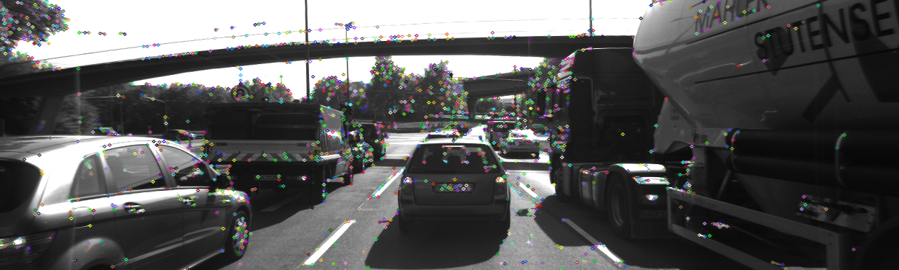
#### Harris
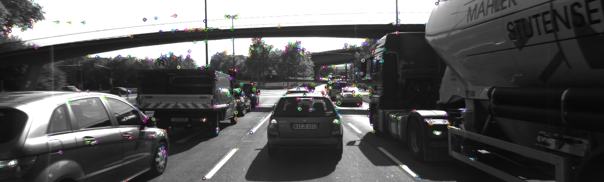
#### FAST

#### SIFT
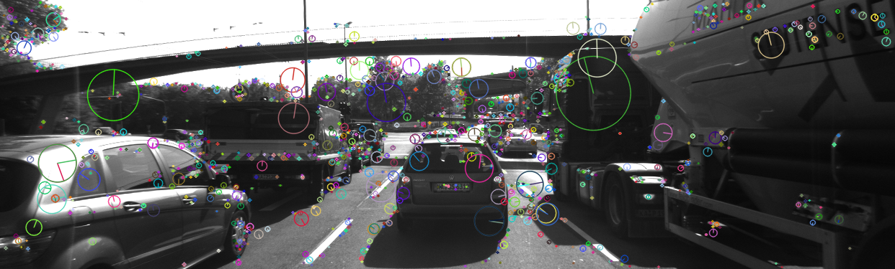
#### AKAZE

#### ORB
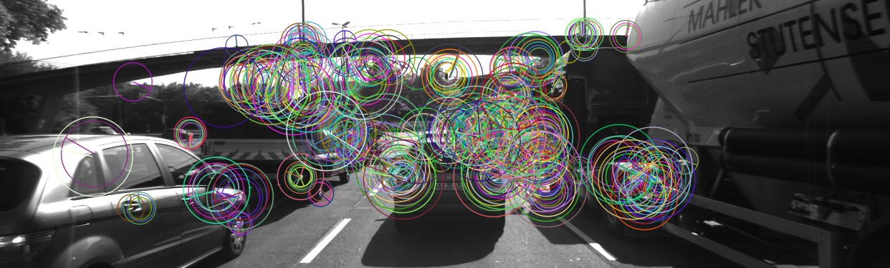
#### BRISK
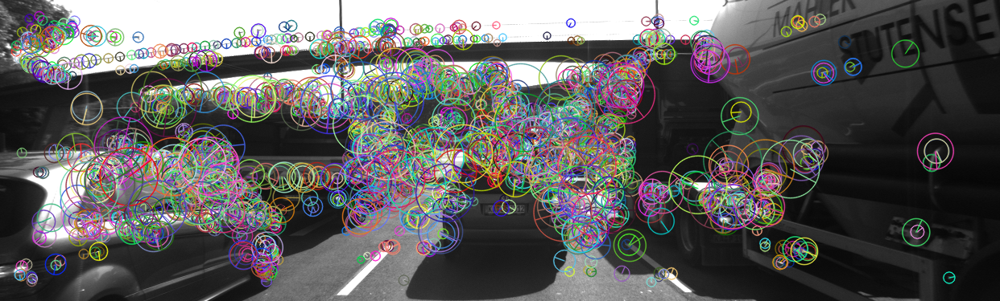
## Examples of keypoint matches detected by each detector-descriptor pair
### Shi-Tomasi

#### Shi-Tomasi + BRISK showing matches between image 3 and image 4


#### Shi-Tomasi + BRIEF showing matches between image 3 and image 4

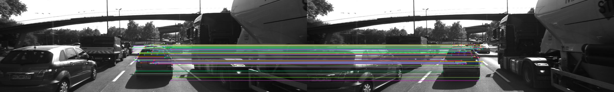

#### Shi-Tomasi + ORB showing matches between image 3 and image 4

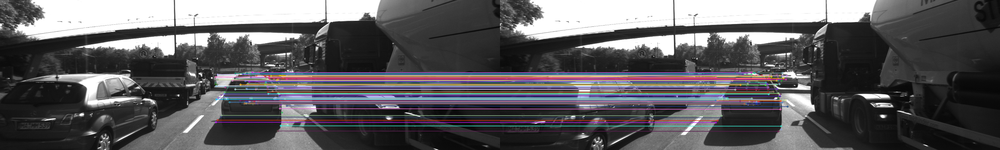

#### Shi-Tomasi + FREAK showing matches between image 3 and image 4


#### Shi-Tomasi + AKAZE showing matches between image 3 and image 4


#### Shi-Tomasi + SIFT showing matches between image 3 and image 4


### HARRIS

#### HARRIS + BRISK showing matches between image 3 and image 4


#### HARRIS + BRIEF showing matches between image 3 and image 4

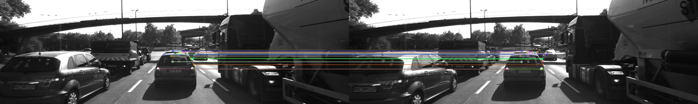

#### HARRIS + ORB showing matches between image 3 and image 4

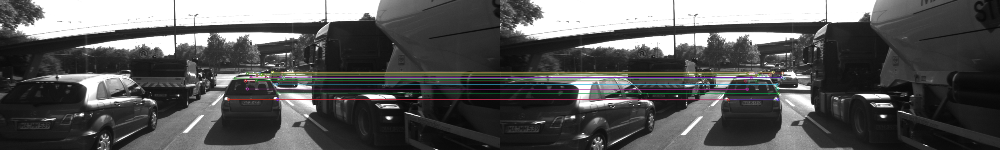

#### HARRIS + FREAK showing matches between image 3 and image 4


#### HARRIS + AKAZE showing matches between image 3 and image 4


#### HARRIS + SIFT showing matches between image 3 and image 4

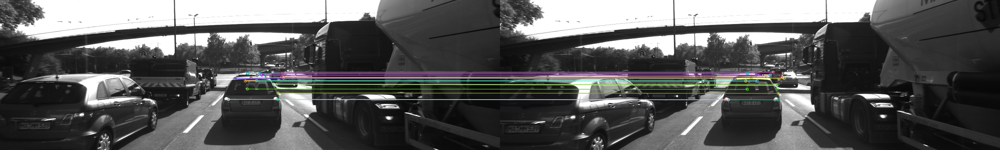
### FAST

#### FAST + BRISK showing matches between image 3 and image 4

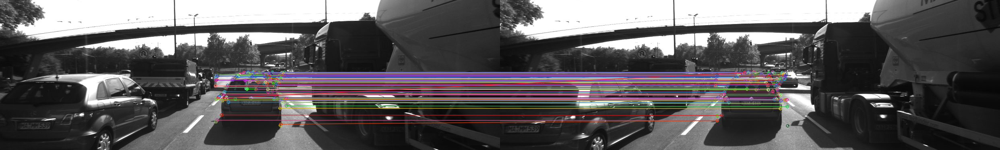

#### FAST + BRIEF showing matches between image 3 and image 4

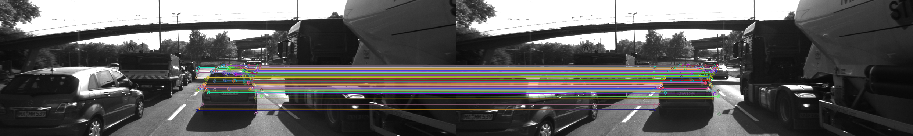

#### FAST + ORB showing matches between image 3 and image 4

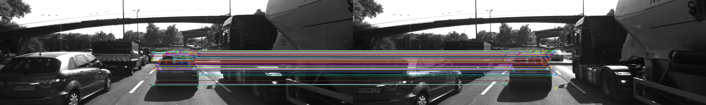

#### FAST + FREAK showing matches between image 3 and image 4


#### FAST + AKAZE showing matches between image 3 and image 4


#### FAST + SIFT showing matches between image 3 and image 4

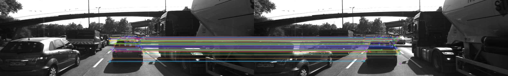
### SIFT

#### SIFT + BRISK showing matches between image 3 and image 4

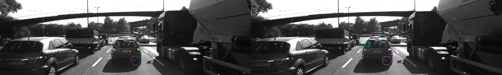

#### SIFT + BRIEF showing matches between image 3 and image 4

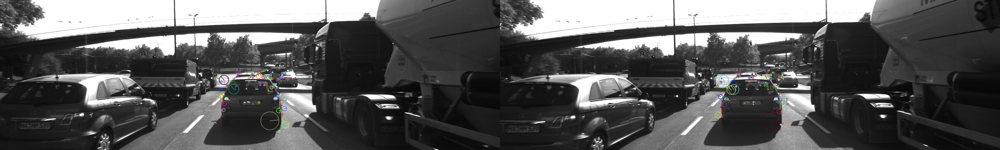

#### SIFT + ORB showing matches between image 3 and image 4


#### SIFT + FREAK showing matches between image 3 and image 4

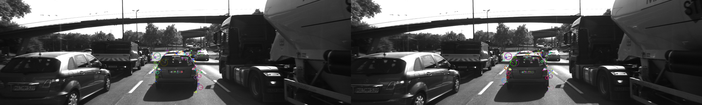

#### SIFT + AKAZE showing matches between image 3 and image 4


#### SIFT + SIFT showing matches between image 3 and image 4

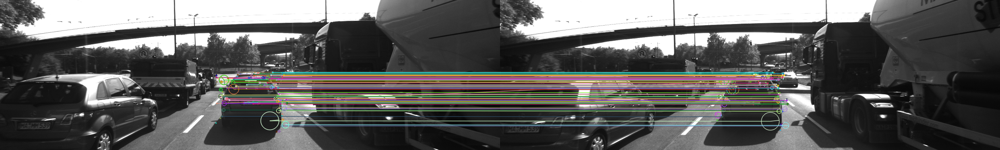
### AKAZE

#### AKAZE + BRISK showing matches between image 3 and image 4

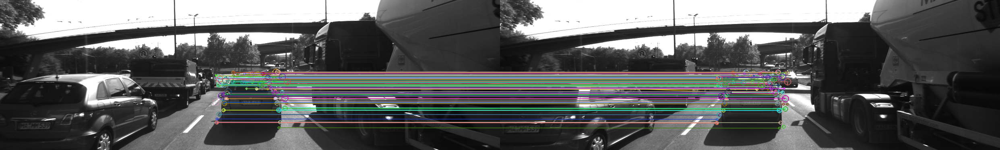

#### AKAZE + BRIEF showing matches between image 3 and image 4


#### AKAZE + ORB showing matches between image 3 and image 4


#### AKAZE + FREAK showing matches between image 3 and image 4


#### AKAZE + AKAZE showing matches between image 3 and image 4

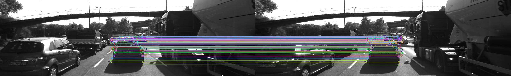

#### AKAZE + SIFT showing matches between image 3 and image 4


### ORB

#### ORB + BRISK showing matches between image 3 and image 4


#### ORB + BRIEF showing matches between image 3 and image 4


#### ORB + ORB showing matches between image 3 and image 4


#### ORB + FREAK showing matches between image 3 and image 4


#### ORB + AKAZE showing matches between image 3 and image 4


#### ORB + SIFT showing matches between image 3 and image 4

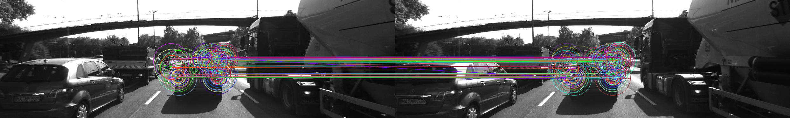
### BRISK

#### BRISK + BRISK showing matches between image 3 and image 4

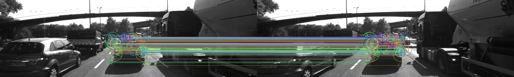

#### BRISK + BRIEF showing matches between image 3 and image 4


#### BRISK + ORB showing matches between image 3 and image 4

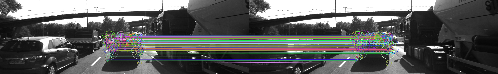

#### BRISK + FREAK showing matches between image 3 and image 4


#### BRISK + AKAZE showing matches between image 3 and image 4


#### BRISK + SIFT showing matches between image 3 and image 4

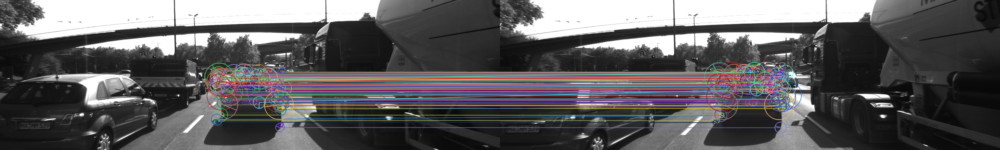

```