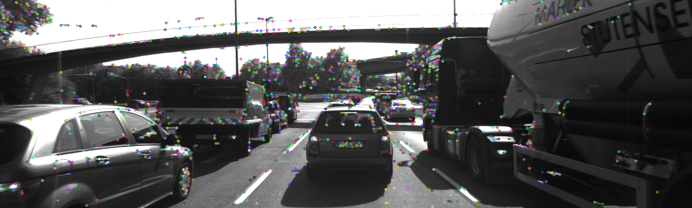
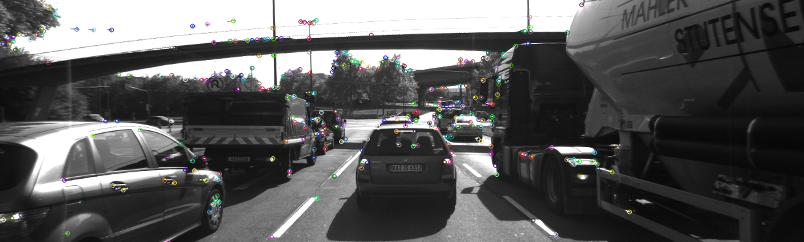
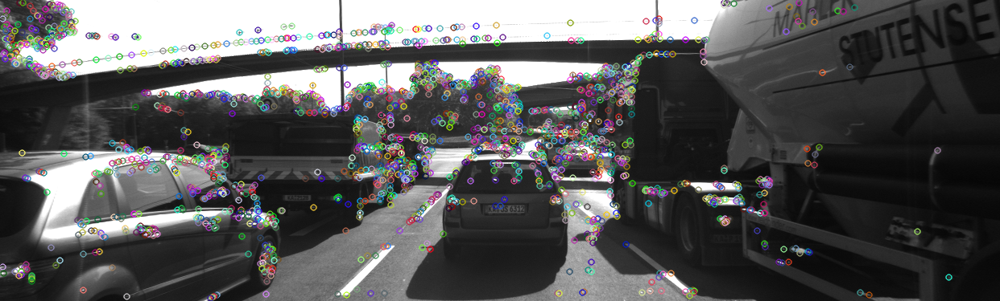
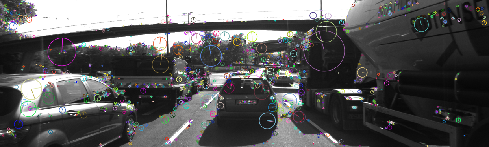
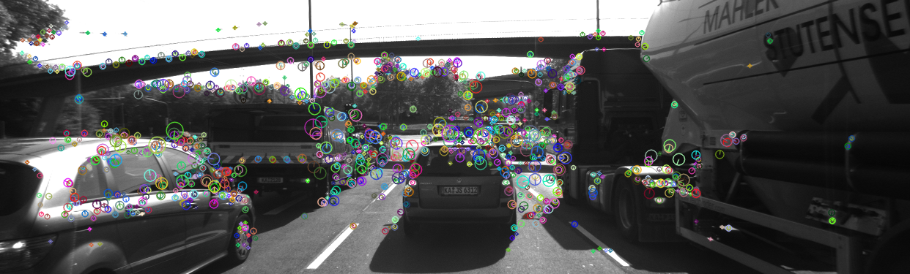
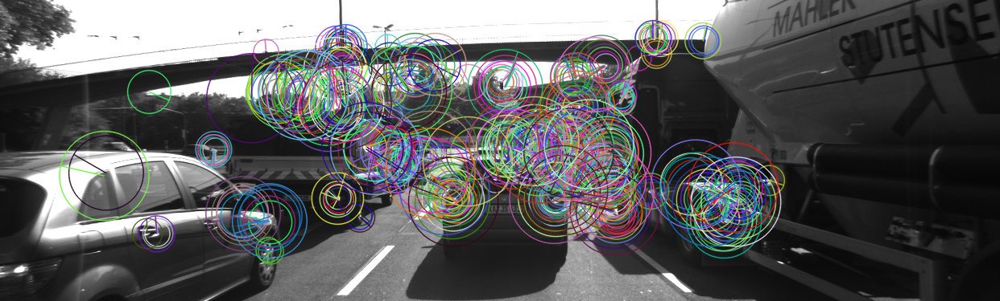
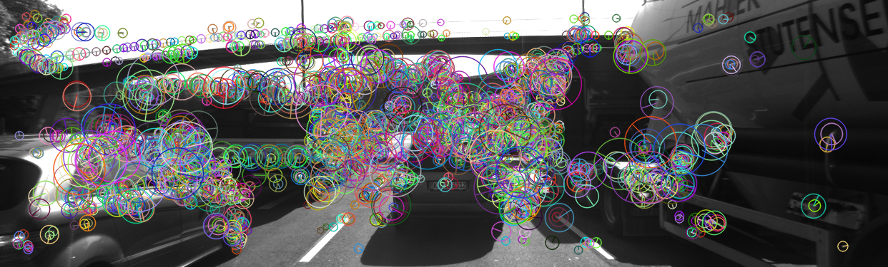

# Performance Evaluation
These results are recorded from running a total of 35 experiments based on combinations of 7 detectors and 6 descriptors.

## Performance Evaluation 1: Number of Keypoints

Count the number of keypoints on the preceding vehicle for all 10 images and take note of the distribution of their neighborhood size. Do this for all the detectors you have implemented.

Detector  | Total keypoints from all 10 images  | Total keypoints in scene (average per image) | Keypoints detected on preceding vehicle (average per image) | % keypoints removed from scene to focus on preceding vehicle
 :--- | ---: | ---: | ---: | ---: 
Shi-Tomasi | 13423 | 1342 | 117 | 91.2166
HARRIS | 1737 | 173 | 24 | 85.7225
FAST | 17874 | 1787 | 149 | 91.6583
BRISK | 27116 | 2711 | 276 | 89.8141
ORB | 5000 | 500 | 116 | 76.78
AKAZE | 13430 | 1343 | 167 | 87.5652
SIFT | 13861 | 1386 | 138 | 90.0007

## Performance Evaluation 2: Number of Matched Keypoints

Count the number of matched keypoints for all 10 images using all possible combinations of detectors and descriptors. In the matching step, the BF approach is used with the descriptor distance ratio set to 0.8.

### Total number of matched keypoints over 10 images
Detector - Descriptor|BRISK|BRIEF|ORB|FREAK|AKAZE|SIFT
 :--- | ---: | ---: | ---: | ---: | ---: | ---:
Shi-Tomasi | 767 | 944 | 1814 | 766 | 0 | 928
HARRIS | 142 | 173 | 320 | 146 | 0 | 163
FAST | 899 | 1099 | 2162 | 881 | 0 | 1048
SIFT | 300 | 339 | 0 | 270 | 0 | 800
AKAZE | 1215 | 1266 | 2372 | 1188 | 2518 | 1274
ORB | 751 | 545 | 1522 | 421 | 0 | 766
BRISK | 1570 | 1704 | 3020 | 1526 | 0 | 1658
### Average number of matched keypoints per image pair
Detector - Descriptor|BRISK|BRIEF|ORB|FREAK|AKAZE|SIFT
 :--- | ---: | ---: | ---: | ---: | ---: | ---:
Shi-Tomasi | 76 | 94 | 181 | 76 | 0 | 92
HARRIS | 14 | 17 | 32 | 14 | 0 | 16
FAST | 89 | 109 | 216 | 88 | 0 | 104
SIFT | 30 | 33 | 0 | 27 | 0 | 80
AKAZE | 121 | 126 | 237 | 118 | 251 | 127
ORB | 75 | 54 | 152 | 42 | 0 | 76
BRISK | 157 | 170 | 302 | 152 | 0 | 165

## Performance Evaluation 3: Keypoint Detection and Descriptor Extraction

Log the time it takes for keypoint detection and descriptor extraction.

### Keypoint Detection Times (milliseconds)

Detector - Descriptor|BRISK|BRIEF|ORB|FREAK|AKAZE|SIFT
 :--- | ---: | ---: | ---: | ---: | ---: | ---:
Shi-Tomasi | 119.691 | 100.825 | 194.883 | 97.2086 | 0 | 95.2458
HARRIS | 106.882 | 106.321 | 215.06 | 105.65 | 0 | 114.046
FAST | 2.95875 | 3.63778 | 5.87557 | 3.04111 | 0 | 2.93478
SIFT | 279.623 | 291.777 | 0 | 277.026 | 0 | 269.24
AKAZE | 195.898 | 192.331 | 389.947 | 200.115 | 420.824 | 202.292
ORB | 18.2713 | 12.4689 | 29.0668 | 13.458 | 0 | 10.5294
BRISK | 50.0622 | 51.9845 | 104.338 | 50.8684 | 0 | 50.3581

### Descriptor Extraction Times (milliseconds)

Detector - Descriptor|BRISK|BRIEF|ORB|FREAK|AKAZE|SIFT
 :--- | ---: | ---: | ---: | ---: | ---: | ---:
Shi-Tomasi | 17.5855 | 10.0552 | 41.3105 | 164.972 | 0 | 116.911
HARRIS | 8.83779 | 7.56274 | 38.4216 | 160.111 | 0 | 117.8
FAST | 9.12265 | 3.61084 | 18.4732 | 88.2758 | 0 | 65.7425
SIFT | 7.85048 | 3.81915 | 0 | 57.5693 | 0 | 219.924
AKAZE | 8.49599 | 5.58923 | 43.1449 | 43.319 | 391.162 | 79.6987
ORB | 6.03889 | 5.74562 | 33.7996 | 35.6146 | 0 | 75.6039
BRISK | 5.28721 | 2.35414 | 24.7665 | 28.236 | 0 | 38.9537

### Keypoints detected by each detector

#### Shi-Tomasi

#### Harris

#### FAST

#### SIFT

#### AKAZE

#### ORB

#### BRISK

