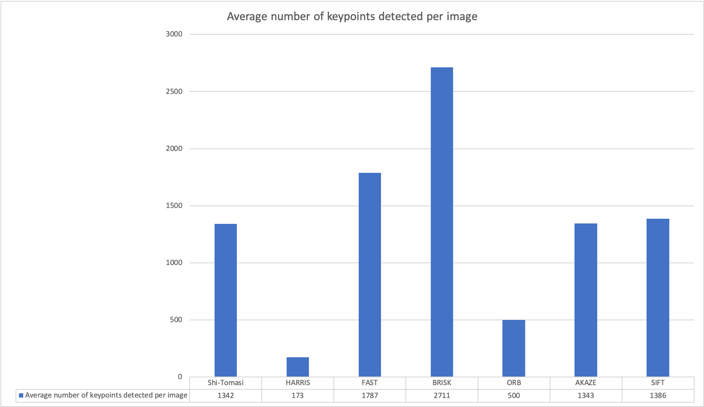

# 2D Feature Tracking

The goal of this project is to build the feature tracking part of a collision detection system, and test various detector / descriptor combinations to see which ones perform best.

This document contains the following sections:

* [Project Specification](#Project-Specification)
* [Project Report](#Project-Report)
  * [1. Data Buffer Implementation](#1-data-buffer)
    * [Results with vector implementation](#Results-with-vector-implementation)
    * [Results with ring buffer implementation](#Results-with-ring-buffer-implementation)
  * [2. Keypoints](#2-keypoints)
    * [Keypoint Detection](#Keypoint-Detection)
    * [Keypoint Removal](#Keypoint-Removal)
  * [3. Descriptors](#3-descriptors)
    * [Keypoint Descriptors](#Keypoint-Descriptors)
    * [Descriptor Matching](#Descriptor-Matching)
    * [Descriptor Distance Ratio](#Descriptor-Distance-Ratio)
  * [4. Performance Evaluation](#4-performance-evaluation)
    * [Performance Evaluation 1: Number of Detected Keypoints](#performance-evaluation-1-number-of-keypoints)
    * [Performance Evaluation 2: Number of Matched Keypoints](#performance-evaluation-2-number-of-matched-keypoints)
    * [Performance Evaluation 3: Keypoint Detection and Descriptor Extraction Times](#performance-evaluation-3-keypoint-detection-and-descriptor-extraction)
    * [Observations](#Observations)
    * [Recommendations for Detecting Keypoints on Vehicles](#Recommendations)
* [Building and Running the Project](#Building-and-Running-the-Project)
  * [Dependencies](#Dependencies)
  * [Basic Build Instructions](#Basic-Build-Instructions)
  * [Notes on the Code](#Notes-on-the-Code)
* [References](#References)
  
# Project Specification

#### Report
Number|Criteria|Meets Specifications|Status
:---:|---|---|---
0|Report|Provide a Writeup / README that includes all the rubric points and how you addressed each one. You can submit your writeup as markdown or pdf.|[DONE](#Project-Report)

#### Data Buffer
Number|Criteria|Meets Specifications|Status
:---:|---|---|---
1|Data Buffer Optimization|Implement a vector for dataBuffer objects whose size does not exceed a limit (e.g. 2 elements). This can be achieved by pushing in new elements on one end and removing elements on the other end.|[DONE](#1-data-buffer)

#### Keypoints
Number|Criteria|Meets Specifications|Status
:---:|---|---|---
2|Keypoint Detection|Implement detectors HARRIS, FAST, BRISK, ORB, AKAZE, and SIFT and make them selectable by setting a string accordingly.|[DONE](#Keypoint-Detection)
3|Keypoint Removal|Remove all keypoints outside of a pre-defined rectangle and only use the keypoints within the rectangle for further processing.|[DONE](#Keypoint-Removal)

#### Descriptors
Number|Criteria|Meets Specifications|Status
:---:|---|---|---
4|Keypoint Descriptors|Implement descriptors BRIEF, ORB, FREAK, AKAZE and SIFT and make them selectable by setting a string accordingly.|[DONE](#Keypoint-Descriptors)
5|Descriptor Matching|Implement FLANN matching as well as k-nearest neighbor selection. Both methods must be selectable using the respective strings in the main function.|[DONE](#Descriptor-Matching)
6|Descriptor Distance Ratio|Use the K-Nearest-Neighbor matching to implement the descriptor distance ratio test, which looks at the ratio of best vs. second-best match to decide whether to keep an associated pair of keypoints.|[DONE](#Descriptor-Distance-Ratio)

#### Performance
Number|Criteria|Meets Specifications|Status
:---:|---|---|---
7|Performance Evaluation 1|Count the number of keypoints on the preceding vehicle for all 10 images and take note of the distribution of their neighborhood size. Do this for all the detectors you have implemented.|[DONE](#performance-evaluation-1-number-of-keypoints)
8|Performance Evaluation 2|Count the number of matched keypoints for all 10 images using all possible combinations of detectors and descriptors. In the matching step, the BF approach is used with the descriptor distance ratio set to 0.8.|[DONE](#performance-evaluation-2-number-of-matched-keypoints)
9|Performance Evaluation 3|Log the time it takes for keypoint detection and descriptor extraction. The results must be entered into a spreadsheet and based on this data, the TOP3 detector / descriptor combinations must be recommended as the best choice for our purpose of detecting keypoints on vehicles.|[DONE](#performance-evaluation-3-keypoint-detection-and-descriptor-extraction)


# Project Report

## 1. Data Buffer

Rather than implement a custom ring buffer, this project is using the Circular Buffer implementation from the Boost C++ libraries. The [references section](#References) contains links to relevant articles to help add Boost to the project. The class ```boost::circular_buffer``` serves as a drop-in replacement for ```vector```.

The only change I need to make was to replace this line
```c++
    vector<DataFrame> dataBuffer; // list of data frames which are held in memory at the same time
```

with this line (and use the defined variable ```dataBufferSize``` to set the ring buffer capacity:
```c++
    int dataBufferSize = 2;       // no. of images which are held in memory (ring buffer) at the same time
    boost::circular_buffer<DataFrame> dataBuffer(dataBufferSize); // buffer of data frames which are held in memory at the same time
```

The following results show that with the vector implementation, the size of the buffer keeps rising each time a new image is processed. With the ring buffer implementation, the size of the buffer is constrained to the desired data buffer size, in this case 2.

#### Results with vector implementation
```shell
------>>>> Data Buffer Size = 1    <<<<------
#1 : LOAD IMAGE INTO BUFFER done
Shi-Tomasi detection with n=1370 keypoints in 11.9359 ms
NOTE: Keypoints have been limited!
#2 : DETECT KEYPOINTS done
BRISK descriptor extraction in 1.37182 ms
#3 : EXTRACT DESCRIPTORS done
------>>>> Data Buffer Size = 2    <<<<------
#1 : LOAD IMAGE INTO BUFFER done
Shi-Tomasi detection with n=1301 keypoints in 12.0098 ms
NOTE: Keypoints have been limited!
#2 : DETECT KEYPOINTS done
BRISK descriptor extraction in 0.837618 ms
#3 : EXTRACT DESCRIPTORS done
#4 : MATCH KEYPOINT DESCRIPTORS done
Press key to continue to next image
------>>>> Data Buffer Size = 3    <<<<------
#1 : LOAD IMAGE INTO BUFFER done
Shi-Tomasi detection with n=1361 keypoints in 8.18416 ms
NOTE: Keypoints have been limited!
#2 : DETECT KEYPOINTS done
BRISK descriptor extraction in 0.98411 ms
#3 : EXTRACT DESCRIPTORS done
#4 : MATCH KEYPOINT DESCRIPTORS done
Press key to continue to next image
------>>>> Data Buffer Size = 4    <<<<------
#1 : LOAD IMAGE INTO BUFFER done
Shi-Tomasi detection with n=1358 keypoints in 11.0209 ms
NOTE: Keypoints have been limited!
#2 : DETECT KEYPOINTS done
BRISK descriptor extraction in 1.02524 ms
#3 : EXTRACT DESCRIPTORS done
#4 : MATCH KEYPOINT DESCRIPTORS done
Press key to continue to next image
------>>>> Data Buffer Size = 5    <<<<------
#1 : LOAD IMAGE INTO BUFFER done
Shi-Tomasi detection with n=1333 keypoints in 12.662 ms
NOTE: Keypoints have been limited!
#2 : DETECT KEYPOINTS done
BRISK descriptor extraction in 1.0883 ms
#3 : EXTRACT DESCRIPTORS done
#4 : MATCH KEYPOINT DESCRIPTORS done
Press key to continue to next image
------>>>> Data Buffer Size = 6    <<<<------
#1 : LOAD IMAGE INTO BUFFER done
Shi-Tomasi detection with n=1284 keypoints in 7.9035 ms
NOTE: Keypoints have been limited!
#2 : DETECT KEYPOINTS done
BRISK descriptor extraction in 0.8943 ms
#3 : EXTRACT DESCRIPTORS done
#4 : MATCH KEYPOINT DESCRIPTORS done
Press key to continue to next image
------>>>> Data Buffer Size = 7    <<<<------
#1 : LOAD IMAGE INTO BUFFER done
Shi-Tomasi detection with n=1322 keypoints in 8.43149 ms
NOTE: Keypoints have been limited!
#2 : DETECT KEYPOINTS done
BRISK descriptor extraction in 0.985863 ms
#3 : EXTRACT DESCRIPTORS done
#4 : MATCH KEYPOINT DESCRIPTORS done
Press key to continue to next image
------>>>> Data Buffer Size = 8    <<<<------
#1 : LOAD IMAGE INTO BUFFER done
Shi-Tomasi detection with n=1366 keypoints in 9.2397 ms
NOTE: Keypoints have been limited!
#2 : DETECT KEYPOINTS done
BRISK descriptor extraction in 1.50615 ms
#3 : EXTRACT DESCRIPTORS done
#4 : MATCH KEYPOINT DESCRIPTORS done
Press key to continue to next image
------>>>> Data Buffer Size = 9    <<<<------
#1 : LOAD IMAGE INTO BUFFER done
Shi-Tomasi detection with n=1389 keypoints in 7.78882 ms
NOTE: Keypoints have been limited!
#2 : DETECT KEYPOINTS done
BRISK descriptor extraction in 0.844176 ms
#3 : EXTRACT DESCRIPTORS done
#4 : MATCH KEYPOINT DESCRIPTORS done
Press key to continue to next image
------>>>> Data Buffer Size = 10    <<<<------
#1 : LOAD IMAGE INTO BUFFER done
Shi-Tomasi detection with n=1339 keypoints in 9.5957 ms
NOTE: Keypoints have been limited!
#2 : DETECT KEYPOINTS done
BRISK descriptor extraction in 1.145 ms
#3 : EXTRACT DESCRIPTORS done
#4 : MATCH KEYPOINT DESCRIPTORS done
```
#### Results with ring buffer implementation
```shell
------>>>> Data Buffer Size = 1    <<<<------
#1 : LOAD IMAGE INTO BUFFER done
Shi-Tomasi detection with n=1370 keypoints in 11.831 ms
NOTE: Keypoints have been limited!
#2 : DETECT KEYPOINTS done
BRISK descriptor extraction in 0.963352 ms
#3 : EXTRACT DESCRIPTORS done
------>>>> Data Buffer Size = 2    <<<<------
#1 : LOAD IMAGE INTO BUFFER done
Shi-Tomasi detection with n=1301 keypoints in 10.131 ms
NOTE: Keypoints have been limited!
#2 : DETECT KEYPOINTS done
BRISK descriptor extraction in 0.982599 ms
#3 : EXTRACT DESCRIPTORS done
#4 : MATCH KEYPOINT DESCRIPTORS done
Press key to continue to next image
------>>>> Data Buffer Size = 2    <<<<------
#1 : LOAD IMAGE INTO BUFFER done
Shi-Tomasi detection with n=1361 keypoints in 10.3851 ms
NOTE: Keypoints have been limited!
#2 : DETECT KEYPOINTS done
BRISK descriptor extraction in 1.45686 ms
#3 : EXTRACT DESCRIPTORS done
#4 : MATCH KEYPOINT DESCRIPTORS done
Press key to continue to next image
------>>>> Data Buffer Size = 2    <<<<------
#1 : LOAD IMAGE INTO BUFFER done
Shi-Tomasi detection with n=1358 keypoints in 11.1961 ms
NOTE: Keypoints have been limited!
#2 : DETECT KEYPOINTS done
BRISK descriptor extraction in 1.00384 ms
#3 : EXTRACT DESCRIPTORS done
#4 : MATCH KEYPOINT DESCRIPTORS done
Press key to continue to next image
------>>>> Data Buffer Size = 2    <<<<------
#1 : LOAD IMAGE INTO BUFFER done
Shi-Tomasi detection with n=1333 keypoints in 11.6565 ms
NOTE: Keypoints have been limited!
#2 : DETECT KEYPOINTS done
BRISK descriptor extraction in 1.00851 ms
#3 : EXTRACT DESCRIPTORS done
#4 : MATCH KEYPOINT DESCRIPTORS done
Press key to continue to next image
------>>>> Data Buffer Size = 2    <<<<------
#1 : LOAD IMAGE INTO BUFFER done
Shi-Tomasi detection with n=1284 keypoints in 8.82204 ms
NOTE: Keypoints have been limited!
#2 : DETECT KEYPOINTS done
BRISK descriptor extraction in 1.02393 ms
#3 : EXTRACT DESCRIPTORS done
#4 : MATCH KEYPOINT DESCRIPTORS done
Press key to continue to next image
------>>>> Data Buffer Size = 2    <<<<------
#1 : LOAD IMAGE INTO BUFFER done
Shi-Tomasi detection with n=1322 keypoints in 8.65441 ms
NOTE: Keypoints have been limited!
#2 : DETECT KEYPOINTS done
BRISK descriptor extraction in 0.980091 ms
#3 : EXTRACT DESCRIPTORS done
#4 : MATCH KEYPOINT DESCRIPTORS done
Press key to continue to next image
------>>>> Data Buffer Size = 2    <<<<------
#1 : LOAD IMAGE INTO BUFFER done
Shi-Tomasi detection with n=1366 keypoints in 10.6717 ms
NOTE: Keypoints have been limited!
#2 : DETECT KEYPOINTS done
BRISK descriptor extraction in 0.930967 ms
#3 : EXTRACT DESCRIPTORS done
#4 : MATCH KEYPOINT DESCRIPTORS done
Press key to continue to next image
------>>>> Data Buffer Size = 2    <<<<------
#1 : LOAD IMAGE INTO BUFFER done
Shi-Tomasi detection with n=1389 keypoints in 9.21086 ms
NOTE: Keypoints have been limited!
#2 : DETECT KEYPOINTS done
BRISK descriptor extraction in 0.939394 ms
#3 : EXTRACT DESCRIPTORS done
#4 : MATCH KEYPOINT DESCRIPTORS done
Press key to continue to next image
------>>>> Data Buffer Size = 2    <<<<------
#1 : LOAD IMAGE INTO BUFFER done
Shi-Tomasi detection with n=1339 keypoints in 13.4377 ms
NOTE: Keypoints have been limited!
#2 : DETECT KEYPOINTS done
BRISK descriptor extraction in 1.05039 ms
#3 : EXTRACT DESCRIPTORS done
#4 : MATCH KEYPOINT DESCRIPTORS done
```

## 2. Keypoints

### Keypoint Detection

This project implements the following keypoint detectors:
* Shi-Tomasi
* HARRIS
* FAST
* BRISK
* ORB
* AKAZE
* SIFT

The file [matching2D_Student.cpp](src/matching2D_Student.cpp) implements a function for each of these keypoint detectors. 

The `KeypointDetector` enum in file [matching2D.hpp](src/matching2D.hpp) is used to choose the desired keypoint detector.
```c++
enum KeypointDetector
{
    Shi_Tomasi,
    HARRIS,
    FAST,
    BRISK,
    ORB,
    AKAZE,
    SIFT
};
```

Instantiate the `keypointDetectorType` variable specifying the desired `KeypointDetector`, e.g. in [MidTermProject_Camera_Student.cpp](src/MidTermProject_Camera_Student.cpp):

```c++
        KeypointDetector keypointDetectorType = KeypointDetector::SIFT;
```

The `switch` statement then calls the appropriate function based on which detector type is chosen.
```c++
switch (experiment.hyperparameters.keypointDetector)
{
  case KeypointDetector::Shi_Tomasi:
    detKeypointsShiTomasi(keypoints, imgGray, experiment.hyperparameters.visualizeImageMatches, resultLine);
    break;
  case KeypointDetector::HARRIS:
    detKeypointsHarris(keypoints, imgGray, experiment.hyperparameters.visualizeImageMatches, resultLine);
    break;
  case KeypointDetector::FAST:
    detKeypointsFAST(keypoints, imgGray, experiment.hyperparameters.visualizeImageMatches, resultLine);
    break;
  case KeypointDetector::BRISK:
    detKeypointsBRISK(keypoints, imgGray, experiment.hyperparameters.visualizeImageMatches, resultLine);
    break;
  case KeypointDetector::ORB:
    detKeypointsORB(keypoints, imgGray, experiment.hyperparameters.visualizeImageMatches, resultLine);
    break;
  case KeypointDetector::AKAZE:
    detKeypointsAKAZE(keypoints, imgGray, experiment.hyperparameters.visualizeImageMatches, resultLine);
    break;
  case KeypointDetector::SIFT:
    detKeypointsSIFT(keypoints, imgGray, experiment.hyperparameters.visualizeImageMatches, resultLine);
    break;
  default:
      cerr << "*** Not using a specified keypoint detector" << endl;
}
```

### Keypoint Removal

We want to remove all keypoints outside of a pre-defined rectangle and only use the keypoints within the rectangle for further processing.

The code in [MidTermProject_Camera_Student.cpp](src/MidTermProject_Camera_Student.cpp) creates a rectangle, which defines a region of interest that encapsulates the preceding vehicle:
```c++
        cv::Rect vehicleRect(535, 180, 180, 150);
```

The following code then removes all keypoints not contained within the defined rectangle, i.e., it removes all keypoints that are not part of the preceding vehicle:
```c++
        if (bFocusOnVehicle)
        {
            for(auto it = keypoints.begin(); it != keypoints.end();)
            {
                // remove the keypoint if it is not contained within the rectangle of interest
                if(!vehicleRect.contains(it->pt))
                {
                    //cout << "||| Removing keypoint " << it->pt << " not contained in rectangle of interest" << endl;
                    keypoints.erase(it);
                }
                else
                {
                    //cout << "/// Keeping keypoint " << it->pt << " contained in rectangle of interest" << endl;
                    it++;
                }
            }
        }
```

## 3. Descriptors

### Keypoint Descriptors
This project implements the BRIEF, ORB, FREAK, AKAZE and SIFT descriptors, and makes them selectable. The `descriptorType` is specified as a parameter to the `descKeypoints` function, which is implemented in the file [matching2D_Student.cpp](src/matching2D_Student.cpp), and has the following signature:
```c++
// Use one of several types of state-of-art descriptors to uniquely identify keypoints
void descKeypoints(vector<cv::KeyPoint> &keypoints, cv::Mat &img, cv::Mat &descriptors, string descriptorType);
```

### Descriptor Matching
Implement FLANN matching as well as k-nearest neighbor selection. Both methods must be selectable using the respective strings in the main function.

FLANN matching is implemented in the `matchDescriptors()` function in [matching2D_Student.cpp](src/matching2D_Student.cpp):
```c++
    else if (matcherType == "MAT_FLANN")
    {
        if (descSource.type() != CV_32F)
        {
            // OpenCV bug workaround : convert binary descriptors to floating point due
            // to a bug in current OpenCV implementation
            descSource.convertTo(descSource, CV_32F);
            descRef.convertTo(descRef, CV_32F);
        }

        // implement FLANN matching
        matcher = cv::DescriptorMatcher::create(cv::DescriptorMatcher::FLANNBASED);
    }
```

### Descriptor Distance Ratio
Use the K-Nearest-Neighbor matching to implement the descriptor distance ratio test, which looks at the ratio of best vs. second-best match to decide whether to keep an associated pair of keypoints.

This is implemented in the `matchDescriptors()` function in [matching2D_Student.cpp](src/matching2D_Student.cpp)

```c++
    else if (selectorType == "SEL_KNN")
    {
        // implement k-nearest-neighbor matching
        vector<vector<cv::DMatch>> knn_matches;
        auto t = (double) cv::getTickCount();

        int k = 2; // finds the 2 best matches
        matcher->knnMatch(descSource, descRef, knn_matches, k);

        t = ((double) cv::getTickCount() - t) / cv::getTickFrequency();
        cout << " (KNN) with n=" << knn_matches.size() << " matches in " << 1000 * t / 1.0 << " ms";

        // filter matches using descriptor distance ratio test
        double minDescDistRatio = 0.8;

        for (auto &knn_match : knn_matches)
        {
            if (knn_match[0].distance < minDescDistRatio * knn_match[1].distance)
            {
                matches.push_back(knn_match[0]);
            }
        }

        cout << "; matches = " << matches.size() << ", KNN matches = " << knn_matches.size();

        long keypointsRemoved = static_cast<long>(knn_matches.size() - matches.size());
        float percentageKeypointsRemoved =
                (static_cast<float>(keypointsRemoved) / static_cast<float>(knn_matches.size())) * 100;

        cout << " => keypoints removed = " << keypointsRemoved << " (" << percentageKeypointsRemoved << "%)" << endl;
    }

```

## 4. Performance Evaluation

These results are recorded from running a total of 35 experiments based on combinations of 7 detectors and 6 descriptors.

The spreadsheet I created to analyse the results and generate the graphs and charts is [in this file](results/results.xlsx).

### Performance Evaluation 1: Number of Keypoints

Count the number of keypoints on the preceding vehicle for all 10 images and take note of the distribution of their neighborhood size. Do this for all the detectors you have implemented.

Detector | Total keypoints on preceding vehicle from all 10 images | Average number of keypoints detected per image
 :--- | ---: | ---:
Shi-Tomasi | 13423 | 1342
HARRIS | 1737 | 173
FAST | 17874 | 1787
BRISK | 27116 | 2711
ORB | 5000 | 500
AKAZE | 13430 | 1343
SIFT | 13861 | 1386


The following chart shows the number of keypoints detected by each detector on the preceding vehicle:




For a more detailed analysis of what is happening image-by-image, the following graph shows the number of keypoints detected on each image by each of the detectors:


### Performance Evaluation 2: Number of Matched Keypoints

Count the number of matched keypoints for all 10 images using all possible combinations of detectors and descriptors. In the matching step, the BF approach is used with the descriptor distance ratio set to 0.8.

Detector - Descriptor|BRISK|BRIEF|ORB|FREAK|AKAZE|SIFT
 :--- | ---: | ---: | ---: | ---: | ---: | ---:
Shi-Tomasi | 767 | 944 | 1814 | 766 |  | 926
HARRIS | 142 | 173 | 320 | 146 |  | 163
FAST | 899 | 1099 | 2162 | 881 |  | 1048
BRISK | 1570 | 1704 | 3020 | 1526 |  | 1662
ORB | 751 | 545 | 1522 | 421 | | 765
AKAZE | 1215 | 1266 | 2372 | 1188 | 2518 | 1273
SIFT | 304 | 338 | | 274 |  | 801

The number of matches per detector-descriptor pair are shown visually in the following graph:


### Performance Evaluation 3: Keypoint Detection and Descriptor Extraction

Log the time it takes for keypoint detection and descriptor extraction.

#### Keypoint Detection Times

Detector - Descriptor|BRISK|BRIEF|ORB|FREAK|AKAZE|SIFT
 :--- | ---: | ---: | ---: | ---: | ---: | ---:
Shi-Tomasi | 113.961 | 103.281 | 182.746 | 88.6761 |  | 88.6581
HARRIS | 117.739 | 115.977 | 224.026 | 114.519 |  | 120.658
FAST | 2.75996 | 2.84834 | 5.50425 | 2.74408 |  | 2.74581
BRISK | 49.2949 | 49.3449 | 103.928 | 51.1041 |  | 49.9847
ORB | 17.722 | 13.3629 | 20.6844 | 11.4591 |  | 12.4044
AKAZE | 170.732 | 174.562 | 340.939 | 175.438 | 368.825 | 183.47
SIFT | 251.051 | 247.2 |  | 244.247 |  | 260.259

These keypoint detection times are plotted for comparison in this graph:


#### Descriptor Extraction Times

Detector - Descriptor|BRISK|BRIEF|ORB|FREAK|AKAZE|SIFT
 :--- | ---: | ---: | ---: | ---: | ---: | ---:
Shi-Tomasi | 16.0448 | 8.91525 | 40.1351 | 164.883 |  | 108.667
HARRIS | 9.76207 | 5.42603 | 41.2102 | 155.613 |  | 123.167
FAST | 8.54358 | 3.68155 | 18.1524 | 80.7901 |  | 57.0617
BRISK | 4.30439 | 2.03225 | 21.3602 | 27.7593 |  | 31.6481
ORB | 3.00601 | 2.8468 | 25.0946 | 31.4454 |  | 59.4137
AKAZE | 8.55506 | 4.42716 | 32.1053 | 43.9621 | 311.096 | 67.973
SIFT | 6.2278 | 5.26704 |  | 55.5796 |  | 197.059

These descriptor extraction times are plotted for comparison in this graph:


The following table shows the total times:


The detector-descriptor combinations with the fastest times are highlighted in green. The slowest (AKAZE detector with AKAZE descriptor) is highlighted in red.

### Observations

Detectors that detect the highest number of keypoints on the preceding vehicle over 10 images:
1. BRISK (Total 27,116 keypoints;  Average 2,711 per image)
2. FAST (Total 17,874 keypoints; Average 1,787 per image)
3. SIFT (Total 13,861 keypoints; Average 1,343 per image)

Pairs that detect the highest number of matched keypoints between successive image pairs on the preceding vehicle:
1. BRISK + ORB (3020 keypoints)
2. AKAZE + AKAZE (2518 keypoints)   
3. AKAZE + ORB (2372 keypoints)

Fastest keypoint detection:
1. FAST + FREAK (2.7441 ms) 
2. FAST + SIFT (2.7458 ms)
3. FAST + BRISK (2.76 ms)

The FAST detector, in combination with the five descriptors that it works with (all except AKAZE), are the five fastest pairs. The FAST detector, with any of hte supported descriptors, provides the fastest keypoint detection times.

Fastest descriptor extraction:
1. BRISK + BRIEF (2.0323 ms)
2. ORB + BRIEF (2.8468 ms)
3. FAST + BRIEF (3.6816 ms)


### Recommendation for Detecting Keypoints on Vehicles

The recommendations here are based on a overall analysis of the overall performance. E.g., although FAST + FREAK is the fastest combination at keypoint detection, FREAK results in the slowest performance of FAST for descriptor extraction.   

Based on the performance evaluation and observations above, these are the top 3 detector / descriptor combinations that are the best choices for our purpose of detecting keypoints on vehicles:

Recommendation | Detector + Descriptor pair | Number of matched keypoints | Keypoint detection time| Descriptor extraction time | Total time 
:--- | :--- | ---: | ---: | ---: | ---:
1. | FAST + BRIEF | 1099 | 2.8483 ms| 3.6816 ms | 6.53 ms
2. | FAST + BRISK | 1099 | 5.5043 ms| 18.1524 ms | 11.30 ms
3. | ORB + BRIEF  | 545 | 13.36 ms| 2.85 ms | 16.21 ms

This assumes that speed of execution is a higher priority than number of matched keypoints, as long as we have sufficient matched keypoints for accuracy.

If more matches were a higher priority, then I would swap ORB + BRIEF with ORB + BRISK. ORB + BRIEF executes roughly 4.5 ms faster, but ORB + BRISK detects 206 keyopints more than ORB + BRIEF. 

# Building and Running the Project
## Dependencies
* cmake >= 3.1
  * All OSes: [click here for installation instructions](https://cmake.org/install/)
* make >= 4.1 (Linux, Mac), 3.81 (Windows)
  * Linux: make is installed by default on most Linux distros
  * Mac: [install Xcode command line tools to get make](https://developer.apple.com/xcode/features/)
  * Windows: [Click here for installation instructions](http://gnuwin32.sourceforge.net/packages/make.htm)
* OpenCV >= 4.5.1
  * This must be compiled from source using the `-D OPENCV_ENABLE_NONFREE=ON` cmake flag for testing the SIFT and SURF detectors.
  * The OpenCV 4.5.1 source code can be found [here](https://github.com/opencv/opencv/tree/4.5.1)
* gcc/g++ >= 5.4
  * Linux: gcc / g++ is installed by default on most Linux distros
  * Mac: same deal as make - [install Xcode command line tools](https://developer.apple.com/xcode/features/)
  * Windows: recommend using [MinGW](http://www.mingw.org/)
* Boost >= 1.75.0
  * The Boost C++ Libraries can be found [here](https://www.boost.org/)

## Basic Build Instructions

1. Make a build directory in the top level directory: `mkdir build && cd build`
2. Compile: `cmake .. && make`
3. Run it: `./2D_feature_tracking`.

## Notes on the Code

* The file [MidTermProject_Camera_Student.cpp](src/MidTermProject_Camera_Student.cpp) contains the `main()` function, and is the starting point for the program.
* The file [dataStructures.h](src/dataStructures.h) contains data structures used throughout the proejct code, including `DataFrame`, `KeypointDetector`, and `Hyperparameters`.
* The files [matching2D.hpp](src/matching2D.hpp) and [matching2D_Student.cpp](src/matching2D_Student.cpp) define the functions that perform keypoint detection and matching.
* The files [](src/reporting.h) and [](src/reporting.cpp) define structures and functions used to auto-generate the results in markdown format. I use these to easily generate all the performance evaluation tables, and then insert them into this README document, and into the [results spreadsheet](results/results.xlsx).  

### The `main()` funciton

Rather than re-run the program manually for each detector-descriptor pair, and then manually gather the results from the console, I run the program once for all detector-descriptor pairs. The project is structured around the model of an `Experiment`. Each `Experiment` runs one detector-descriptor pair, and gathers the results. The `main()` function invokes a function called `RunExperimentSet`, which runs a set of experiments - one for each valid detector-descriptor combination.


The `main()` function defines three variables - the hyperparameters, the set of detectors to use, and the set of descriptors to use in the experiments.

```c++
int main(int argc, const char *argv[])
{
    Hyperparameters hyperparameters = Hyperparameters();

    std::vector<KeypointDetector> detectors = {
            KeypointDetector::Shi_Tomasi,
            KeypointDetector::HARRIS,
            KeypointDetector::FAST,
            KeypointDetector::SIFT,
            KeypointDetector::AKAZE,
            KeypointDetector::ORB,
            KeypointDetector::BRISK
    };

    std::vector<string> descriptors = {
            "BRISK",
            "BRIEF",
            "ORB",
            "FREAK",
            "AKAZE",
            "SIFT"
    };

    // Run experiments for all combinations of detectors and descriptors
    RunExperimentSet(hyperparameters, detectors, descriptors);

    return 0;
}
```

The `Hyperparameters` are implemented as a `struct` in [dataStructures.h](src/dataStructures.h):

```c++
struct Hyperparameters
{
    Hyperparameters(){}

    KeypointDetector keypointDetector = Shi_Tomasi;
    string descriptor = "BRIEF";                    // BRISK, BRIEF, ORB, FREAK, AKAZE, SIFT
    string matcherType = "MAT_BF";                  // MAT_BF, MAT_FLANN
    string descriptorType = "DES_BINARY";           // DES_BINARY, DES_HOG
    string selectorType = "SEL_KNN";                // SEL_NN, SEL_KNN
    bool visualizeImageMatches = false;             // visualize matches between current and previous image?
    bool isFocusOnPrecedingVehicleOnly = true;      // only keep keypoints on the preceding vehicle?
};
```

The `RunExperimentSet()` function calls the `RunExperiment()` function one time for each valid detector-descriptor combination. The `RunExperiment()` function is where you will find much of the student assignment code.

```c++
/*
 * This function encapsulates running an experiment with a given combination of detector, descriptor, matcher,
 * descriptor type, and selector.
 */
void RunExperiment(Experiment &experiment)
{
    ...
    ...
}

```

The files [matching2D.hpp](src/matching2D.hpp) and [matching2D_Student.cpp](src/matching2D_Student.cpp) are where I have implemented the detection and matching functions. They contain the following function definitions:

```c++
void visualizeKeypoints(const std::vector<cv::KeyPoint> &keypoints, const cv::Mat &img, const std::string windowName, ExperimentResult &result);
void detectKeypoints(cv::Ptr<cv::FeatureDetector> &detector, std::string detectorName, std::vector<cv::KeyPoint> &keypoints, const cv::Mat &img, bool bVis, ExperimentResult &result);
void detKeypointsSIFT(std::vector<cv::KeyPoint> &keypoints, cv::Mat &img, bool bVis, ExperimentResult &result);
void detKeypointsAKAZE(std::vector<cv::KeyPoint> &keypoints, cv::Mat &img, bool bVis, ExperimentResult &result);
void detKeypointsORB(std::vector<cv::KeyPoint> &keypoints, cv::Mat &img, bool bVis, ExperimentResult &result);
void detKeypointsBRISK(std::vector<cv::KeyPoint> &keypoints, cv::Mat &img, bool bVis, ExperimentResult &result);
void detKeypointsFAST(std::vector<cv::KeyPoint> &keypoints, cv::Mat &img, bool bVis, ExperimentResult &result);
void detKeypointsHarris(std::vector<cv::KeyPoint> &keypoints, cv::Mat &img, bool bVis, ExperimentResult &result);
void detKeypointsShiTomasi(vector<cv::KeyPoint> &keypoints, cv::Mat &img, bool bVis, ExperimentResult &result);
void detKeypointsModern(std::vector<cv::KeyPoint> &keypoints, cv::Mat &img, std::string detectorType, bool bVis, ExperimentResult &result);
void descKeypoints(std::vector<cv::KeyPoint> &keypoints, cv::Mat &img, cv::Mat &descriptors, std::string descriptorType, ExperimentResult &result);
void matchDescriptors(vector<cv::KeyPoint> &kPtsSource,
                      vector<cv::KeyPoint> &kPtsRef,
                      cv::Mat &descSource,
                      cv::Mat &descRef,
                      vector<cv::DMatch> &matches,
                      string descriptorType,
                      string matcherType,
                      string selectorType,
                      ExperimentResult &result);

```


# References
* Jan Gaspar. [_Chapter 7. Boost.Circular Buffer_](https://www.boost.org/doc/libs/1_61_0/doc/html/circular_buffer.html). [Boost C++ Libraries](https://www.boost.org/).
* Phillip Johnston. [_Creating a Circular Buffer in C and C++_](https://embeddedartistry.com/blog/2017/05/17/creating-a-circular-buffer-in-c-and-c/). [Embedded Artistry](https://embeddedartistry.com/), May 17, 2017.
* StackOverflow. [_How to link C++ program with Boost using CMake_](https://stackoverflow.com/questions/3897839/how-to-link-c-program-with-boost-using-cmake).
* The spreadsheet I created to analyse the results and generate the graphs and charts is [in this file](results/results.xlsx).
* Işık, Ş. and Özkan, K., 2014. [A comparative evaluation of well-known feature detectors and descriptors](https://www.researchgate.net/profile/Sahin_Isik/publication/279278472_A_Comparative_Evaluation_of_Well-known_Feature_Detectors_and_Descriptors/links/56a1532e08ae27f7de266583.pdf). International Journal of Applied Mathematics, Electronics and Computers, 3(1), pp.1-6.
* Trzcinski, T. and Lepetit, V., 2012, October. [Efficient discriminative projections for compact binary descriptors](https://link.springer.com/content/pdf/10.1007/978-3-642-33718-5_17.pdf). In European Conference on Computer Vision (pp. 228-242). Springer, Berlin, Heidelberg.
* Bay, H., Tuytelaars, T. and Van Gool, L., 2006, May. [Surf: Speeded up robust features](https://link.springer.com/chapter/10.1007/11744023_32). In European conference on computer vision (pp. 404-417). Springer, Berlin, Heidelberg.

